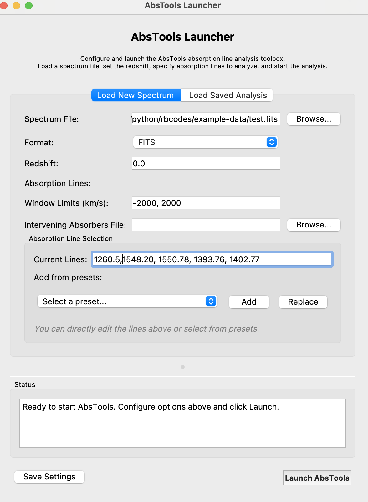
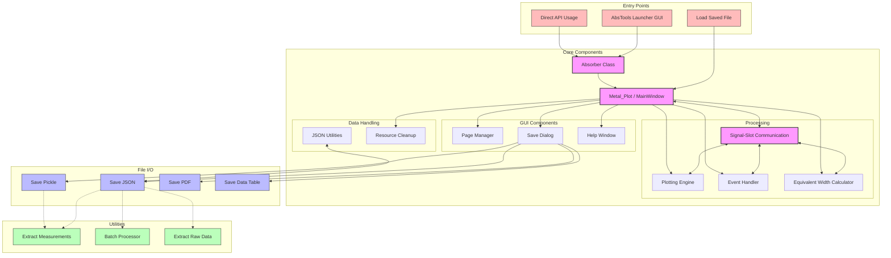

# AbsTools: Absorption Line Analysis Toolbox

[Back to Main Page](../../main_readme.md)

AbsTools is an interactive toolkit for analyzing absorption lines in astronomical spectra. It provides a user-friendly graphical interface for continuum fitting, equivalent width measurements, and column density determinations of absorption features in spectra of the Circumgalactic Medium (CGM), Intergalactic Medium (IGM), and Interstellar Medium (ISM).

## Overview

AbsTools is part of the `rbcodes` package under `rbcodes.GUIs.abstools`. This README provides comprehensive instructions on using the toolbox, including the new launcher GUI.

### Features

- **Interactive Continuum Fitting**: Fit polynomials to the spectrum continuum with adjustable orders and masked regions
- **Equivalent Width Measurements**: Calculate equivalent widths and errors with user-defined velocity integration limits
- **Column Density Calculations**: Determine column densities directly from absorption features
- **Intervening Absorption Line Analysis**: Identify and analyze intervening absorption systems
- **Multi-page Support**: Analyze up to 30 transitions simultaneously across 5 tabbed pages
- **Enhanced Save/Load Functionality**: Save your analysis in various formats (JSON, Pickle, PDF, data tables)
- **Improved Error Handling**: Better error recovery and prevention of segmentation faults
- **Signal-Slot Architecture**: Robust communication between application components
- **User-Friendly Launcher**: New GUI for setting up and launching analysis sessions

## Dependencies

AbsTools requires the following libraries:
- Python 3.6 or higher
- NumPy
- Matplotlib
- PyQt5
- Pandas
- Astropy
- linetools (for spectrum handling)

## Quick Start

There are now three ways to start using AbsTools:

### 1. Using the AbsTools Launcher GUI (Recommended)

The new launcher GUI provides the simplest way to get started:

```bash
python abstools_launcher.py
```

This opens a user-friendly interface where you can:
- Load a spectrum file
- Set the redshift
- Select absorption lines to analyze
- Configure analysis parameters
- Load previously saved analysis sessions


*Screenshot of the AbsTools Launcher GUI showing the spectrum configuration options*

### 2. Using the AbsTools API Directly

For more control or scripting, you can use the AbsTools API:

```python
from linetools.spectra.xspectrum1d import XSpectrum1D
from rbcodes.GUIs.abstools import Absorber as A
from rbcodes.GUIs.abstools import Metal_Plot as M

# Read in the 1D spectrum to be analyzed
from pkg_resources import resource_filename
filename = resource_filename('rbcodes', 'example-data/test.fits')
sp = XSpectrum1D.from_file(filename)
wave = sp.wavelength.value
flux = sp.flux.value
error = sp.sig.value

# Specify redshift at which to perform analysis
z = 0.348

# Specify rest-frame wavelengths of absorption lines to analyze
# Common lines: OVI doublet (1031.93, 1037.62), CIV doublet (1548.20, 1550.78)
lines = [1031.93, 1037.62, 1215.67, 1548.20, 1550.78]

# Create an absorber class with the data
absys = A.Absorber(z, wave, flux, error, lines=lines, window_lim=[-2000, 2000])
Abs = absys.ions

# Launch the main GUI
M.Transitions(Abs)

# Optional: if you have pre-identified intervening absorption lines
# M.Transitions(Abs, intervening='intervening_lines.txt')
```

### 3. Loading a Saved Analysis Session

To resume a previously saved analysis:

```python
from rbcodes.GUIs.abstools import Metal_Plot as M

# For JSON files (recommended format)
from rbcodes.GUIs.abstools.json_utils import load_from_json
ions = load_from_json('analysis.json')

# For pickle files
import pickle
with open('analysis.p', 'rb') as f:
    ions = pickle.load(f)

# Launch GUI with loaded data
M.Transitions(ions)
```

## AbsTools Launcher GUI

The new AbsTools Launcher provides a user-friendly interface for setting up analysis sessions.

### Launcher Features

- **Multiple Launch Modes**: Start a new analysis or load a saved session
- **Spectrum Selection**: Browse for and load FITS, ASCII, or HDF5 spectrum files
- **Absorption Line Presets**: Quickly select common absorption lines
- **Parameter Configuration**: Set redshift, velocity window limits, and other parameters
- **Settings Persistence**: Save and recall your settings between sessions
- **Detailed Status Updates**: Track the progress of your analysis setup

### Using the Launcher

1. **Start the Launcher**:
   ```bash
   python abstools_launcher.py
   ```

2. **For New Analysis**:
   - Select the "Load New Spectrum" tab
   - Browse for your spectrum file
   - Enter the redshift
   - Select absorption lines (choose from presets or enter manually)
   - Set velocity window limits
   - Optionally specify an intervening absorbers file
   - Click "Launch AbsTools"

3. **For Saved Analysis**:
   - Select the "Load Saved Analysis" tab
   - Browse for your saved analysis file (.json or .p)
   - Optionally specify an intervening absorbers file
   - Click "Launch AbsTools"

4. **Save Settings**:
   - Click "Save Settings" to store your configuration for future use

### Preset Absorption Lines

The launcher provides quick access to common absorption line wavelengths:

| Preset | Lines |
|--------|-------|
| OVI Doublet | 1031.93, 1037.62 |
| CIV Doublet | 1548.20, 1550.78 |
| Lyman-α | 1215.67 |
| MgII Doublet | 2796.35, 2803.53 |
| SiIV Doublet | 1393.76, 1402.77 |
| NV Doublet | 1238.82, 1242.80 |
| FeII Lines | 2344.21, 2374.46, 2382.77, 2586.65, 2600.17 |
| Common IGM Lines | 1215.67, 1031.93, 1037.62, 1548.20, 1550.78, 1393.76, 1402.77 |

## Main Interface Guide

### Main Interface Layout

The AbsTools interface is divided into two columns:
- **Left Side**: Raw spectrum with continuum fitting tools
- **Right Side**: Normalized spectrum with velocity integration tools

Each row represents a different absorption line transition.


*Screenshot of the AbsTools main interface showing continuum fitting and normalized spectrum views*

### Mouse Controls

| Action | Description |
|--------|-------------|
| Left panel + Left mouse button (double click) | Add wavelength region to continuum fit |
| Left panel + Right mouse button (double click) | Remove wavelength region from continuum fit |
| Right panel + Left mouse button | Set lower velocity integration limit |
| Right panel + Right mouse button | Set upper velocity integration limit |

### Keyboard Controls

| Key | Description |
|-----|-------------|
| Up arrow | Increase polynomial order for continuum fit |
| Down arrow | Decrease polynomial order for continuum fit |
| v | Manually enter regions to mask (left panel) or integration limits (right panel) |
| V | Apply current velocity limits to all subplots |
| m | Measure equivalent width for active subplot |
| M | Measure equivalent width for all subplots |
| 0 | Flag absorber as positive detection |
| 1 | Flag absorber as upper limit |
| 2 | Flag absorber as lower limit |
| t | Toggle text display mode (cycles between none, equivalent width, and column density) |
| q | Exit application |

### Button Controls

| Button | Description |
|--------|-------------|
| Add Ion | Add a new absorption line to analyze |
| Help | Open help window with instructions |
| Save | Open save dialog with various export options |
| Load | Open load dialog to import a saved analysis |

### Tab Navigation

- You can switch between pages (tabs) to view different sets of absorption lines
- Each page can display up to 6 transitions
- Up to 5 pages are supported, for a total of 30 simultaneous transitions

## Workflow Example

Here's a typical workflow for analyzing absorption lines:

1. **Load Spectrum**: Start AbsTools Launcher and select your spectrum file
2. **Continuum Fitting**:
   - Click on the left panel to select a transition
   - Use left/right mouse buttons to add/remove regions for continuum fitting
   - Adjust polynomial order with up/down arrow keys
   - Areas excluded from the fit appear grayed out

3. **Measure Equivalent Widths**:
   - Click on the right panel to select a transition
   - Set velocity integration limits using left/right mouse buttons
   - Press 'm' to measure the equivalent width
   - For uncertain detections, flag them with keys 0/1/2

4. **Save Results**:
   - Click the "Save" button to open the save dialog
   - Choose to save as PDF (plots), data table, pickle file, or JSON (recommended)

## Save Dialog Options

The save dialog offers multiple ways to save your analysis:

| Option | Description |
|--------|-------------|
| Save PDF | Save plots as PDF files for publication or presentation |
| Save Table | Export measurements to a data table (ASCII format) |
| Save Progress (Pickle) | Save analysis state in Python's pickle format |
| Save Progress (JSON) | Save analysis state in JSON format (recommended) |

### Using the JSON Format (Recommended)

The JSON format is recommended for saving your analysis because:
- It's human-readable (unlike pickle files)
- It's more portable across different platforms
- It's compatible with other programming languages
- It's less prone to compatibility issues when upgrading Python versions

When saved in JSON format, all analysis details are preserved:
- Spectrum data (wavelength, flux, error)
- Continuum fits and polynomial coefficients
- Velocity limits and measurements
- Equivalent width and column density values with errors
- Detection flags and measurement metadata

## Working with Saved Analysis Files

AbsTools can save analysis in multiple formats:
- **JSON**: Human-readable, portable format (recommended)
- **Pickle**: Binary Python format
- **Data Table**: ASCII tables of measurements
- **PDF**: Plots of continuum fits and normalized spectra

## Utility Scripts

AbsTools includes several utility scripts for working with analysis data:

### Extracting Measurements

```python
from rbcodes.GUIs.abstools.extract_abstools_measurements import extract_measurements_table

# Extract measurements to a DataFrame
file_path = "Spectrum_Analysis_z_0.348.json"
df = extract_measurements_table(file_path)

# View the measurements
print(f"Measurements for spectrum at z = {df.attrs['redshift']}")
print(df)

# Export to CSV
df.to_csv("measurements.csv", index=False)
```

### Batch Processing

```python
from rbcodes.GUIs.abstools.batch_process_abstools import batch_process_abstools_files, plot_ew_comparison

# Process all JSON files in a directory
json_pattern = "data/Spectrum_Analysis_*.json"
measurements_df = batch_process_abstools_files(json_pattern)

# Create comparison plot of specific ions across spectra
ions_to_compare = ['OVI 1031.93', 'OVI 1037.62', 'CIV 1548.20', 'CIV 1550.78']
fig, ax = plot_ew_comparison(measurements_df, ions_to_compare)
fig.savefig("ew_comparison.png", dpi=300)
```

### Extracting Raw Data

```python
from rbcodes.GUIs.abstools.extract_abstools_data import load_abstools_analysis

# Load the full analysis data
file_path = "Spectrum_Analysis_z_0.348.json"
ions = load_abstools_analysis(file_path)

# Access flux, wavelength, and other data for an ion
ion_name = list(ions.keys())[0]  # First ion
wavelength = ions[ion_name]['wave']
normalized_flux = ions[ion_name]['flux'] / ions[ion_name]['cont']
velocity = ions[ion_name]['vel']

# Now you can work with the raw data in your own code
import matplotlib.pyplot as plt
plt.figure()
plt.step(velocity, normalized_flux, 'k', where='mid')
plt.xlabel('Velocity (km/s)')
plt.ylabel('Normalized Flux')
plt.show()
```

## Detailed Feature Guide

### Continuum Fitting

AbsTools offers several approaches to fitting the continuum:

1. **Interactive Masking**:
   - Click twice on the left panel to define a velocity range
   - Left-click to exclude regions from the fit (e.g., absorption features)
   - Right-click to include regions back in the fit
   - Grey regions indicate masked areas

2. **Manual Masking**:
   - Press 'v' with cursor in the left panel
   - Enter velocity limits in the format "min,max"
   - The region will be excluded from the continuum fit

3. **Polynomial Order Adjustment**:
   - Press up/down arrow keys to increase/decrease the polynomial order
   - Default order is 4
   - Higher orders follow the continuum more closely but may overfit
   - Lower orders provide smoother fits but may not capture complex continuum shapes

The continuum fitting uses Legendre polynomials, which are well-suited for fitting astronomical continua.

### Equivalent Width Measurement

For measuring equivalent widths (EW):

1. **Set Integration Limits**:
   - Click in the right panel to select a transition
   - Left-click to set the lower velocity limit (blue dashed line)
   - Right-click to set the upper velocity limit (red dashed line)
   - Or press 'v' and enter limits manually in the format "min,max"

2. **Perform the Measurement**:
   - Press 'm' to measure EW for the active transition
   - Press 'M' to measure EW for all transitions at once
   - The values appear in the upper left of each right panel

3. **Handle Detection Confidence**:
   - Press '0' to flag as positive detection (default)
   - Press '1' to flag as upper limit (useful for non-detections)
   - Press '2' to flag as lower limit (useful for saturated lines)

4. **Apply Limits to All Transitions**:
   - Set integration limits for one transition
   - Press 'V' to apply these limits to all transitions
   - Useful for ensuring consistent integration ranges

### Column Density Calculation

Column densities are automatically calculated when measuring equivalent widths:

1. **Calculation Method**:
   - Uses the apparent optical depth method
   - Takes into account the oscillator strength (f-value) of each transition
   - Considers the velocity integration range

2. **View Column Densities**:
   - Press 't' to cycle display modes (None → EW → Column Density)
   - Column densities are displayed in logarithmic form (log N in cm^-2)
   - Includes error estimates

3. **Handling Saturation**:
   - For saturated lines, flag as lower limits (press '2')
   - This will display the column density with a '>' symbol

### Intervening Absorption Lines

AbsTools can mark intervening absorption systems:

1. **Provide an Intervening Lines File**:
   - Create a space-separated text file with columns: Name Wave_obs Zabs
   - Name: Line identification (e.g., "HI")
   - Wave_obs: Observed wavelength
   - Zabs: Redshift of the absorber

2. **Load With the Intervening Flag**:
   - In the launcher, specify the intervening file path
   - Or when using the API: `M.Transitions(Abs, intervening='path/to/file.txt')`

3. **Interpretation**:
   - Intervening lines are marked on the normalized spectra
   - Lines within 200 km/s of the system redshift are shown in blue
   - Lines at larger velocity differences are shown in red

## Architecture Overview

AbsTools follows a modular architecture with components communicating via a signal-slot mechanism:

1. **AbsToolsLauncher**: User interface for configuring and starting analysis sessions
2. **Absorber**: Creates ion dictionaries from spectrum data
3. **Metal_Plot / MainWindow**: Main application window and controller
4. **PageManager**: Handles page (tab) creation and initialization
5. **Plotting**: Manages all visualization aspects
6. **EventHandler**: Processes user interactions (mouse/keyboard)
7. **EquivalentWidth**: Performs line measurements and calculations
8. **Utility Modules**: Support JSON handling, data extraction, batch processing

The signal-slot communication system ensures robust coordination between components while preventing segmentation faults that could occur with direct coupling.

### Architecture Diagram

The following diagram illustrates the relationship between all components of AbsTools:




### User Workflow Diagram

This diagram illustrates the typical user workflow when working with AbsTools:


## Adding Screenshots to Documentation

To enhance this documentation with visual guides:

1. **Capture AbsTools Launcher Screenshot**:
   - Start the launcher: `python abstools_launcher.py`
   - Capture a screenshot of the interface
   - Save as `abstools_launcher.png` in the documentation folder

2. **Capture Main Interface Screenshot**:
   - Load a spectrum with common absorption lines
   - Capture the interface showing both continuum fitting and normalized views
   - Save as `abstools_main_interface.png` in the documentation folder

3. **Replace Image Placeholders**:
   - Update the image paths in this README.md file
   - Commit the screenshots along with the updated documentation

## Troubleshooting

### Common Issues

1. **Missing Libraries**: Ensure all dependencies are properly installed. The error messages will indicate which libraries are missing.

2. **JSON Support Unavailable**: If you see "JSON utilities not found" messages, make sure the `json_utils.py` module is accessible within the rbcodes package.

3. **Spectrum Loading Errors**: Verify that your spectrum file is in a supported format (FITS, ASCII, HDF5). Check that the file contains flux, wavelength, and error arrays.

4. **Lines Outside Observed Range**: If you specify lines that fall outside the wavelength range of your spectrum, AbsTools will warn you during initialization.

5. **Launcher Script Path**: If the launcher can't find required modules, ensure the rbcodes package is in your Python path.

6. **Segmentation Faults on Exit**: The improved error handling should prevent these, but if they occur, try using the 'q' key to exit properly instead of closing the window directly.

7. **Plotting Errors**: If you encounter errors during plotting, try reducing the complexity (number of transitions) or check the data ranges.

### Error Recovery

The updated AbsTools includes improved error handling:

- Signals communicate errors to a central handler
- Error messages are displayed in status bars and dialog boxes
- Critical errors are caught without causing application crashes
- Resource cleanup on exit prevents segmentation faults

## Version History

- **Initial Version**: Original development by Sean Clark and Rongmon Bordoloi [2021]
- **Major Update**: Enhanced stability, JSON support, and launcher GUI by Rongmon Bordoloi [2025]

## Acknowledgments

AbsTools was originally developed by Sean Clark and Rongmon Bordoloi [2021]
Major refactoring and update with enhanced features by Rongmon Bordoloi [2025]