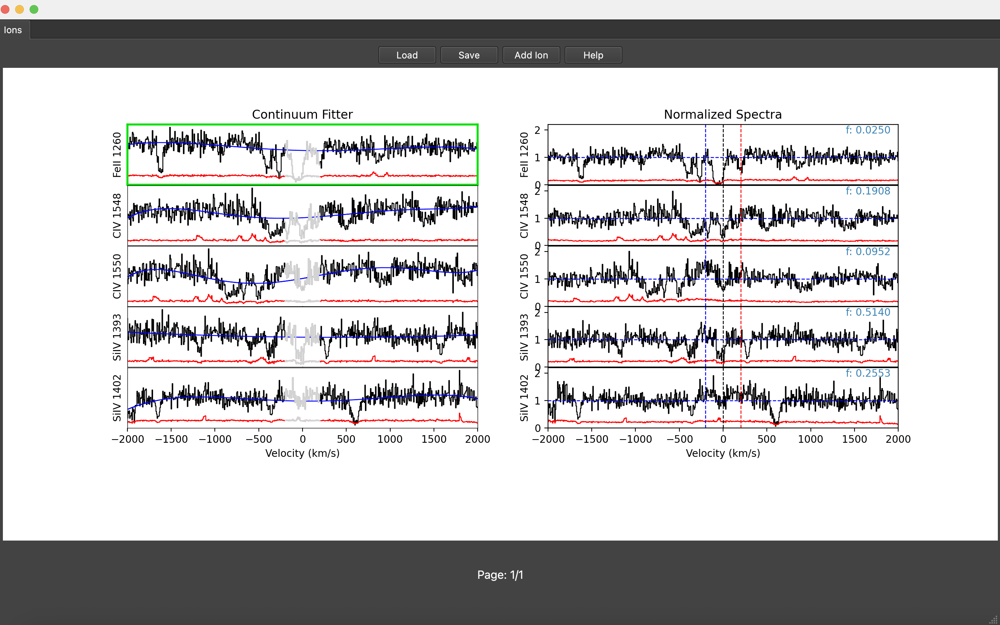

# AbsTools

[Back to Main Page](../../main_readme.md)

Interactive GUI for absorption line analysis — continuum fitting, equivalent
width measurement, and column density for CGM/IGM/ISM spectra. Analyzes up to
30 transitions simultaneously across tabbed pages.

> **Note:** For new work, `launch_specgui` covers the same analysis in a
> more modern interface. AbsTools remains available and fully functional.

---

## Launch

```python
from linetools.spectra.xspectrum1d import XSpectrum1D
from rbcodes.GUIs.abstools import Absorber as A, Metal_Plot as M

sp = XSpectrum1D.from_file('spectrum.fits')
z = 0.348
lines = [1031.93, 1037.62, 1215.67, 1548.20, 1550.78]

absys = A.Absorber(z, sp.wavelength.value, sp.flux.value, sp.sig.value,
                   lines=lines, window_lim=[-2000, 2000])
M.Transitions(absys.ions)
```

Load a saved session:

```python
from rbcodes.GUIs.abstools.json_utils import load_from_json
ions = load_from_json('analysis.json')
M.Transitions(ions)
```



---

## Interface layout

Left panel: raw spectrum + continuum fitting. Right panel: normalized spectrum + EW integration. Each row is one transition.

## Keyboard controls

| Key | Action |
|-----|--------|
| ↑ / ↓ | Increase / decrease polynomial continuum order |
| `v` | Enter mask (left panel) or velocity limits (right panel) manually |
| `V` | Apply current velocity limits to all subplots |
| `m` | Measure EW for active subplot |
| `M` | Measure EW for all subplots |
| `0` | Flag as positive detection |
| `1` | Flag as upper limit |
| `2` | Flag as lower limit |
| `t` | Cycle text display: none → EW → column density |
| `q` | Exit |

## Mouse controls

| Action | Effect |
|--------|--------|
| Left-panel double left-click | Add wavelength region to continuum mask |
| Left-panel double right-click | Remove wavelength region from mask |
| Right-panel left-click | Set lower velocity integration limit |
| Right-panel right-click | Set upper velocity integration limit |

## Preset lines

| Preset | Wavelengths (Å) |
|--------|----------------|
| OVI doublet | 1031.93, 1037.62 |
| CIV doublet | 1548.20, 1550.78 |
| Lyman-α | 1215.67 |
| MgII doublet | 2796.35, 2803.53 |
| SiIV doublet | 1393.76, 1402.77 |
| NV doublet | 1238.82, 1242.80 |
| Common IGM | 1215.67, 1031.93, 1037.62, 1548.20, 1550.78, 1393.76, 1402.77 |

## Save options

| Option | Description |
|--------|-------------|
| Save JSON | Full analysis state — recommended |
| Save Pickle | Binary Python format |
| Save PDF | Plots for publication |
| Save Table | ASCII measurements table |

## Reading saved results

```python
from rbcodes.GUIs.abstools.extract_abstools_measurements import extract_measurements_table

df = extract_measurements_table('Spectrum_Analysis_z_0.348.json')
df.to_csv('measurements.csv', index=False)
```

Batch processing:

```python
from rbcodes.GUIs.abstools.batch_process_abstools import batch_process_abstools_files

df = batch_process_abstools_files('data/Spectrum_Analysis_*.json')
```
