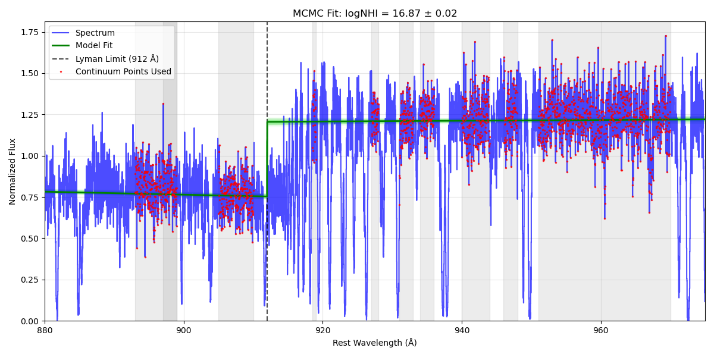
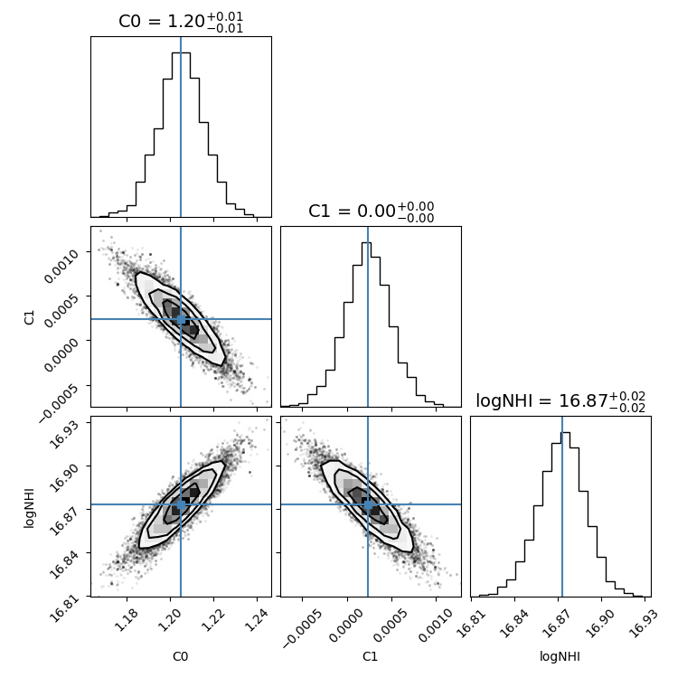

# LLS Fitter

A Python toolkit for measuring the column density of Lyman Limit Systems (LLS) in quasar spectra using both curve-fitting and MCMC methods.

## Overview

This repository contains two main components:

1. **LLSFitter**: A Python class for fitting Lyman Limit Systems in quasar spectra
2. **LLSFitter GUI**: A graphical user interface for the LLSFitter class

These tools allow astronomers to measure neutral hydrogen column densities (N(HI)) in quasar absorption line systems by fitting the flux decrement at the Lyman limit (912 Å).


## Using the LLSFitter Class

### Basic Usage

```python
from rbcodes.IGM.LLSFitter import LLSFitter

# Create LLS fitter with spectrum file and absorption redshift
lls = LLSFitter('path/to/spectrum.fits', zabs=0.528)

# Set continuum regions (using default regions if none specified)
lls.set_continuum_regions()

# Set sigma-clipping threshold for outlier rejection (optional)
lls.set_sigma_clip(3.0)  # 3-sigma clipping

# Fit with curve_fit
popt, pcov = lls.fit_curve_fit()
print(f"Curve fit results: logNHI = {popt[2]:.2f} ± {np.sqrt(pcov[2,2]):.2f}")

# Plot the fit with custom axis limits
fig, ax = lls.plot_fit(
    method='curve_fit', 
    wmin=880,     # x-axis minimum (wavelength in Angstroms)
    wmax=975,     # x-axis maximum
    ymin=0.2,     # y-axis minimum (normalized flux)
    ymax=1.8      # y-axis maximum
)
fig.savefig('lls_curvefit.png')
```

### Advanced Usage with MCMC

```python
# After running curve_fit (or directly)
sampler, samples = lls.fit_emcee(nwalkers=50, nsteps=500, burnin_frac=0.2)

# Plot the MCMC fit with model realizations and custom axis limits
fig, ax = lls.plot_fit(
    method='mcmc', 
    wmin=880,     # x-axis minimum (wavelength in Angstroms)
    wmax=975,     # x-axis maximum
    ymin=0,       # y-axis minimum (normalized flux)
    ymax=2,       # y-axis maximum
    show_realizations=True, 
    n_realizations=100
)
fig.savefig('lls_mcmc_with_realizations.png')

# Plot corner plot
fig = lls.plot_corner()
fig.savefig('lls_corner_plot.png')

# Get summary of results
results = lls.get_results_summary()
print(f"MCMC: logNHI = {results['mcmc']['logNHI']:.2f} ± {results['mcmc']['logNHI_err']:.2f}")
```

### Custom Continuum Regions

```python
# Define your own continuum regions as list of (min, max) wavelength tuples
custom_regions = [
    (860, 870), 
    (895, 900), 
    (920, 925), 
    (950, 965)
]

lls.set_continuum_regions(custom_regions)
```

## Using the LLSFitter GUI

### Running the GUI

From Python:
```python
from rbcodes.GUIs.LLSFitter_GUI import LLSFitterGUI
import sys
from PyQt5.QtWidgets import QApplication

app = QApplication(sys.argv)
window = LLSFitterGUI()
window.show()
sys.exit(app.exec_())
```

From command line:
```bash
python LLSFitter_GUI.py
```

### GUI Usage Instructions

1. **Loading a Spectrum**
   - Click the "Browse" button to select a FITS spectrum file
   - Enter the absorption redshift in the input field
   - The spectrum will automatically load and display

2. **Working with Continuum Regions**
   - In the "Continuum Regions" tab, you can:
     - View and edit the wavelength regions used for continuum fitting
     - Add new regions with the "Add Region" button
     - Remove selected regions with the "Remove Selected" button
     - Reset to default regions with the "Default Regions" button
   - Click "Preview Continuum Regions" to see which points will be used in fitting

3. **Adjusting Fit Parameters**
   - In the "Fit Parameters" tab, you can:
     - Set initial values for C0, C1, and log N(HI)
     - Set bounds for these parameters
     - Configure MCMC parameters (walkers, steps, burn-in fraction)
     - Set plot options (see below)
     - Adjust sigma-clipping threshold for outlier rejection

4. **Setting Plot Options**
   - In the "Fit Parameters" tab, scroll down to find the "Plot Options" section
   - Set the wavelength (x-axis) range with "Min Wavelength (Å)" and "Max Wavelength (Å)" spinboxes
   - Control the y-axis limits:
     - Check "Auto Y-Limits" for automatic scaling based on the data
     - Uncheck this option to manually set "Min Y Value" and "Max Y Value"
   - Toggle the display of continuum regions with "Show Continuum Regions"
   - For MCMC plots, toggle "Show MCMC Realizations" and set the number of realizations to display
   - Note: If the Plot Options section isn't visible, try resizing the application window to make it taller

5. **Running Fits**
   - Click "Run Curve Fit" for a quick analysis using scipy's curve_fit
   - Click "Run MCMC Fit" for a more robust analysis using emcee
   - Results are displayed in the status bar and in the plot tabs

6. **Viewing Results**
   - Use the tabs in the right panel to view:
     - Preview: The spectrum with continuum regions highlighted
     - Curve Fit: Results from the curve_fit method
     - MCMC Fit: Results from the MCMC method with optional realizations
     - Corner Plot: Parameter correlations from MCMC sampling
   - Use "Analysis" → "View Detailed Results" for numerical details
   - Results can be saved with "File" → "Save Results"

7. **Exporting**
   - Plots can be exported with "File" → "Export Current Plot"
   - Results can be saved to a text file with "File" → "Save Results"
   - Continuum regions can be saved/loaded as templates

## Best Practices

### Continuum Regions Selection

- Choose regions that are free of absorption lines
- Include regions both above and below the Lyman limit (912 Å)
- Prefer wider regions when possible for better continuum constraints
- Use sigma-clipping to automatically remove outliers or narrow absorption features

### Fitting Recommendations

1. **Start with curve_fit**:
   - It's faster and provides a good initial estimate
   - Use these results as starting points for MCMC

2. **MCMC Configuration**:
   - For quick exploratory analysis: 50 walkers, 500 steps
   - For publication-quality results: 100+ walkers, 1000+ steps
   - Use a burn-in fraction of 0.2-0.3 to discard initial steps

3. **Plot Display Optimization**:
   - Adjust x-axis limits to focus on the Lyman limit region (around 880-975 Å)
   - For clearer visualization of the flux decrement, set custom y-limits:
     - For systems with strong absorption: try ymin=0, ymax=1.5
     - For weak systems: try ymin=0.5, ymax=2.0
   - Toggle the display of realizations based on your needs:
     - Show them to visualize parameter uncertainty
     - Hide them for cleaner plots in presentations or publications

4. **Evaluate Fit Quality**:
   - Check if the model matches the flux decrement at 912 Å
   - Look for systematic residuals that might indicate problems
   - Compare curve_fit and MCMC results for consistency

5. **Working with Noisy Data**:
   - Increase the sigma-clipping threshold (e.g., to 4-5σ)
   - Use more continuum regions to better constrain the fit
   - Run MCMC with more walkers and steps


## Example Results

Here are some examples of the visualizations produced by LLSFitter:

### Curve Fit Result


### MCMC Fit with Model Realizations


### MCMC Corner Plot



## Troubleshooting

- **No points in continuum regions**: Verify that the redshift is correct and that continuum regions fall within the spectrum's wavelength coverage
- **Poor fits**: Try adjusting parameter bounds or initial values
- **MCMC not converging**: Increase the number of steps and burn-in fraction
- **Outliers affecting the fit**: Adjust the sigma-clipping threshold
- **Plot Options not visible**: Resize the application window to make it taller, or look for scrollbars in the Fit Parameters tab
- **Custom y-limits not applied**: Make sure the "Auto Y-Limits" checkbox is unchecked to enable manual y-limit controls