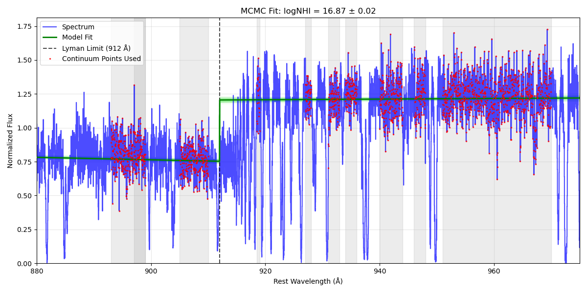
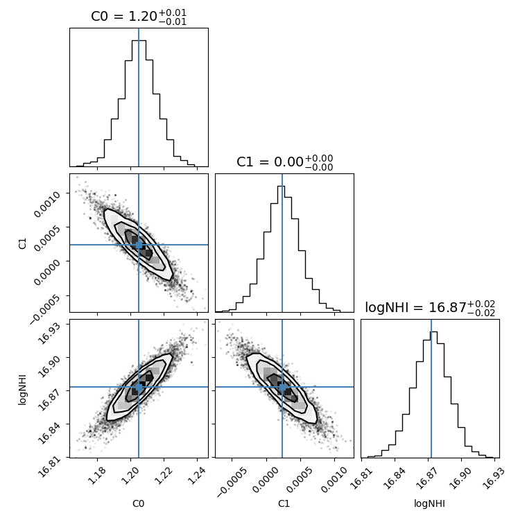

# LLSFitter

[Back to Main Page](../../main_readme.md)

Measures neutral hydrogen column density N(HI) of Lyman Limit Systems by
fitting the flux decrement at the Lyman limit (912 Å). Two fitting methods:
`curve_fit` (fast) and MCMC via `emcee` (robust).

---

## Launch the GUI

```bash
rb_llsfitter
```

Or from Python:

```python
from rbcodes.GUIs.LLSFitter_GUI import LLSFitterGUI
from PyQt5.QtWidgets import QApplication
import sys

app = QApplication(sys.argv)
window = LLSFitterGUI()
window.show()
sys.exit(app.exec_())
```

---

## Python API

```python
from rbcodes.IGM.LLSFitter import LLSFitter

lls = LLSFitter('spectrum.fits', zabs=0.528)
lls.set_continuum_regions()       # use defaults, or pass list of (wmin, wmax) tuples
lls.set_sigma_clip(3.0)           # outlier rejection

# Quick fit
popt, pcov = lls.fit_curve_fit()
print(f"log N(HI) = {popt[2]:.2f} ± {pcov[2,2]**0.5:.2f}")

# MCMC
sampler, samples = lls.fit_emcee(nwalkers=50, nsteps=500, burnin_frac=0.2)
results = lls.get_results_summary()
print(f"log N(HI) = {results['mcmc']['logNHI']:.2f} ± {results['mcmc']['logNHI_err']:.2f}")

# Plots
fig, ax = lls.plot_fit(method='curve_fit', wmin=880, wmax=975)
fig, ax = lls.plot_fit(method='mcmc', show_realizations=True, n_realizations=100)
fig = lls.plot_corner()
```

Custom continuum regions:

```python
lls.set_continuum_regions([(860, 870), (895, 900), (920, 925), (950, 965)])
```

### Curve Fit Result


### MCMC Fit with Model Realizations


### MCMC Corner Plot


---

## Reading saved results

Results are saved as JSON via the GUI (**File → Save Results**):

```python
import json

with open('results.json') as f:
    data = json.load(f)

logNHI  = data['results']['mcmc']['logNHI']
logNerr = data['results']['mcmc']['logNHI_err']

# Percentiles
p = data['results']['mcmc_percentiles']['logNHI']
print(f"log N(HI) = {p['p50']:.2f} +{p['upper_error']:.2f} -{p['lower_error']:.2f}")
```

---

## GUI workflow

1. **Browse** → select FITS spectrum file; enter absorption redshift
2. **Continuum Regions** tab → view, add, or remove fitting regions; click **Preview**
3. **Fit Parameters** tab → set initial values, MCMC walkers/steps, plot axis limits
4. Click **Run Curve Fit** or **Run MCMC Fit**
5. **File → Save Results** → JSON (recommended) or pickle

## Troubleshooting

| Problem | Fix |
|---------|-----|
| No points in continuum regions | Check redshift and wavelength coverage |
| Poor fit | Adjust parameter bounds or initial values |
| MCMC not converging | Increase walkers / steps / burn-in fraction |
| Outliers affecting fit | Increase sigma-clipping threshold |
| Plot Options not visible | Resize window taller or scroll in the Fit Parameters tab |
