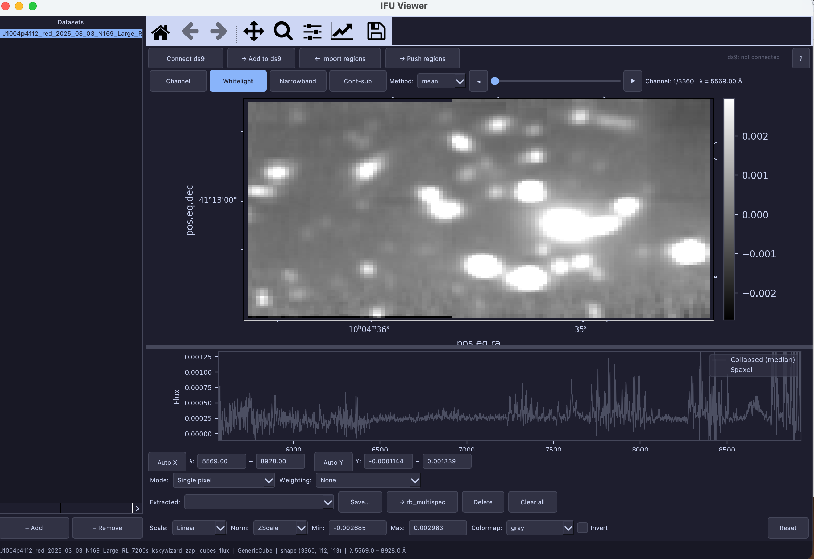
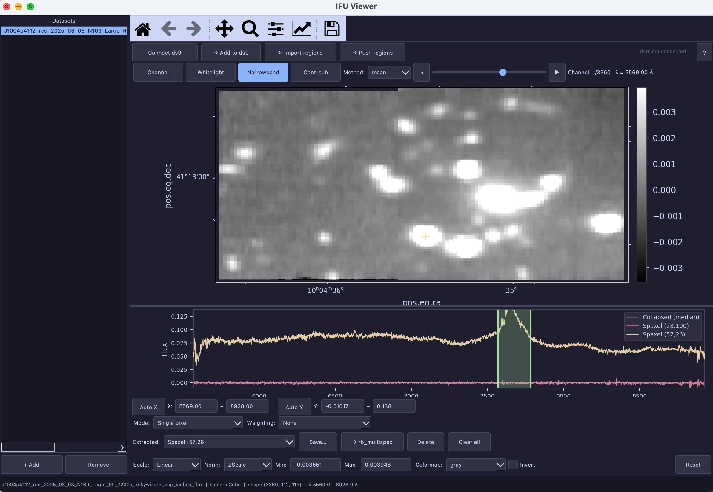
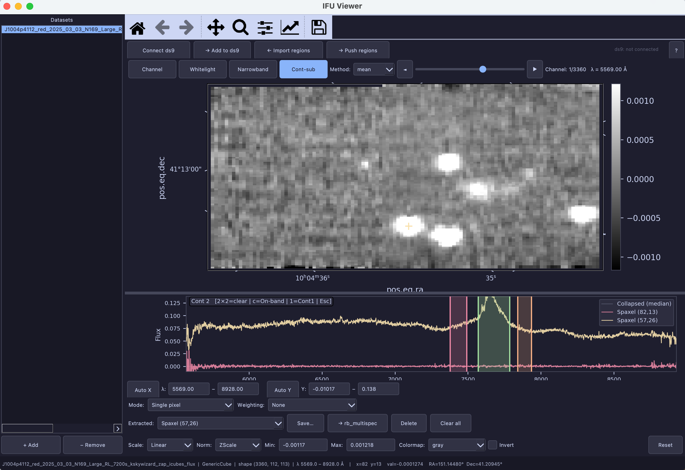
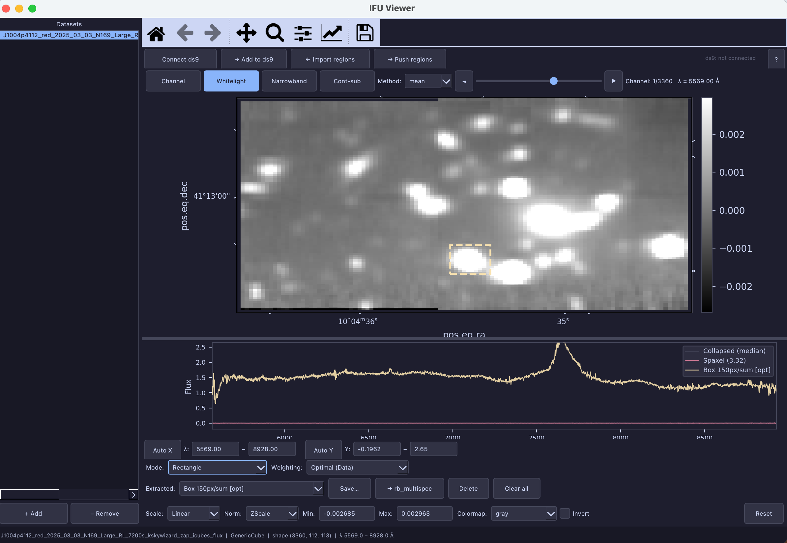
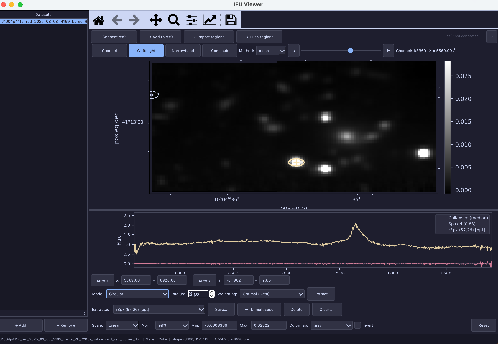
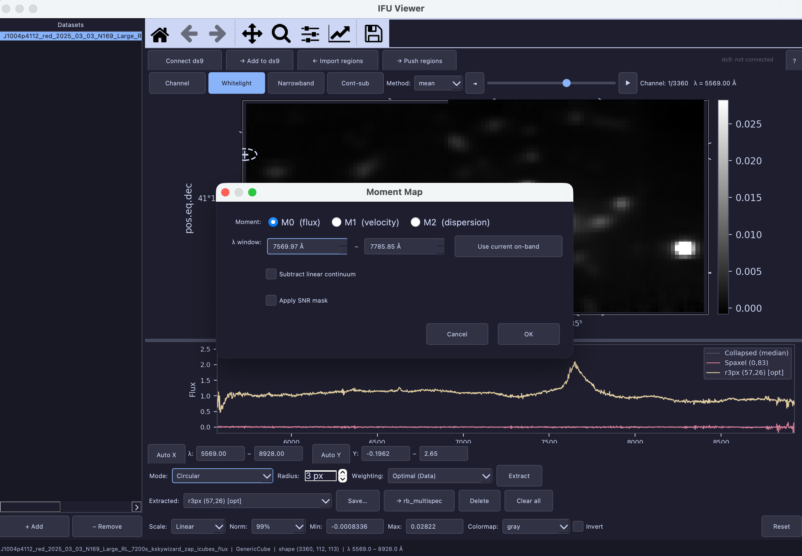
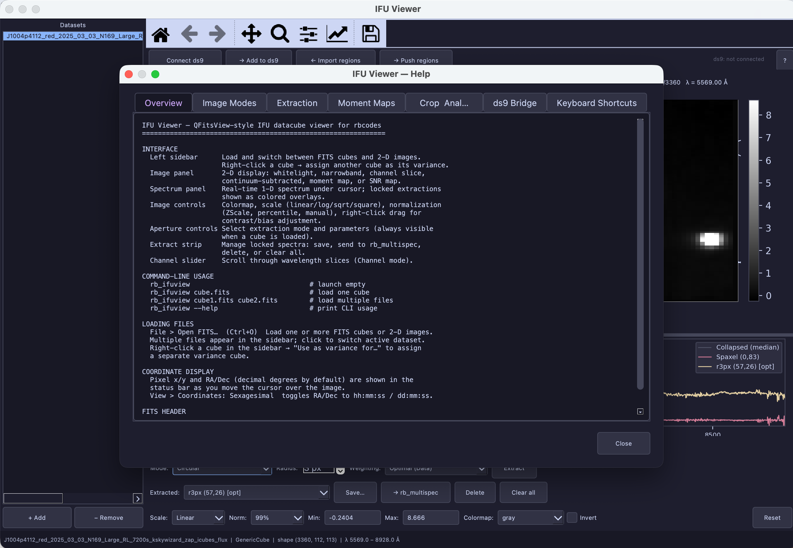

# rb_ifuview — IFU Datacube Viewer

An interactive PyQt5 GUI for visualizing and extracting spectra from IFU datacubes and 2D FITS images.

## Overview

rb_ifuview allows you to:

- Load one or more FITS datacubes (KCWI, MUSE, or generic) and 2D images simultaneously
- Display whitelight, channel, narrowband, and continuum-subtracted images
- Browse wavelength slices interactively with a channel slider
- Extract spectra from single spaxels, rectangles, circular apertures, or circular-annular apertures
- Apply profile-based or variance-based weighting for optimal extraction
- Compute moment maps (M0 flux, M1 velocity, M2 dispersion)
- Crop datacubes spatially and send sub-cubes to file
- Interface with a running ds9 instance to push images and import region overlays
- Batch-extract spectra from a ds9 region file
- Send extracted spectra directly to rb_multispec for further analysis

## Usage

```bash
rb_ifuview                                    # launch empty
rb_ifuview cube.fits                          # load one datacube
rb_ifuview cube1.fits cube2.fits image.fits   # load multiple files
rb_ifuview --help                             # show help
rb_ifuview --install                          # show optional dependency instructions
```

### Supported file formats

| Instrument | Auto-detected | Notes |
|------------|--------------|-------|
| KCWI | Yes | `INSTRUME = 'KCWI'` in header |
| MUSE | Yes | `INSTRUME = 'MUSE'` in header |
| Generic IFU cube | Yes | Any 3-D FITS array |
| 2-D FITS image | Yes | Any 2-D FITS array |

### Optional dependency: ds9 / pyds9

The ds9 bridge is optional. To enable it:

```bash
rb_ifuview --install
```

This prints installation instructions for `pyds9` and the `XPA` message system. All other features work without ds9.

---

## Interface Layout


*Figure 1: rb_ifuview main window with a loaded datacube, showing the sidebar, image panel, spectrum panel, and all controls.*

```
┌─ Menubar ─────────────────────────────────────────────────┐
│  File   View   Analysis   Help                            │
├───────────────────────────────────────────────────────────┤
│ [?]  [Connect ds9]  [→ Send image]  [← Import regions]   │  ← toolbar
├────────────┬──────────────────────────────────────────────┤
│  Datasets  │  Image panel (2D display)                    │
│            │                                              │
│  [+ Add]   │  ┌── Image controls ─────────────────────┐  │
│  [- Remove]│  │ Scale | Norm | Min | Max | Cmap | Inv  │  │
│            │  └────────────────────────────────────────┘  │
│            ├──────────────────────────────────────────────┤
│            │ [Channel][Whitelight][Narrowband][Cont-sub]  │
│            │ Method: [mean▾]   ◄  ──────────────  ►  λ   │
│            ├──────────────────────────────────────────────┤
│            │  Spectrum panel (1D spectrum + spans)        │
│            │  [Auto X]  λmin ── λmax  [Auto Y]  Ymin Ymax │
│            ├──────────────────────────────────────────────┤
│            │  Mode | Radius | BG inner/outer | Method     │
│            │  Weighting | [Extract]                       │
│            ├──────────────────────────────────────────────┤
│            │  [Extractions▾] [Save] [→multispec] [Del]   │
├────────────┴──────────────────────────────────────────────┤
│  Status bar                                               │
└───────────────────────────────────────────────────────────┘
```

---

## Features

### Sidebar — Dataset Management

The left panel lists all loaded datasets. Each entry shows:
- **Cube**: `name  [cube]  w0–w1 Å`
- **Image**: `name  [image]`

| Control | Action |
|---------|--------|
| **[+ Add]** | Open file dialog to load one or more FITS files |
| **[− Remove]** | Remove the selected dataset from the list |
| Click item | Switch active dataset; all panels update |
| Right-click on cube | "Use as variance for '…'" — assign this cube as the variance for another |

Each dataset independently remembers its image display settings, extraction markers, spectrum axis limits, band ranges, sky region, and moment map state. Switching datasets restores all of these automatically.

---

### Image Panel

The 2D display area shows the current image (whitelight, channel slice, narrowband, continuum-subtracted, or moment map).

#### Mouse interactions

| Action | Effect |
|--------|--------|
| **Left-click** (< 5 px drag) | Lock spectrum at clicked spaxel; draw yellow cross marker |
| **Left-drag** (≥ 5 px) | Draw green dashed selection rectangle |
| **Right-drag** (vertical) | Adjust image contrast (narrow/widen color range) |
| **Right-drag** (horizontal) | Adjust image bias (shift brightness) |
| **Right-click** (no drag) | Context menu (see below) |

#### Right-click context menu

| Option | Available when |
|--------|---------------|
| Crop to selection | Rectangle drawn |
| Set as sky region | Rectangle drawn |
| Clear sky region | Sky region defined |
| Clear region overlays | Region shapes present |

#### Coordinate display (status bar)

As the cursor moves over the image the status bar shows:
- Pixel coordinates: `x=123  y=456`
- Pixel value: `val=1.234e-05`
- Sky position (decimal): `RA=123.45678°  Dec=45.67890°`
- Sky position (sexagesimal): `RA=08:13:49.63  Dec=+45:40:54.2`

Toggle the coordinate format with **View > Coordinates: Sexagesimal**.

#### Visual markers

| Marker | Color | Meaning |
|--------|-------|---------|
| Cross (+) | Yellow | Last clicked spaxel |
| Dashed rectangle | Green | Drawn selection region |
| Dashed circle | Green | Circular aperture |
| Dashed circles (×2) | Cyan | Annular background region |
| Preview circle | Lavender dashed | Follows cursor in Circular mode |
| Filled rectangle | Cyan | Sky region for SNR estimation |
| Shapes (circles, ellipses, polygons) | ds9 region colors | Imported region overlays |

---

### Image Controls Bar

| Control | Options | Description |
|---------|---------|-------------|
| **Scale** | Linear, Log, Sqrt, Square | Pixel value transformation before display |
| **Norm** | ZScale (default), MinMax, 99.5%, 99%, 98%, 97%, 95%, Manual | Color range normalization |
| **Min / Max** | Text fields | Type a value and press Enter to apply; switches Norm to Manual |
| **Colormap** | gray, gray_r, viridis, plasma, inferno, magma, cividis, turbo, hot, cubehelix, gnuplot2, coolwarm, RdBu_r, seismic, twilight, jet | Color scheme |
| **Invert** | Checkbox | Reverse the selected colormap |
| **Reset** | Button | Restore defaults (Linear, ZScale, gray) |

**Tip:** Right-click drag on the image is a fast alternative to Min/Max editing — vertical drag adjusts contrast, horizontal drag shifts bias. The Min/Max fields update in real time.

---

### Image Modes (Channel Slider)

Four mutually exclusive mode buttons above the spectrum panel:

| Button | Description |
|--------|-------------|
| **Whitelight** | Mean-collapsed image over all wavelengths (default on load) |
| **Channel** | Single wavelength slice; use slider or ◄/► buttons to browse |
| **Narrowband** | Integrated image over the green span drawn on the spectrum |
| **Cont-sub** | Narrowband minus a linear continuum baseline |

**Method** dropdown (all modes except Channel): **mean**, **sum**, **median** — selects how channels are combined. In Cont-sub mode only mean and median are available.


*Figure 2: Narrowband mode with the green on-band span drawn on the spectrum panel. The image updates immediately as the span is adjusted.*


*Figure 3: Continuum-subtracted mode showing the green on-band span and red continuum window. The image shows the continuum-subtracted emission.*

**Channel navigation** (active in Channel and band modes):
- **◄** / **►** buttons — step one channel at a time
- **Slider** — drag to jump to any wavelength
- Label shows: `Channel: N/total   λ = 1234.56 Å`

---

### Spectrum Panel

Shows the collapsed spectrum and any locked extraction overlays.

#### Spectrum lines

| Line | Color | Description |
|------|-------|-------------|
| Collapsed spectrum | Gray | Sum/mean over all spaxels |
| Hover spectrum | Pink | Updates in real time as you move cursor over the image |
| Extracted spectra | 6-color cycle (yellow, teal, mauve, peach, sky, green) | Locked extractions |

#### Wavelength span regions

Used in Narrowband and Cont-sub modes (drag on spectrum to define):

| Span | Color | Purpose |
|------|-------|---------|
| On-band | Green | Integration window for narrowband/moment maps |
| Continuum 1 | Red | First continuum baseline window (Cont-sub only) |
| Continuum 2 | Orange | Second continuum baseline window (Cont-sub, optional) |

#### Spectrum panel keyboard shortcuts

Click in the spectrum panel first to give it keyboard focus.

| Key | Action |
|-----|--------|
| `r` | Reset to full wavelength range |
| `a` | Autoscale Y to visible data (1st–99th percentile) |
| `l` | Toggle legend |
| `x` | Set cursor x → new xmin |
| `X` | Set cursor x → new xmax |
| `t` | Set cursor y → new ymax |
| `b` | Set cursor y → new ymin |
| `[` | Pan left 10% |
| `]` | Pan right 10% |
| `-` | Zoom out X axis 20% |
| `=` | Zoom in X axis 20% |

**Continuum-subtracted mode only:**

| Key | Action |
|-----|--------|
| `c` | Activate on-band window for drawing (press twice to clear) |
| `1` | Activate continuum window 1 (press twice to clear) |
| `2` | Activate continuum window 2 (press twice to clear) |
| `Esc` | Return to neutral (keeps all spans) |

#### Spectrum range strip

Below the spectrum panel:

| Control | Action |
|---------|--------|
| **[Auto X]** | Reset wavelength axis to full range |
| **λ min / λ max** | Enter wavelength limits and press Enter |
| **[Auto Y]** | Autoscale Y to visible data |
| **Y min / Y max** | Enter flux limits and press Enter |

---

### Aperture Controls

Always visible when a datacube is loaded. Controls how spectra are extracted.

#### Extraction modes

| Mode | Description |
|------|-------------|
| **Single pixel** | Click a spaxel to lock its spectrum |
| **Rectangle** | Left-drag to define a rectangular extraction box |
| **Circular** | Circular aperture with adjustable radius |
| **Circular-Annular** | Circular aperture with annular background subtraction |

#### Controls

| Control | Range / Options | Description |
|---------|----------------|-------------|
| **Mode** | dropdown | Select extraction shape |
| **Radius** | 1–200 px (default 3) | Aperture radius (Circular modes) |
| **BG inner** | 1–500 px (default 5) | Inner background annulus radius (Circular-Annular only) |
| **BG outer** | 2–500 px (default 8) | Outer background annulus radius (Circular-Annular only) |
| **Method** | sum, mean, median | Unweighted collapse (hidden when Weighting is active) |
| **Weighting** | None, Optimal (Data), Optimal (Gaussian), Var-weighted | Extraction weighting scheme |
| **[Extract]** | Button (Circular modes) | Execute extraction at previewed aperture |

#### Weighting options

| Option | Description |
|--------|-------------|
| **None** | Simple sum/mean/median per the Method setting |
| **Optimal (Data)** | Profile-weighted using the collapsed whitelight image |
| **Optimal (Gaussian)** | Profile-weighted using a 2-D Gaussian fit to the whitelight |
| **Var-weighted** | Inverse-variance weighted (1/σ² per channel); requires a variance cube |

---

### Extract Strip

Manages all extracted spectra.

| Control | Action |
|---------|--------|
| **Extractions dropdown** | Select an extraction; its aperture brightens on the image |
| **[Save…]** | Save selected spectrum to FITS (with FLUX, WAVELENGTH, ERROR extensions) or ASCII |
| **[→ rb_multispec]** | Send all (or selected) spectra to the rb_multispec viewer |
| **[Delete]** or `Del`/`Backspace` | Remove the selected extraction and its image marker |
| **[Clear all]** | Remove all extractions and overlays |

---

### Application Keyboard Shortcuts

| Key | Action |
|-----|--------|
| `Ctrl+O` | Open FITS file(s) |
| `Ctrl+S` | Save current displayed frame as FITS |
| `Ctrl+M` | Open Moment Map dialog |
| `Ctrl+K` | Crop cube to drawn rectangle |
| `Ctrl+B` | Open Band Range dialog |
| `Ctrl+R` / `Ctrl+W` | Open Spectrum Range & Scale dialog |
| `Del` / `Backspace` | Delete selected extraction |
| `Ctrl+Q` | Quit |
| `F1` | Open help dialog |

---

### Menus

#### File menu

| Item | Shortcut | Description |
|------|----------|-------------|
| Open FITS… | Ctrl+O | Load one or more FITS files |
| Load Region File… | | Load a ds9 `.reg` file from disk |
| Save Apertures as Region File… | | Export current extraction apertures as `.reg` file |
| Save Current Frame… | Ctrl+S | Save displayed 2D image as FITS with WCS |
| Save Subcube… | | Save full or cropped 3D cube with updated WCS |
| Quit | Ctrl+Q | Close application |

#### View menu

| Item | Description |
|------|-------------|
| Show FITS Header… | Searchable header viewer with extension selector and copy button |
| Coordinates: Sexagesimal | Toggle RA/Dec display between decimal degrees and hh:mm:ss |

#### Analysis menu

| Item | Shortcut | Description |
|------|----------|-------------|
| Moment Map… | Ctrl+M | Compute M0, M1, or M2 moment map |
| Band Range Dialog… | Ctrl+B | Manually set on-band and continuum wavelength windows |
| Spectrum Range & Scale | Ctrl+R | Set spectrum X/Y range and Y scale (linear/log) |
| Crop to drawn rectangle | Ctrl+K | Crop cube to last drawn rectangle |
| Crop by Coordinates… | | Crop by pixel range or RA/Dec |
| Set Sky Region | | Use last drawn rectangle as sky region |
| Clear Sky Region | | Remove sky region |
| Batch Extract from Regions… | | Extract multiple spectra from a region file or ds9 |
| Import regions from ds9 | | Import region shapes from a live ds9 session |

---

## Workflows

### Loading data

1. Launch with `rb_ifuview cube.fits` or use **File > Open FITS…** (Ctrl+O).
2. Files appear in the sidebar list.
3. The first file is automatically selected; the whitelight image appears.
4. Click any other item in the sidebar to switch datasets.

### Viewing wavelength slices (Channel mode)

1. Click **[Channel]**.
2. Drag the slider or use the **◄/►** buttons to step through wavelengths.
3. The image panel updates to the selected channel.

### Making a narrowband image

1. Click **[Narrowband]**.
2. Click and drag on the spectrum panel to draw the green on-band window.
3. The image updates immediately.
4. Adjust the window width by dragging its edges on the spectrum, or use **Analysis > Band Range Dialog…** (Ctrl+B) for precise control.
5. Change the collapse method (mean/sum/median) with the **Method** dropdown.

### Making a continuum-subtracted image

1. Click **[Cont-sub]**.
2. Draw the green on-band window (drag on spectrum, or press `c` to enter drawing mode).
3. Press `1` and drag to draw the red continuum window.
4. Optionally press `2` and drag to add a second (orange) continuum window.
5. Press `Esc` to exit band-drawing mode while keeping all spans.
6. The image updates after each span adjustment.

### Extracting a single spaxel

1. Set **Mode: Single pixel** in the aperture controls.
2. Left-click on the target spaxel in the image panel.
3. A yellow cross marker appears; the spectrum appears in the extract strip and spectrum panel.

### Extracting a rectangle

1. Set **Mode: Rectangle**.
2. Set **Weighting** and **Method** as desired.
3. Left-drag on the image to define the box; the spectrum is extracted when you release.


*Figure 4: Rectangle extraction showing the green dashed box on the image and the extracted spectrum in the spectrum panel.*

### Extracting with a circular aperture

1. Set **Mode: Circular**.
2. Set **Radius** (pixels).
3. A lavender dashed preview circle follows your cursor.
4. Left-click to set the center, then click **[Extract]** (or left-click again) to extract.
5. A green dashed circle marker is drawn on the image.


*Figure 5: Circular aperture mode showing the green dashed circle marker on the image after extraction.*

### Background subtraction (Circular-Annular)

1. Set **Mode: Circular-Annular**.
2. Set **Radius** (source aperture), **BG inner**, and **BG outer** (background annulus).
3. The preview shows all three circles.
4. Left-click to center, then **[Extract]** to extract with background subtraction.

### Sending extractions to rb_multispec

1. Extract one or more spectra.
2. Click **[→ rb_multispec]** in the extract strip.
3. A selection dialog opens — choose which spectra to send.
4. rb_multispec opens in a new window with those spectra loaded.

### Computing moment maps

1. Click **[Narrowband]** and draw the green span over the emission line of interest.
2. **Analysis > Moment Map…** (Ctrl+M).
3. Choose the moment order:
   - **M0** — integrated flux (flux × Å); displayed with gray colormap
   - **M1** — flux-weighted velocity centroid (km/s); displayed with RdBu_r (red=receding)
   - **M2** — flux-weighted velocity dispersion (km/s); displayed with plasma
4. For M1/M2 enter the **Line center (v=0)** wavelength in Å.
5. Optionally enable **Subtract linear continuum** (set blue/red baseline windows).
6. Optionally enable **Apply SNR mask** and set the threshold (uses defined sky region).
7. Click **OK**. The moment map replaces the current image.
8. Click any image mode button (Whitelight, Channel, etc.) to return to normal display.
9. The moment map is saved per-dataset and restored when you return to this dataset.


*Figure 6: Moment Map dialog (Ctrl+M) showing M0/M1/M2 options, line center, continuum subtraction, and SNR masking controls.*

### Cropping a cube

**Visually:**
1. Left-drag a rectangle on the image.
2. Right-click → **Crop to selection** (or Ctrl+K).
3. A new cropped cube is added to the sidebar with `_crop` appended to the name.

**By coordinates:**
1. **Analysis > Crop by Coordinates…**
2. Choose **Pixel (X/Y)** or **Sky (RA/Dec)** mode and enter bounds.
3. Click **OK**; cropped cube is added to the sidebar.

### Setting a sky region (for SNR estimation)

1. Left-drag a rectangle over a blank sky area.
2. Right-click → **Set as sky region** (or **Analysis > Set Sky Region**).
3. A cyan filled rectangle with "sky" label appears.
4. This region is used in the moment map SNR masking.
5. Remove it with right-click → **Clear sky region**.

### Using the ds9 bridge

Requires `pyds9` to be installed (see `rb_ifuview --install`).

1. Start ds9 externally first.
2. Click **[Connect ds9]** in the toolbar.
3. On success the button changes to **[Disconnect]**.
4. Click **[→ Send image]** to add the current image to the send queue; click **[Send all]** to push to ds9.
5. Click **[← Import regions]** to fetch region overlays from ds9.

### Batch extraction from regions

1. **Analysis > Batch Extract from Regions…**
2. Choose source: **Region file** (browse for `.reg`) or **Live ds9** (selected or all regions).
3. Set **Method** and **Weighting**.
4. Choose output options:
   - **Load into extract strip** — spectra added to combo
   - **Save to folder** — written as FITS files with IAU, index, or name-based filenames
   - **Open in rb_multispec** — launch viewer when complete
5. Click **Extract N regions**.

### Viewing the FITS header

1. **View > Show FITS Header…**
2. Use the **Extension** dropdown to browse HDUs.
3. Type a keyword in the **Search** box; matches are highlighted yellow.
4. Use **[Prev]** / **[Next]** to navigate matches.
5. Click **[Copy to Clipboard]** to copy the full header text.

---

## Tips

### Image display

- **ZScale** (default normalization) works well for most data. Switch to a percentile clip (e.g. 99%) for images with bright point sources.
- **Right-click drag** on the image is the fastest way to fine-tune contrast and bias — no typing required.
- For emission line maps use the **RdBu_r** colormap with **M1** moment maps: blue spaxels are approaching, red are receding.
- Click **[Reset]** in the image controls to immediately restore defaults if the display becomes unusable.

### Extraction

- In **Single pixel** mode the hover spectrum (pink line in the spectrum panel) previews the spaxel spectrum in real time before you click — use this to find the brightest spaxel before locking.
- **Optimal (Data)** weighting usually gives the best S/N for point-like sources; **Optimal (Gaussian)** is more robust when the PSF is slightly off-center.
- **Var-weighted** extraction requires a variance cube — right-click the variance file in the sidebar and choose **"Use as variance for '…'"** to assign it.
- Use **[→ rb_multispec]** to compare multiple extracted spectra side by side.

### Narrowband and continuum subtraction

- Drag the **edges** of a drawn span (not the center) to adjust its width without redrawing from scratch.
- In **Cont-sub** mode pressing the same key twice (e.g. `c` → `c`) clears that window and lets you redraw it.
- The **Band Range Dialog** (Ctrl+B) lets you type precise wavelength values for all three windows.

### Moment maps

- Always define a **sky region** before computing M1/M2 with SNR masking — the sky median and RMS are used to set the threshold.
- M1 and M2 are only meaningful inside the emission-line window. Make sure the on-band span covers the full line profile.
- The moment map is cached per-dataset; switch to another dataset and back to restore it without recomputing.

### Multiple datasets

- Load a flux cube and its variance cube separately, then right-click the variance in the sidebar to assign it. This enables **Var-weighted** extraction on the flux cube.
- Each dataset maintains completely independent state — image scale, extraction markers, band ranges, etc. — so you can compare results between cubes freely.

---

## Troubleshooting

| Problem | Solution |
|---------|----------|
| No colorbar / blank image on load | Check the FITS file is a valid 3-D or 2-D array; try **View > Show FITS Header** to inspect extensions |
| Variance weighting greyed out | Assign a variance cube first (right-click in sidebar → "Use as variance for…") |
| ds9 bridge won't connect | Ensure ds9 is running **before** clicking Connect; install pyds9 if missing (`rb_ifuview --install`) |
| Moment map looks blank | Check that the on-band span covers the emission line; lower the SNR threshold or disable SNR masking |
| Extracted spectrum is all zeros | The aperture may be outside the valid data footprint; check the image for NaN regions |
| Continuum-subtracted image shows no emission | Verify the continuum windows bracket the on-band window and don't overlap it |
| Batch extract produces no output | Check that the region file uses sky (fk5/icrs) coordinates and that the WCS header is valid |

---

## Help

Press **F1** or open **Help > Help** from the menubar to open the tabbed in-app help dialog covering all keyboard shortcuts, image modes, extraction modes, moment maps, cropping, and the ds9 bridge.


*Figure 7: In-app help dialog (F1) with tabbed sections for keyboard shortcuts and usage reference.*
