# MultispecViewer v1.6.0

A tool for visualizing and analyzing multiple spectroscopic datasets simultaneously.

## Overview

MultispecViewer is a PyQt-based GUI tool that allows users to:

- Load and display multiple FITS spectra simultaneously
- Apply redshifts and identify spectral features
- Perform quick identification of common ionic species
- Fit spectral lines with one-keystroke Gaussian or centre-of-mass centroiding
- Open a multi-Gaussian advanced fitting dialog for precise z ± error measurements
- Adjust view limits interactively
- Catalog multiple absorber systems at different redshifts
- Use velocity plots (vStack) for detailed line analysis
- Save and load line identifications and absorber systems

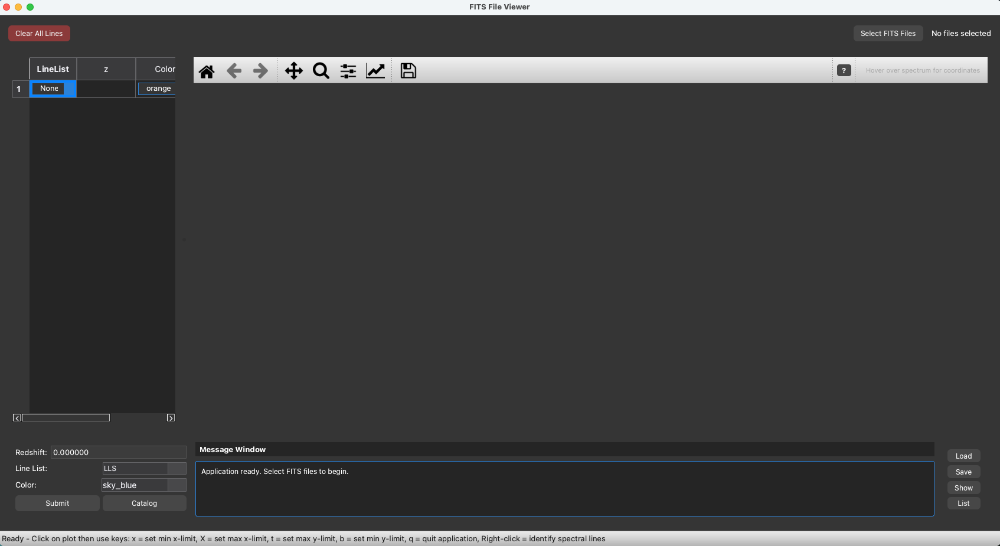
*Figure 1: Main interface of MultispecViewer showing spectrum display, absorber manager, and control panels.*

## Usage

MultispecViewer can be run from the command line using:

```bash
python /path/to/rbcodes/GUIs/multispecviewer/rb_multispec.py
```

For convenience, you can create an alias:

```bash
alias multispec='python /path/to/rbcodes/GUIs/multispecviewer/rb_multispec.py'
```

Then simply run:

```bash
multispec
```

### Command Line Options

```
usage: rb_multispec.py [-h] [-c] [-v] [-e] [filenames [filenames ...]]

rb_multispec - A tool for visualizing spectral data

positional arguments:
  filenames          FITS files to load automatically on startup

optional arguments:
  -h, --help         show this help message and exit
  -c, --classic      Run the classic version of multispecviewer
  -v, --version      Display version information
  -e, --examples     Display detailed usage examples
```

### Loading Files from Command Line

You can load FITS files directly from the command line:

```bash
# Load a single file
multispec file.fits

# Load multiple files
multispec file1.fits file2.fits

# Use wildcards
multispec *.fits

# Specify full paths
multispec /path/to/data/file.fits

# Mix files from different directories
multispec dir1/file1.fits dir2/file2.fits
```

Use the `-e` or `--examples` flag to see more detailed usage examples:

```bash
multispec --examples
```

## Features

### Interface

The MultispecViewer interface consists of several components:

- A toolbar for selecting FITS files and clearing displayed lines
- A **status bar** in the toolbar showing cursor position in spectral coordinates (see below)
- A `?` **help button** in the toolbar for quick access to keyboard shortcuts
- A main plotting area for displaying spectra
- A redshift input panel for applying and cataloging redshifts
- A message box for displaying status information
- An absorber manager for cataloging multiple systems
- Action buttons for loading, saving, and displaying identified lines

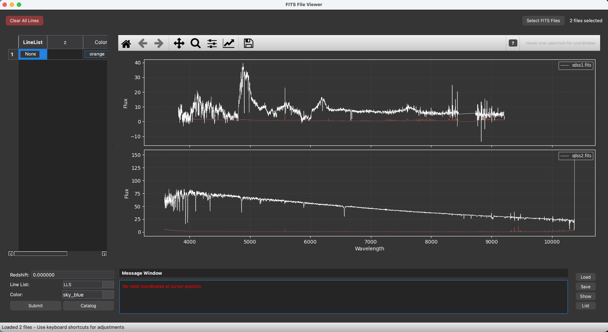
*Figure 2: Key components of the MultispecViewer interface.*

### Spectral Coordinates Status Bar

A status bar in the toolbar continuously shows the cursor's spectral position as you hover over any spectrum panel:

- **λ** — observed wavelength at the cursor in Ångströms
- **Δv** — velocity offset from the nearest line in the active line list, at the current redshift

When no line list is selected ("None"), the status bar still shows λ and computes Δv at z=0 (useful for identifying Milky Way lines). The display updates in real time on mouse movement.

### Loading Data

You can load data in two ways:

1. **Command Line**: Specify FITS files when launching the application:
   ```bash
   multispec file1.fits file2.fits
   ```

2. **GUI**: Click the "Select FITS Files" button, then navigate to and select one or more FITS format spectral files.

The spectra will be loaded and displayed in the main plotting area.

### Navigation Controls

MultispecViewer supports the following keyboard shortcuts for navigating the display:

| Key | Action |
|-----|--------|
| `x` | Set minimum x-limit to cursor position |
| `X` | Set maximum x-limit to cursor position |
| `t` | Set maximum y-limit to cursor position (per panel) |
| `b` | Set minimum y-limit to cursor position (per panel) |
| `Y` | Manually input y-limits range |
| `[` | Shift view left by one viewport width |
| `]` | Shift view right by one viewport width |
| `o` | Zoom out (x-axis) |
| `r` | Reset view to original state |
| `R` | Clear all line identifications and any fit overlays |
| `h` / `H` | Show help window |
| `?` button | Show help window (toolbar button) |
| `q` | Quit application |

### Display Controls

| Key | Action |
|-----|--------|
| `a` | Autoscale y-axis of **all** panels to flux visible in the current x-range |
| `A` | Autoscale y-axis of the **current panel only** to flux in the current x-range |
| `L` | Toggle line labels on/off (vertical lines remain; useful when absorbers overlap) |
| `S` | Increase smoothing (convolution kernel size) |
| `U` | Decrease smoothing (convolution kernel size) |

The `a`/`A` autoscale keys work like IRAF's `y` key: they compute the min/max flux within the currently visible x-range and rescale the y-axis accordingly, rather than using the global flux range.

### Quick Line Fitting

Line profiles can be fit with two keystrokes directly on the canvas. Both methods require two cursor clicks that define the fit window **and** the local continuum: the flux values at the two clicked positions set the left and right continuum levels, so a tilted continuum is fully supported. The fit runs on the panel under the cursor.

| Keys | Action |
|------|--------|
| `g` → `g` | Gaussian fit. Click left edge, then right edge of the line. Draws an orange model overlay and updates z in the main widget (if a line list is active). |
| `c` → `c` | Centre-of-mass (CoM) centroid. Same two-click interaction. Draws a cyan marker at the centroid and updates z. |
| `Z` | Revert to the previous z (before the last quick fit). Press again to toggle back. |
| `R` | Clear the fit overlay and cancel any pending fit keystroke. |

**Notes:**
- Pressing any key other than the pending one (e.g. `g` while a `c` fit is pending) cancels the pending fit and shows a message.
- If no line list is selected when the fit completes, the centroid and FWHM are still reported, but z is not updated.
- Half-profile fits are supported: the two anchor points can bracket just one side of a line.
- Absorption vs emission is detected automatically from the sign of the continuum-subtracted flux sum.

### Advanced Line Fitting

Press `G` → `G` to open the **Advanced Fit dialog** for multi-Gaussian fitting with z ± error output. The two `G` keypresses define the wavelength window that is zoomed into when the dialog opens.

#### Opening the dialog

Position the cursor to the left edge of the region of interest and press `G`, then move to the right edge and press `G` again. The dialog opens showing only the selected window.

#### Dialog controls

| Control | Description |
|---------|-------------|
| **Smooth (kernel)** spinbox | Convolve the displayed spectrum with a Box1D kernel before fitting. Odd values only; use 1 for no smoothing. |
| **Linelist** dropdown | Select or change the line list. The choice is transmitted back to the main GUI when "Apply" is clicked. |
| **z guess** field | Starting redshift for the fit. Edit directly or use **Shift+C** on the canvas to set it from the cursor (uses Ion 1 rest wavelength). |
| **Lines to fit** spinbox | Number of Gaussian components (1–5). Only that many ion dropdowns are shown; unused slots are hidden. |
| **Ion 1…N** dropdowns | Select the ionic transitions to fit. Choosing Ion 1 auto-populates subsequent slots with the next entries in the line list. |
| **Auto continuum** | Continuum from the median of the first and last N edge pixels in the current view (default N = 15). |
| **Manual continuum** | Press `d` → `d` on the canvas to set two anchor points for a linear continuum. |
| **Edge pixels** spinbox | Number of pixels used per side for the auto-continuum median. |
| **Weight by flux errors** checkbox | Use the error spectrum as inverse-variance weights in the fit. Uncheck for unweighted least-squares. |
| **Fit** button | Run the fit. Enabled once at least one ion is selected. |
| **Advanced…** button | Open the constraints dialog to edit initial guesses, bounds, and toggle tie-sigma / fix-z options. |

#### Canvas keystrokes inside the dialog

| Key | Action |
|-----|--------|
| `Shift+C` | Set z_guess from cursor wavelength (divides by Ion 1 rest wavelength) |
| `d` → `d` | Set two manual continuum anchor points |
| `x` / `X` | Set left / right x-limit |
| `[` / `]` | Pan left / right by one viewport width |
| `t` / `b` | Set y max / y min to cursor position |
| `r` | Reset view to full spectrum |

#### Fitting constraints dialog (Advanced…)

Accessible after an initial fit. Allows editing:
- Initial parameter guesses, lower bounds, and upper bounds for each parameter
- **Tie sigmas** — all components share a single σ
- **Fix z** — z is held at z_guess; only amplitudes and σ are free

#### Results

Results appear in the text area below the fit button. For each component:
- σ (rest frame, Å) ± error
- FWHM (Å and km/s in the observed frame)
- Amplitude ± error
- Equivalent width (Å, observed frame, trapezoidal integration)

When two or more components are fit, amplitude and EW ratios are reported.

#### Action buttons

| Button | Action |
|--------|--------|
| **Copy to clipboard** | Copy the full results text to the clipboard |
| **Export to file** | Save results text to a `.txt` file |
| **Apply z + linelist to main** | Push the fitted z and the current linelist back to the main GUI (also saves z for `Z`-key revert) |
| **Add to absorbers** | Add the fitted z and linelist as a new entry in the absorber manager |
| **Close** | Dismiss the dialog |

### Quick Line Identification

Press the following keys with the cursor positioned at a spectral feature to identify it:

| Key | Line |
|-----|------|
| `C` | CIV doublet (1548, 1550) |
| `M` | MgII doublet (2796, 2803) |
| `F` | FeII multiplet (2600, 2586, 2382) |
| `6` | OVI doublet (1031, 1037) |
| `4` | SiIV doublet (1393, 1402) |
| `8` | NeVIII doublet (778, 770) |
| `2` | Lyb/Lya |
| `1` | Lya/Lyb |

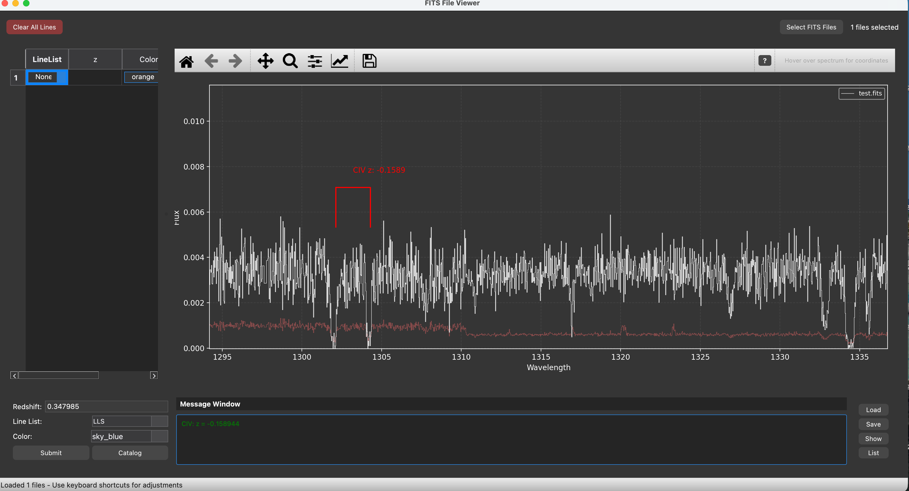
*Figure 3: Example of quick line identification using keyboard shortcuts.*

Right-clicking anywhere on the spectrum opens a dialog with a complete list of lines from the selected line list at the clicked wavelength.

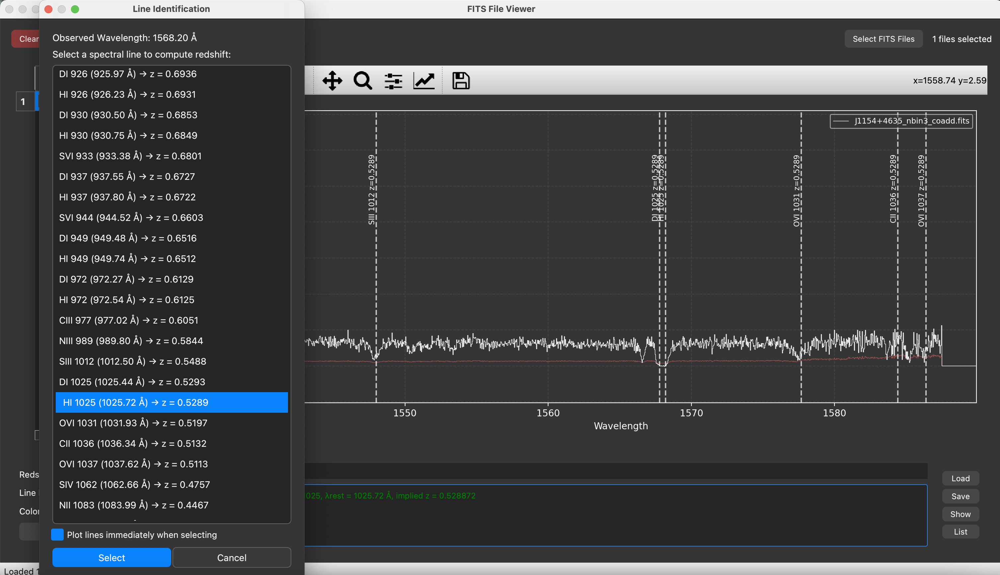
*Figure 4: Line identification dialog from right-clicking on a feature.*

### Redshift Controls

1. Enter a redshift value in the input field
2. Select a line list from the dropdown menu (choose "None" to clear lines without applying a new redshift)
3. Choose a color for the lines
4. Click "Submit" to mark lines at the specified redshift

Clicking "Catalog" adds the current redshift to the absorber manager for reference.

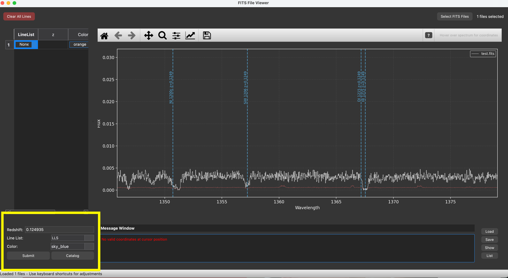
*Figure 5: Redshift input widget and absorber cataloging.*

### Velocity Plot Analysis with vStack

The vStack feature allows you to analyze absorption lines in velocity space:

| Key | Action |
|-----|--------|
| `v` | Launch vStack with default velocity window (±1000 km/s) |
| `V` | Launch vStack with custom velocity window (prompts for limits) |
| `>` | Navigate to next page of lines in vStack |
| `<` | Navigate to previous page of lines in vStack |
| `w` | Toggle line detection status (cycles: Non-Detection → Detection → Blended → Low-Confidence) |
| `S` | Save line identifications and return to main display |
| `Y` | Manually set y-limits for the current vStack panel |

vStack replaces the spectrum display in the main window. Pressing `S` saves all flagged detections to the line list and restores the original spectral view.

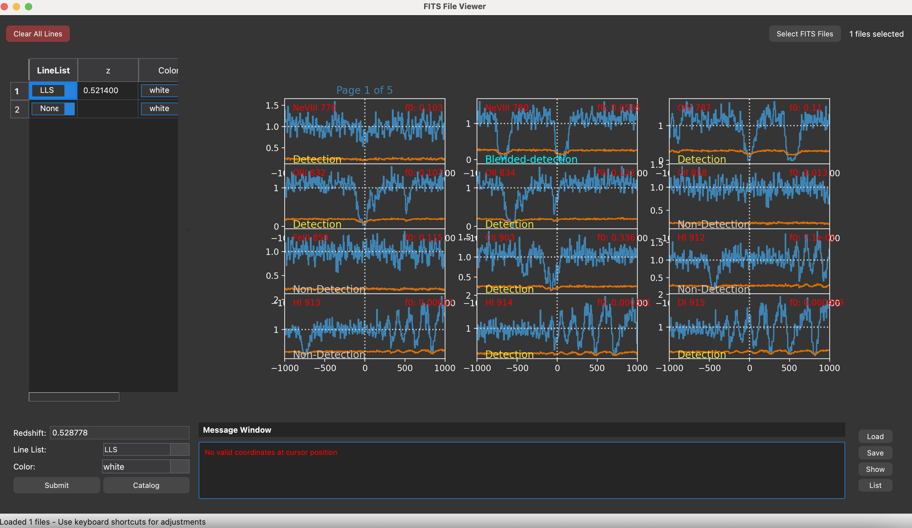
*Figure 6: vStack interface for analyzing absorber lines in velocity space.*

### Help Dialog

Press `h`/`H` or click the `?` button in the toolbar to open the help dialog. The dialog is organized into tabs:

- **Navigation** — x/y limit controls, pan keys, reset, quit
- **Display** — smoothing, autoscale (`a`/`A`), label toggle (`L`)
- **Quick Line ID** — one-key line identification shortcuts
- **Quick Fit** — `g`+`g`, `c`+`c`, and `Z` key reference
- **Advanced Fit** — `G`+`G` dialog usage summary
- **vStack** — velocity plot controls
- **Overview** — general usage notes

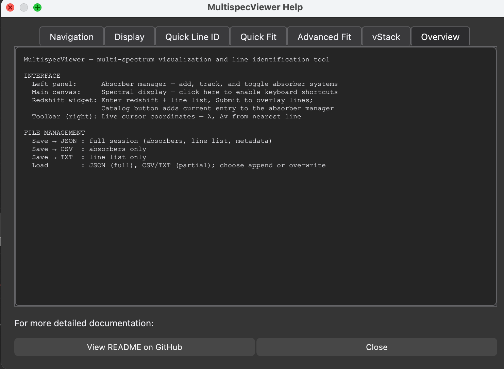
*Figure 13: Tabbed help dialog showing the Overview tab.*

### Action Buttons

| Button | Action |
|--------|--------|
| Clear All Lines | Remove all line identifications from the display |
| Load | Load previously saved line identifications and absorber systems |
| Save | Save current line identifications and absorber systems |
| Show | Toggle visibility of all identified lines |
| List | Display a table of all identified lines |


## Complete Workflow Examples

### Identifying and Cataloging an Absorber

Here's a typical workflow for identifying and cataloging an absorber:

1. **Load spectral data**:
   - Use command line: `multispec file1.fits file2.fits`
   - Or click "Select FITS Files" and choose your FITS files
   - The spectra will be displayed in the main window

2. **Initial redshift identification**:
   - Right-click on a spectral feature
   - Select a possible line from the dialog to calculate the implied redshift
   - The redshift will be applied to the redshift input widget

3. **Apply redshift and check for additional lines**:
   - Verify the selected line list in the redshift widget
   - Choose a color for the lines
   - Click "Submit" to mark all lines at that redshift
   - Visually inspect the marked lines to confirm the identification

4. **Autoscale y-axis after zooming**:
   - Zoom into a region of interest using `x`/`X`
   - Press `a` to rescale all panels to the visible flux range, or `A` to rescale only the current panel

5. **Detailed analysis with vStack**:
   - Position your cursor on the spectrum and press `v` for default velocity windows or `V` to set custom velocity limits
   - Navigate through pages of lines using `<` and `>` keys
   - Mark each line as Detection, Non-Detection, Blended, or Low-Confidence using the `w` key
   - Press `S` to save all marked lines and return to the main display

6. **Catalog the absorber system**:
   - Click "Catalog" to add the current redshift system to the absorber manager
   - The absorber will appear in the left panel with its redshift, line list, and color
   - Use the checkbox to toggle visibility of the system

7. **Save your work**:
   - Click the "Save" button to save your line identifications and absorber systems
   - Choose a filename and format (JSON recommended for complete data)
   - Add optional metadata when prompted


### Measuring a Line Centroid or Fitting a Gaussian

Quick workflow for measuring the centre wavelength of a spectral line and updating the current redshift:

1. Zoom into the line of interest using `x`/`X` and press `a` to rescale y.
2. Press `g` at the left edge of the line (at the appropriate continuum flux level) — a status message confirms the first anchor.
3. Press `g` again at the right edge. The Gaussian fit runs automatically:
   - An orange model overlay is drawn.
   - If a line list is active, the nearest line is identified and z is updated in the main widget.
   - The message box reports centroid, FWHM (Å and km/s), and Δv from the previous z.
4. Press `Z` to revert z if the identification is wrong; press `Z` again to toggle back.
5. Press `R` to remove the overlay and clear any pending fit state.

Use `c`+`c` instead of `g`+`g` for a centre-of-mass centroid (no Gaussian assumption; more robust on asymmetric profiles).

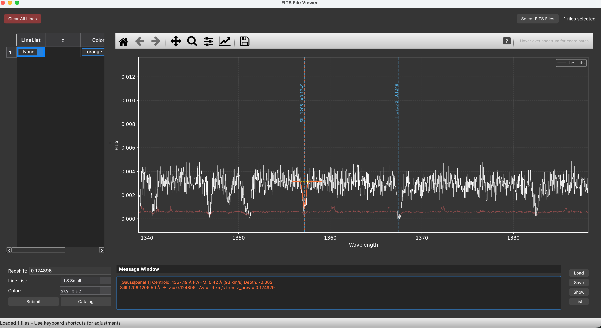
*Figure 10: Quick Gaussian fit (`g`+`g`) showing the orange model overlay, linear continuum, and fit results in the message box.*

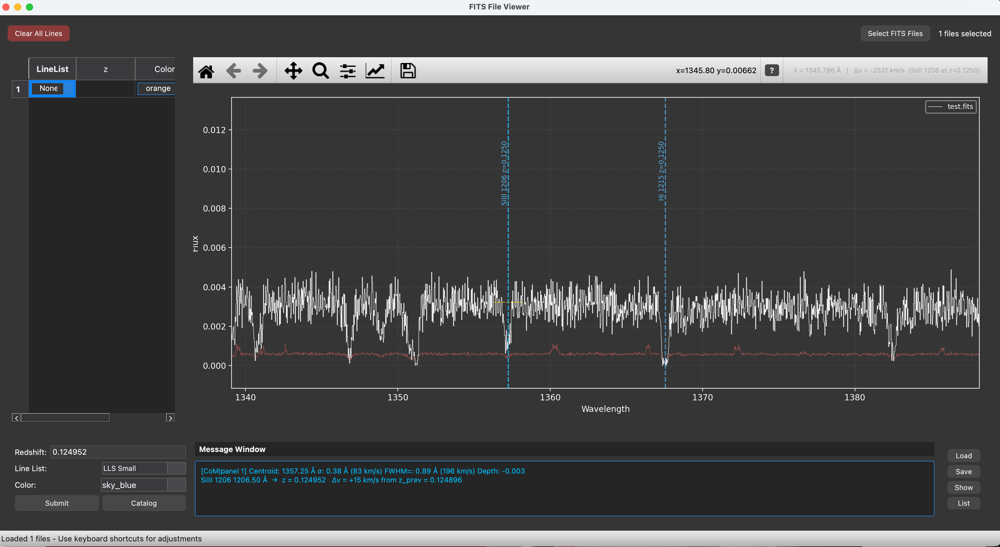
*Figure 11: Quick centre-of-mass centroid (`c`+`c`) showing the cyan centroid marker.*

### Advanced Gaussian Fitting with z ± Error

For a precise redshift measurement from one or more lines simultaneously:

1. Position the cursor to the left of the region of interest and press `G`; move to the right edge and press `G` again.
2. The Advanced Fit dialog opens, zoomed to your selected window.
3. Set the number of lines in the **Lines to fit** spinbox and choose the ionic transitions from the dropdowns. Selecting Ion 1 auto-populates the remaining slots.
4. Adjust the z_guess field or use **Shift+C** on the dialog canvas to set it from the cursor position.
5. Optionally adjust the continuum: switch to Manual and press `d`→`d` to define two anchor points, or tune the edge-pixel count for the auto median.
6. Click **Fit**. Results appear in the text area showing z ± error, σ, FWHM, amplitude, and EW per component.
7. Click **Advanced…** to fine-tune bounds or enable tie-sigma / fix-z before re-fitting.
8. Click **Apply z + linelist to main** to push the result back to the main GUI, or **Add to absorbers** to catalog the system.

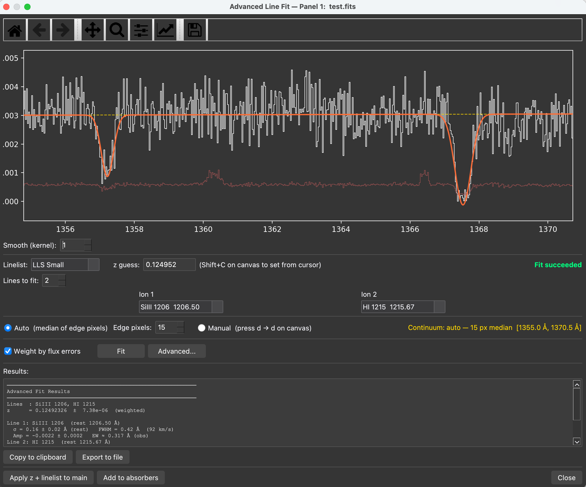
*Figure 12: Advanced Fit dialog showing multi-Gaussian fit overlay, ion dropdowns, and z ± error results.*

### Identifying Multiple Systems

To identify multiple absorber systems:

1. Follow the workflow above to identify your first system
2. After cataloging the first system, clear the current redshift markings by pressing `R`
3. Identify a feature from a different system using right-click or direct redshift input
4. Apply a different color to distinguish the second system from the first
5. Confirm the identification and add it to the catalog
6. Repeat for additional systems

When many absorbers overlap and labels clutter the view, press `L` to toggle all line labels off. The vertical tick marks remain visible; pressing `L` again restores the labels.


### Managing Line Identifications

After identifying multiple systems:

1. Click the "List" button to view all identified lines in a tabular format
2. Use the "Show" button to toggle the visibility of all identified lines
3. Use the absorber manager checkboxes to control which systems are displayed
4. Click the "Save" button to save all identifications

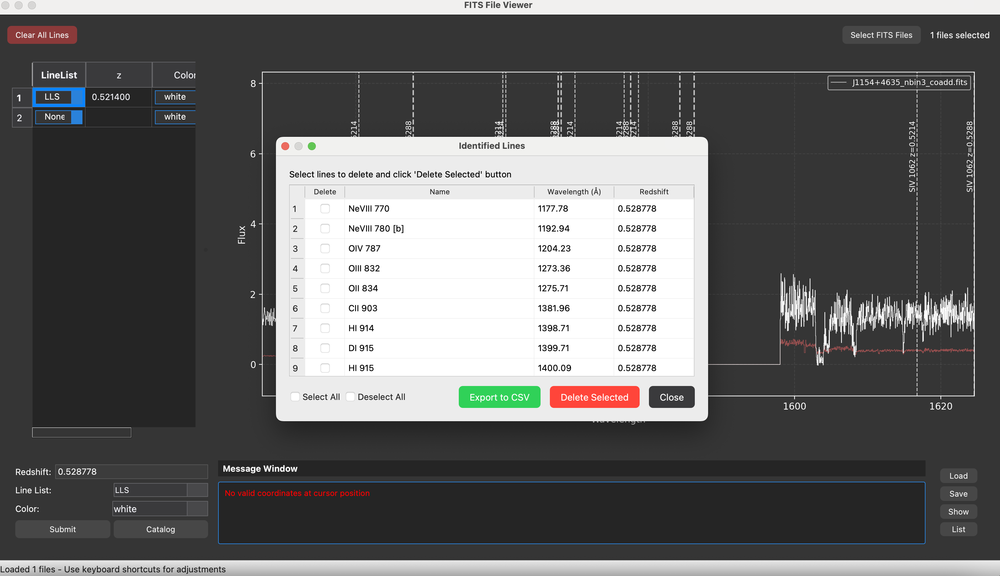
*Figure 7: Line list dialog showing all identified lines.*


## Classic vs New Version

### Classic Version

The classic version provides the core functionality in a streamlined interface:
- Multiple spectrum display
- Redshift application
- Line identification
- Basic navigation

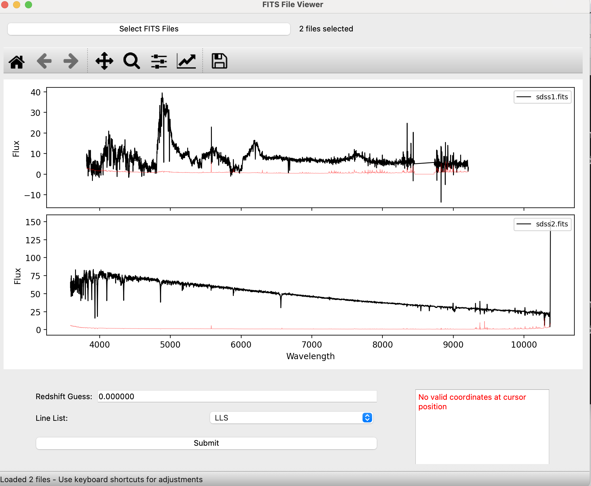
*Figure 8: Classic version of MultispecViewer.*

### New Version

The new version adds several enhancements:
- Dark theme for improved visibility
- Absorber manager for cataloging multiple systems
- Color selection for different redshift systems
- Spectral coordinates status bar in the toolbar
- `?` help button in the toolbar; tabbed help dialog
- Autoscale y-axis to visible x-range (`a`/`A` keys)
- Line label toggle (`L` key)
- Enhanced metadata display
- Improved performance and error handling
- Action buttons for common tasks (Load, Save, Show, List)
- Quick line fitting with `g`+`g` (Gaussian) and `c`+`c` (CoM) keystrokes
- Advanced multi-Gaussian fitting dialog (`G`+`G`) with z ± error output


*Figure 9: New version of MultispecViewer with enhanced features.*


## Reconciling Line Identifications from Multiple Sessions

MultispecViewer includes a utility function for reconciling line identifications from multiple saved files. This is particularly useful when combining line catalogs from different observers or analysis sessions.

Lines with the same transition name and rest-frame velocity separation within the threshold are merged into a single entry (mean redshift and mean wavelength). Each candidate line is compared against the **first entry** (anchor) of its cluster, so the threshold is absolute — a line 50 km/s from the anchor is never merged even if each successive pair is within 20 km/s.

### Using the Line Reconciliation Tool

```python
from rbcodes.GUIs.multispecviewer.utils import reconcile_linelists

# Combine line identifications from multiple files
input_files = [
    '/path/to/session1_lines.json',
    '/path/to/session2_lines.txt',
    '/path/to/session3_lines.csv'
]

# Reconcile lines with the same name within 20 km/s of each other
reconciled_lines, absorber_systems = reconcile_linelists(
    input_files,
    velocity_threshold=20,                 # Velocity difference threshold in km/s
    output_file='combined_catalog.json',   # Output file (optional)
    create_absorber_df=True                # Create absorber systems DataFrame
)

print(f"Combined {len(input_files)} files into {len(reconciled_lines)} unique line identifications")
print(f"Identified {len(absorber_systems)} distinct absorber systems")
```


## Tips and Best Practices

### Command Line Usage

- Use wildcards to load multiple files: `multispec *.fits`
- For files with spaces in names, use quotes: `multispec "My Data/file.fits"`
- Run classic mode with files: `multispec -c file1.fits file2.fits`
- View detailed examples: `multispec --examples`

### Keyboard Navigation

- Use `x`/`X` to set x-limits, then `a` or `A` to rescale y to the visible flux range
- Press `r` to reset to the original view if you get lost
- Use `R` to clear line identifications without changing the view
- Press `h`/`H` or the `?` toolbar button to open the tabbed help dialog

### Redshift Identification

- Start by identifying strong, unambiguous features like MgII, CIV, or Lyman-alpha
- Use right-click to see all possible line identifications at a given wavelength
- After applying a redshift, check for other expected lines at the same redshift
- If uncertain about a feature, use vStack (`v` or `V`) for detailed analysis
- The status bar shows Δv from the nearest line as you move the cursor — useful for quickly checking if a feature matches your current redshift

### Line Fitting

- The two anchor clicks for `g`+`g` and `c`+`c` set both the window boundaries **and** the continuum level — place them at the expected continuum flux on each side of the line.
- A tilted continuum is fully supported; clicking at different y-values on each side defines a sloped baseline.
- You can fit half of a line profile by placing one anchor at the line peak — useful when the other wing is blended.
- Pressing any unrelated key while a fit is pending (e.g. pressing `x` after the first `g`) cancels the pending fit.
- `Z` is a single-level undo for z; it swaps the current z with the one before the last fit. A second `Z` toggles back.
- In the Advanced Fit dialog, use **Shift+C** to quickly anchor z_guess to a visible feature rather than typing it.
- For noisy spectra, smooth with the kernel spinbox before fitting; the results box labels smoothed fits with a warning.
- After a successful fit, click **Advanced…** to tighten bounds or tie sigmas before re-fitting — the previous popt is used as the new starting point.

### vStack Analysis

- Use `V` to specify custom velocity limits for better visualizing line profiles
- Mark line detections systematically using the `w` key
- Don't forget to press `S` to save your work before returning to the main display
- Use `Y` to adjust y-limits for better visualization of line profiles

### Multiple Absorber Systems

- Use different colors for different absorber systems
- Press `L` to toggle line labels when many absorbers overlap and the display becomes crowded
- Use the absorber manager checkboxes to toggle visibility of individual systems
- Use the "Clear All Lines" button to remove all line identifications at once
- Save your work frequently using the "Save" button

### File Management

- Use JSON format for complete data preservation (includes all metadata)
- CSV and TXT formats are available for compatibility with other tools
- When loading a saved JSON, absorbers are restored with their saved visibility state — only checked absorbers will be plotted
- Use consistent file naming conventions for your saved data


## Version Information

MultispecViewer follows semantic versioning (MAJOR.MINOR.PATCH):

- MAJOR version changes indicate incompatible API changes
- MINOR version changes add functionality in a backward-compatible manner
- PATCH version changes make backward-compatible bug fixes

You can check the current version by running:

```bash
multispec --version
```

## Development

MultispecViewer is part of the rbcodes package for spectroscopic analysis. It utilizes:
- PyQt5 for the graphical interface
- Matplotlib for plotting
- linetools for spectral data handling
- astropy for astronomical calculations

## Troubleshooting

### Common Issues

- **No files selected**: Ensure you've clicked "Select FITS Files" and chosen valid FITS files or specified files on the command line
- **No error spectrum**: If no error spectrum is found, the program will assume 5% of flux values
- **No lines visible after applying redshift**: Check that the selected line list contains lines within your wavelength range
- **vStack not launching**: Ensure you have a redshift and line list selected before pressing `v` or `V`
- **Absorbers not visible after loading a JSON**: Check the absorber manager — absorbers are restored with their saved visibility state. Check the checkbox next to each system to display it.
- **Quick fit "Only N finite pixels" error**: The fit window is too narrow or lands in a masked/NaN region. Widen the window by moving the second anchor further from the first.
- **Quick fit z not updated after fit**: No line list is selected, or the fit centroid does not match any line in the current list within the search tolerance. The centroid is still reported in the message box.
- **Advanced Fit "Fit failed" message**: The initial guesses or bounds may be too tight. Click **Advanced…** to inspect and relax them, or adjust z_guess with Shift+C before re-fitting.

### Error Messages

Watch the message box at the bottom of the screen for helpful error messages and status updates.

### Getting Help

Press `h`/`H` or click the `?` toolbar button to open the tabbed help dialog with keyboard shortcuts and quick reference information.
