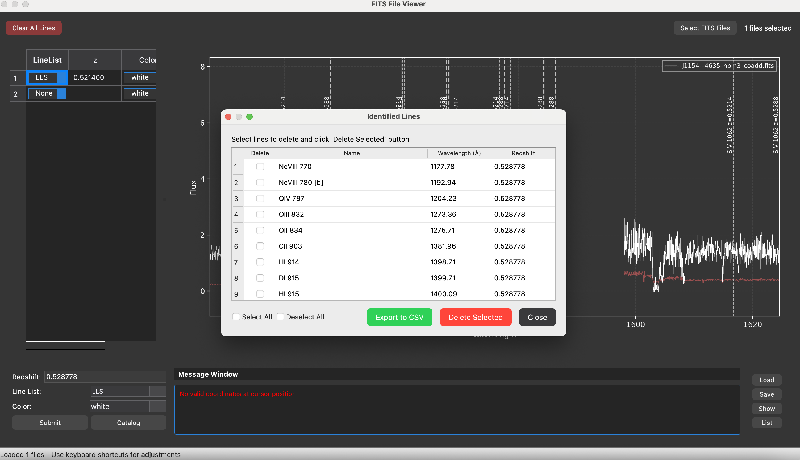

# MultispecViewer v1.0.0

A tool for visualizing and analyzing multiple spectroscopic datasets simultaneously.

## Overview

MultispecViewer is a PyQt-based GUI tool that allows users to:

- Load and display multiple FITS spectra simultaneously
- Apply redshifts and identify spectral features
- Perform quick identification of common ionic species
- Adjust view limits interactively
- Catalog multiple absorber systems at different redshifts
- Use velocity plots (vStack) for detailed line analysis
- Save and load line identifications and absorber systems


*Figure 1: Main interface of MultispecViewer showing spectrum display, absorber manager, and control panels.*

## Usage

MultispecViewer can be run from the command line using:

```bash
python /path/to/rbcodes/GUIs/multispecviewer/rb_multispec.py
```

For convenience, you can create an alias:

```bash
alias multispec='python /path/to/rbcodes/GUIs/multispecviewer/rb_multispec.py'
```

Then simply run:

```bash
multispec
```

### Command Line Options

```
usage: rb_multispec.py [-h] [-c] [-v] [-e] [filenames [filenames ...]]

rb_multispec - A tool for visualizing spectral data

positional arguments:
  filenames          FITS files to load automatically on startup

optional arguments:
  -h, --help         show this help message and exit
  -c, --classic      Run the classic version of multispecviewer
  -v, --version      Display version information
  -e, --examples     Display detailed usage examples
```

### Loading Files from Command Line

You can now load FITS files directly from the command line:

```bash
# Load a single file
multispec file.fits

# Load multiple files
multispec file1.fits file2.fits

# Use wildcards
multispec *.fits

# Specify full paths
multispec /path/to/data/file.fits

# Mix files from different directories
multispec dir1/file1.fits dir2/file2.fits
```

Use the `-e` or `--examples` flag to see more detailed usage examples:

```bash
multispec --examples
```

## Features

### Interface

The MultispecViewer interface consists of several components:

- A toolbar for selecting FITS files and clearing displayed lines
- A main plotting area for displaying spectra
- A redshift input panel for applying and cataloging redshifts
- A message box for displaying status information
- An absorber manager for cataloging multiple systems (new version only)
- Action buttons for loading, saving, and displaying identified lines


*Figure 2: Key components of the MultispecViewer interface.*

### Loading Data

You can load data in two ways:

1. **Command Line**: Specify FITS files when launching the application:
   ```bash
   multispec file1.fits file2.fits
   ```

2. **GUI**: Click the "Select FITS Files" button, then navigate to and select one or more FITS format spectral files.

The spectra will be loaded and displayed in the main plotting area.

### Navigation Controls

MultispecViewer supports the following keyboard shortcuts for navigating the display:

| Key | Action |
|-----|--------|
| `x` | Set minimum x-limit to cursor position |
| `X` | Set maximum x-limit to cursor position |
| `t` | Set maximum y-limit to cursor position (per panel) |
| `b` | Set minimum y-limit to cursor position (per panel) |
| `Y` | Manually input y-limits range |
| `[` | Shift view left by one viewport width |
| `]` | Shift view right by one viewport width |
| `o` | Zoom out (x-axis) |
| `r` | Reset view to original state |
| `R` | Clear all line identifications |
| `H` | Show help window |
| `q` | Quit application |

### Spectral Processing

| Key | Action |
|-----|--------|
| `S` | Increase smoothing (convolution kernel size) |
| `U` | Decrease smoothing (convolution kernel size) |

### Quick Line Identification

Press the following keys with the cursor positioned at a spectral feature to identify it:

| Key | Line |
|-----|------|
| `C` | CIV doublet (1548, 1550) |
| `M` | MgII doublet (2796, 2803) |
| `F` | FeII multiplet (2600, 2586, 2382) |
| `6` | OVI doublet (1031, 1037) |
| `4` | SiIV doublet (1393, 1402) |
| `8` | NeVIII doublet (778, 770) |
| `2` | Lyb/Lya |
| `1` | Lya/Lyb |


*Figure 3: Example of quick line identification using keyboard shortcuts.*

Right-clicking anywhere on the spectrum opens a dialog with a complete list of lines from the selected line list at the clicked wavelength.


*Figure 4: Line identification dialog from right-clicking on a feature.*

### Redshift Controls

1. Enter a redshift value in the input field
2. Select a line list from the dropdown menu
3. Choose a color (new version only)
4. Click "Submit" to mark lines at the specified redshift

In the new version, clicking "Catalog" adds the current redshift to the absorber manager for reference.


*Figure 5: Redshift input widget and absorber cataloging.*

### Velocity Plot Analysis with vStack

The vStack feature allows you to analyze absorption lines in velocity space:

| Key | Action |
|-----|--------|
| `v` | Launch vStack with default velocity window (±1000 km/s) |
| `V` | Launch vStack with custom velocity window (prompts for limits) |
| `>` | Navigate to next page of lines in vStack |
| `<` | Navigate to previous page of lines in vStack |
| `w` | Toggle line detection status in vStack (cycles through Non-Detection, Detection, Blended-detection, Low-Confidence) |
| `S` | Save line identifications and return to main display |
| `Y` | Manually set y-limits for the current vStack panel |


*Figure 6: vStack interface for analyzing absorber lines in velocity space.*

### Action Buttons

The new version includes several action buttons:

| Button | Action |
|--------|--------|
| Clear All Lines | Remove all line identifications from the display |
| Load | Load previously saved line identifications and absorber systems |
| Save | Save current line identifications and absorber systems |
| Show | Toggle visibility of all identified lines |
| List | Display a table of all identified lines |


## Complete Workflow Examples

### Identifying and Cataloging an Absorber

Here's a typical workflow for identifying and cataloging an absorber:

1. **Load spectral data**:
   - Use command line: `multispec file1.fits file2.fits`
   - Or click "Select FITS Files" and choose your FITS files
   - The spectra will be displayed in the main window


2. **Initial redshift identification**:
   - Right-click on a spectral feature
   - Select a possible line from the dialog to calculate the implied redshift
   - The redshift will be applied to the redshift input widget


3. **Apply redshift and check for additional lines**:
   - Verify the selected line list in the redshift widget
   - Choose a color for the lines
   - Click "Submit" to mark all lines at that redshift
   - Visually inspect the marked lines to confirm the identification


4. **Detailed analysis with vStack**:
   - Position your cursor on the spectrum and press `v` for default velocity windows or `V` to set custom velocity limits
   - Navigate through pages of lines using `<` and `>` keys
   - Mark each line as Detection, Non-Detection, Blended, or Low-Confidence using the `w` key
   - Press `S` to save all marked lines and return to the main display


5. **Catalog the absorber system**:
   - Click "Catalog" to add the current redshift system to the absorber manager
   - The absorber will appear in the left panel with its redshift, line list, and color
   - Use the checkbox to toggle visibility of the system


6. **Save your work**:
   - Click the "Save" button to save your line identifications and absorber systems
   - Choose a filename and format (JSON recommended for complete data)
   - Add optional metadata when prompted


### Identifying Multiple Systems

To identify multiple absorber systems:

1. Follow the workflow above to identify your first system
2. After cataloging the first system, clear the current redshift markings by pressing `R`
3. Identify a feature from a different system using right-click or direct redshift input
4. Apply a different color to distinguish the second system from the first
5. Confirm the identification and add it to the catalog
6. Repeat for additional systems


### Managing Line Identifications

After identifying multiple systems:

1. Click the "List" button to view all identified lines in a tabular format
2. Use the "Show" button to toggle the visibility of all identified lines
3. Use the absorber manager checkboxes to control which systems are displayed
4. Click the "Save" button to save all identifications


*Figure 6: Line list dialog showing all identified lines.*

## Classic vs New Version

### Classic Version

The classic version provides the core functionality in a streamlined interface:
- Multiple spectrum display
- Redshift application
- Line identification
- Basic navigation


*Figure 7: Classic version of MultispecViewer.*

### New Version

The new version adds several enhancements:
- Dark theme for improved visibility
- Absorber manager for cataloging multiple systems
- Color selection for different redshift systems
- Enhanced metadata display
- Improved performance and error handling
- Action buttons for common tasks (Load, Save, Show, List)
- Better visualization of multiple absorber systems
- Help function (press `H` key)


*Figure 8: New version of MultispecViewer with enhanced features.*

## Reconciling Line Identifications from Multiple Sessions

MultispecViewer includes a utility function for reconciling line identifications from multiple saved files. This is particularly useful when combining line catalogs from different observers or analysis sessions.

### Using the Line Reconciliation Tool

You can use the line reconciliation tool directly in Python script outside the GUI:

```python
from rbcodes.GUIs.multispecviewer.utils import reconcile_linelists

# Combine line identifications from multiple files
input_files = [
    '/path/to/session1_lines.json',
    '/path/to/session2_lines.txt',
    '/path/to/session3_lines.csv'
]

# Reconcile lines that have the same name and are within 20 km/s of each other
reconciled_lines, absorber_systems = reconcile_linelists(
    input_files,
    velocity_threshold=20,                 # Velocity difference threshold in km/s
    output_file='combined_catalog.json',   # Output file (optional)
    create_absorber_df=True                # Create absorber systems DataFrame
)

print(f"Combined {len(input_files)} files into {len(reconciled_lines)} unique line identifications")
print(f"Identified {len(absorber_systems)} distinct absorber systems")
```

## Tips and Best Practices

### Command Line Usage

- Use wildcards to load multiple files: `multispec *.fits`
- For files with spaces in names, use quotes: `multispec "My Data/file.fits"`
- Run classic mode with files: `multispec -c file1.fits file2.fits`
- View detailed examples: `multispec --examples`

### Keyboard Navigation

- Use the keyboard navigation keys (`x`, `X`, `t`, `b`) for precise control of the display
- Press `r` to reset to the original view if you get lost
- Use `R` to clear line identifications without changing the view
- Press `H` at any time to see the help window with keyboard shortcuts

### Redshift Identification

- Start by identifying strong, unambiguous features like MgII, CIV, or Lyman-alpha
- Use right-click to see all possible line identifications at a given wavelength
- After applying a redshift, check for other expected lines at the same redshift
- If uncertain about a feature, use vStack (`v` or `V`) for detailed analysis

### vStack Analysis

- Use `V` to specify custom velocity limits for better visualizing line profiles
- Mark line detections systematically using the `w` key
- Don't forget to press `S` to save your work before returning to the main display
- Use `Y` to adjust y-limits for better visualization of line profiles

### Multiple Absorber Systems

- Use different colors for different absorber systems
- Use the absorber manager to toggle visibility of systems when the display gets crowded
- Use the "Clear All Lines" button to remove all line identifications at once
- Save your work frequently using the "Save" button

### File Management

- Use JSON format for complete data preservation (includes all metadata)
- CSV and TXT formats are available for compatibility with other tools
- When loading data, you can choose to append to or overwrite existing data
- Use consistent file naming conventions for your saved data

## Version Information

MultispecViewer follows semantic versioning (MAJOR.MINOR.PATCH):

- MAJOR version changes indicate incompatible API changes
- MINOR version changes add functionality in a backward-compatible manner
- PATCH version changes make backward-compatible bug fixes

You can check the current version by running:

```bash
multispec --version
```

## Development

MultispecViewer is part of the rbcodes package for spectroscopic analysis. It utilizes:
- PyQt5 for the graphical interface
- Matplotlib for plotting
- linetools for spectral data handling
- astropy for astronomical calculations

## Troubleshooting

### Common Issues

- **No files selected**: Ensure you've clicked "Select FITS Files" and chosen valid FITS files or specified files on the command line
- **No error spectrum**: If no error spectrum is found, the program will assume 5% of flux values
- **No lines visible after applying redshift**: Check that the selected line list contains lines within your wavelength range
- **vStack not launching**: Ensure you have a redshift and line list selected before pressing `v` or `V`

### Error Messages

Watch the message box at the bottom of the screen for helpful error messages and status updates.

### Getting Help

Press `H` at any time to open the help dialog with keyboard shortcuts and quick reference information.
