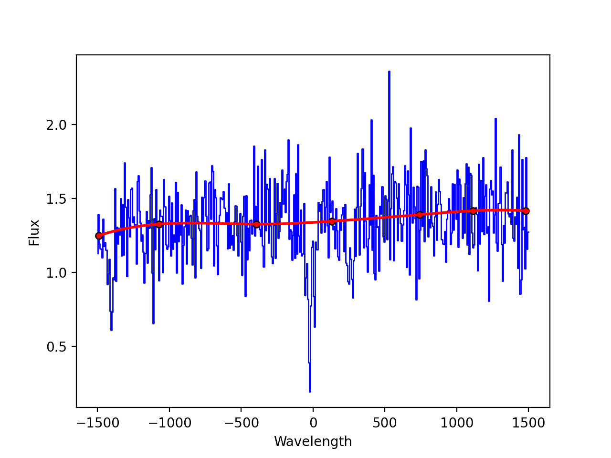
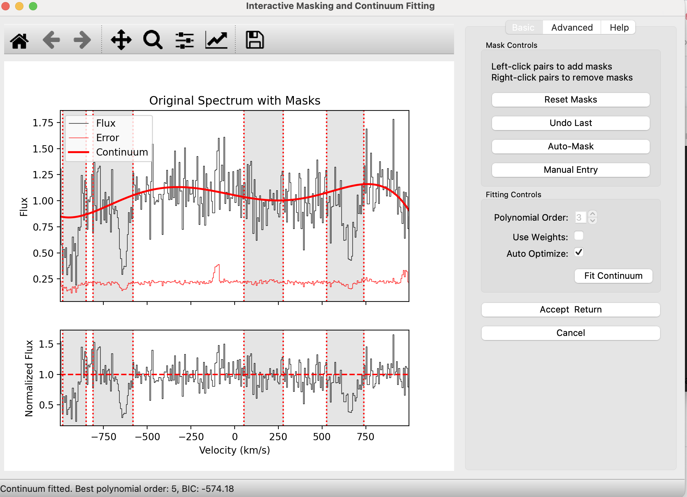
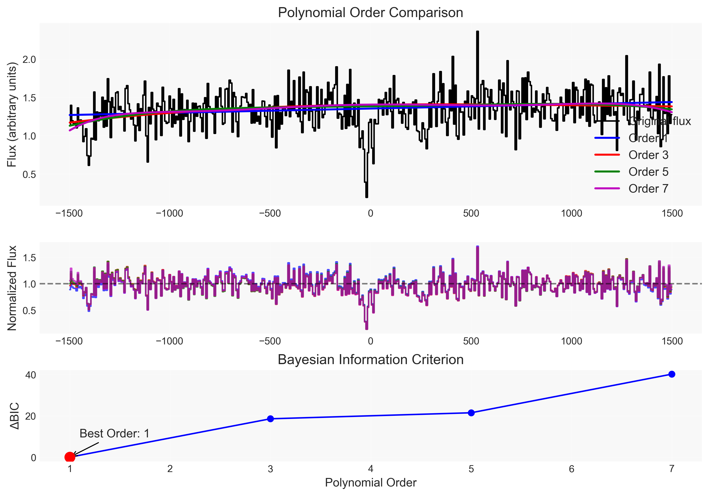
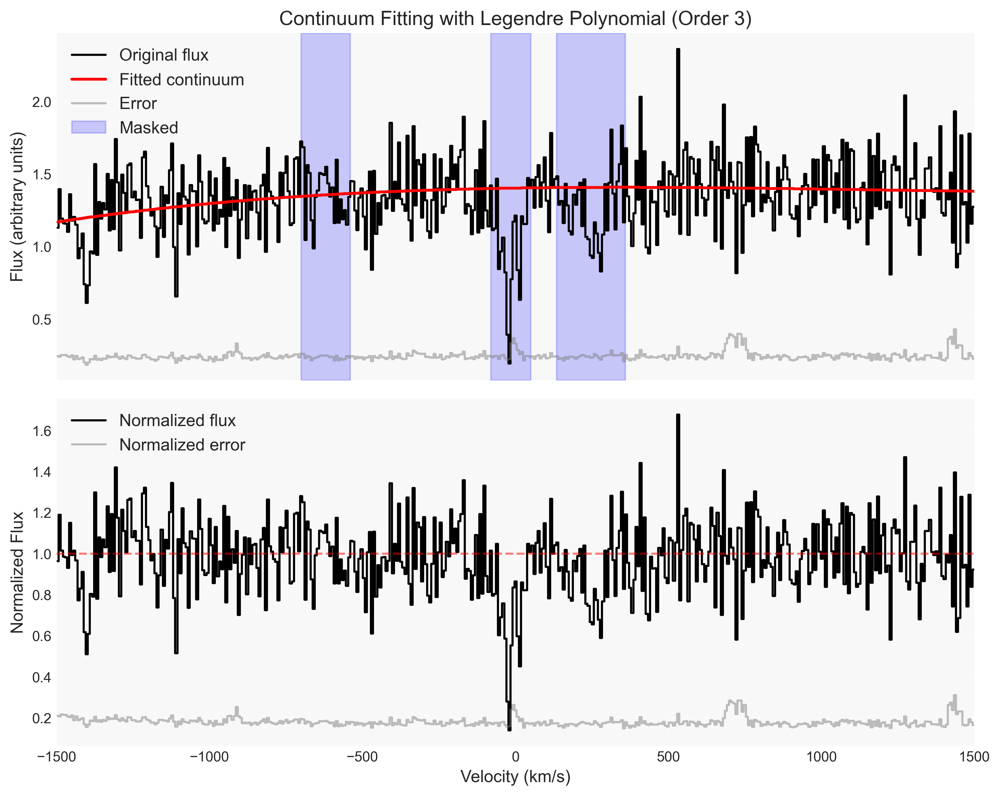
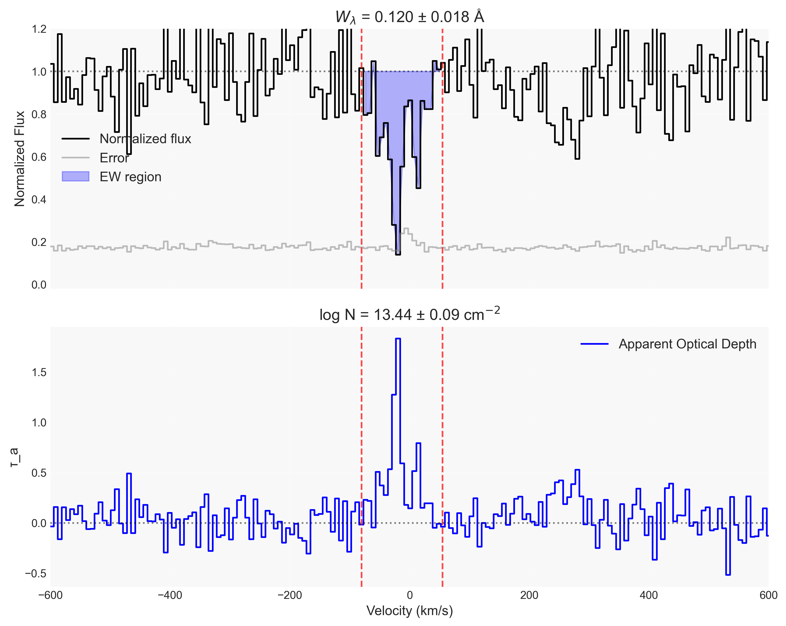
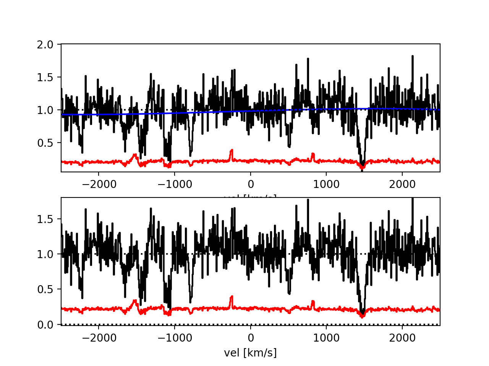

# rb_spec — Absorption Line Analysis Pipeline

[Back to Main Page](../../main_readme.md)

## Table of Contents

- [Overview](#overview)
- [Quick Start](#quick-start)
- [Loading Spectra](#loading-spectra)
- [Continuum Fitting](#continuum-fitting)
  - [Interactive Spline](#1-interactive-spline)
  - [Interactive Masking GUI](#2-interactive-masking-gui)
  - [Polynomial Fitting](#3-polynomial-fitting)
  - [RANSAC Fitting](#4-ransac-fitting)
- [Equivalent Width and Column Density](#equivalent-width-and-column-density)
- [Signal-to-Noise and Saturation](#signal-to-noise-and-saturation)
- [Visualization](#visualization)
- [Saving and Loading](#saving-and-loading)
- [Output Attributes](#output-attributes)
- [Example Applications](#example-applications)
- [Related Tools](#related-tools)

---

## Overview

`rb_spec` is the central analysis class in rbcodes. It provides a complete pipeline for absorption line spectroscopy — from loading raw spectra through continuum fitting, equivalent width measurement, and column density calculation — for both interactive and scripted workflows.

**Capabilities:**
- Load spectra from FITS, ASCII, XSpectrum1D, or numpy arrays
- Shift to absorber rest frame and slice around any transition
- Four continuum fitting methods: interactive spline, interactive masking GUI, Legendre polynomial, RANSAC
- Automatic BIC-based polynomial order optimization
- Equivalent width and AOD column density with full error propagation
- Saturation detection, SNR estimation, velocity centroid and dispersion
- Save/load full analysis state to JSON

---

## Quick Start

```python
from rbcodes.GUIs.rb_spec import rb_spec as r

spec = r.from_file('spectrum.fits', filetype='linetools')
spec.shift_spec(zabs=0.348)
spec.slice_spec(1548.2, -1500, 1500, use_vel=True)
spec.fit_continuum(mask=[-200, 200], Legendre=3)
spec.compute_EW(1548.2, vmin=-150, vmax=150, plot=True)
spec.save_slice('results.json', file_format='json')
```

---

## Loading Spectra

```python
from rbcodes.GUIs.rb_spec import rb_spec as r

# From file (auto-detects format)
spec = r.from_file('spectrum.fits', filetype='linetools')

# From numpy arrays
spec = r.from_data(wave, flux, error)
```

**Supported file types:** `'linetools'`, `'fits'`, `'ascii'`, `'p'` (pickle), `'xfits'`

After loading, shift to the absorber rest frame and slice around a transition:

```python
spec.shift_spec(zabs=0.511)
spec.slice_spec(2796.3, -1500, 1500, use_vel=True)  # velocity limits in km/s
```

---

## Continuum Fitting

### 1. Interactive Spline

```python
spec.fit_continuum(Interactive=True)
```

| Key / Click | Action |
|-------------|--------|
| Left-click | Add continuum point (median of ±2.5 px) |
| Right-click | Delete nearest point |
| `b` | Add point at exact cursor position |
| `Enter` | Fit spline through current points |
| `n` | Show normalized spectrum |
| `w` | Save continuum and exit |
| `q` | Quit without saving |



### 2. Interactive Masking GUI

```python
spec.fit_continuum_interactive(
    order=3,
    use_weights=False,
    domain=[-1000, 1000]   # velocity domain, optional
)
```

Provides a full GUI for defining mask regions and fitting a polynomial continuum.

| Key / Click | Action |
|-------------|--------|
| Left-click pairs | Define a mask region (start → end) |
| Right-click pairs | Remove masks within the selected range |
| `f` | Fit continuum with current masks |
| `a` | Accept and exit |
| `r` | Reset all masks |
| `z` | Undo last mask |
| `m` | Manual mask entry by velocity values |
| `c` / `Esc` | Cancel |

Features: real-time mask preview, automatic feature detection, BIC-optimized polynomial order.



### 3. Polynomial Fitting

Fixed order:

```python
spec.fit_continuum(
    mask=[-200, 200],       # pairs of velocity values to mask
    domain=[-1500, 1500],
    Legendre=3,
    use_weights=False
)
```

Automatic order selection via BIC:

```python
spec.fit_continuum(
    mask=[-200, 200],
    domain=[-1500, 1500],
    Legendre=True,
    optimize_cont=True,
    min_order=1,
    max_order=7
)
```



### 4. RANSAC Fitting

```python
# Window-based outlier rejection
spec.fit_continuum_ransac(window=149)

# Polynomial RANSAC
spec.fit_polynomial_ransac(degree=4, residual_threshold=0.1)
```

After any continuum fit, inspect the result:

```python
fig = spec.plot_continuum_fit(verbose=True)
```



---

## Equivalent Width and Column Density

```python
spec.compute_EW(
    transition,
    vmin=-80,
    vmax=55,
    plot=True,
    SNR=True,
    _binsize=3
)

print(f"W_λ    = {spec.W:.3f} ± {spec.W_e:.3f} Å")
print(f"log N  = {spec.logN:.2f} ± {spec.logN_e:.2f}")
print(f"v_cen  = {spec.vel_centroid:.1f} km/s")
print(f"SNR    = {spec.SNR:.1f}")
```



---

## Signal-to-Noise and Saturation

SNR is computed during `compute_EW` when `SNR=True`. Access via `spec.SNR`.

Saturation is detected automatically:

```python
result = spec.compute_EW(transition, vmin=-100, vmax=100)
if result['line_saturation']:
    print(f"Saturated — {result['saturation_fraction']:.1%} of pixels affected")
```

---

## Visualization

```python
spec.plot_continuum_fit(verbose=True)   # continuum + mask regions
spec.plot_spec()                         # full spectrum
spec.plot_slice()                        # sliced region with continuum
spec.plot_doublet(1548.2, 1550.8, vmin=-600, vmax=600)
```



---

## Saving and Loading

```python
# Save
spec.save_slice('results.json', file_format='json')  # preferred
spec.save_slice('results.p')                          # pickle

# Load
from rbcodes.GUIs.rb_spec import load_rb_spec_object
spec = load_rb_spec_object('results.json')
```

The JSON file preserves wavelength/flux/error arrays, the continuum fit, all mask information, fitting parameters, and measurement results.

---

## Output Attributes

| Attribute | Description |
|-----------|-------------|
| `wave_slice` | Sliced wavelength array |
| `flux_slice` | Sliced flux array |
| `error_slice` | Sliced error array |
| `velo` | Velocity array (km/s) |
| `cont` | Fitted continuum |
| `fnorm` | Normalized flux |
| `enorm` | Normalized error |
| `cont_mask` | Velocity masks used for continuum fitting |
| `continuum_masks` | Mask region velocity values |
| `continuum_mask_wavelengths` | Mask region wavelength values |
| `continuum_fit_params` | Method, order, and fit metadata |
| `cont_err` | Continuum uncertainty (when available) |
| `W` | Rest-frame equivalent width (Å) |
| `W_e` | EW uncertainty (Å) |
| `N` | AOD column density |
| `N_e` | Column density uncertainty |
| `logN` | log AOD column density |
| `logN_e` | log column density uncertainty |
| `vel_centroid` | EW-weighted velocity centroid (km/s) |
| `vel_disp` | Velocity dispersion (km/s) |
| `Tau` | Apparent optical depth |
| `SNR` | Signal-to-noise ratio |

---

## Example Applications

### CGM absorption in multiple systems

```python
zabs_list = [0.511, 1.026, 1.564]

for zabs in zabs_list:
    spec.shift_spec(zabs)
    spec.slice_spec(2796.3, -1500, 1500, use_vel=True)
    spec.fit_continuum_interactive(order=3)
    spec.compute_EW(2796.3, vmin=-100, vmax=100)
    spec.save_slice(f'mgii_z{zabs:.3f}.json', file_format='json')
```

### IGM Lyman series

```python
lyman_lines = [1215.67, 1025.72, 972.54]  # Lyα, Lyβ, Lyγ
zabs = 2.354

for lam in lyman_lines:
    spec.shift_spec(zabs)
    spec.slice_spec(lam, -2000, 2000, use_vel=True)
    spec.fit_continuum_interactive(order=4, use_weights=True)
    spec.compute_EW(lam, vmin=-300, vmax=300)
```

### Batch processing

```python
files = ['qso1.fits', 'qso2.fits', 'qso3.fits']
results = []

for file in files:
    spec = r.from_file(file, filetype='linetools')
    spec.shift_spec(zabs=0.5)
    spec.slice_spec(1548.2, -1000, 1000, use_vel=True)
    spec.fit_continuum(domain=[-1000, 1000], Legendre=3)
    spec.compute_EW(1548.2, vmin=-200, vmax=200)
    results.append({'file': file, 'EW': spec.W, 'EW_err': spec.W_e, 'logN': spec.logN})
```

---

## Related Tools

| Module | Description |
|--------|-------------|
| `rb_iter_contfit.py` | Advanced iterative polynomial continuum fitting |
| `compute_EW.py` | Core equivalent width and column density calculations |
| `rb_setline.py` | Atomic line database |
| `rb_interactive_mask.py` | Standalone masking GUI |
| `launch_specgui` | Point-and-click GUI wrapper around `rb_spec` |
