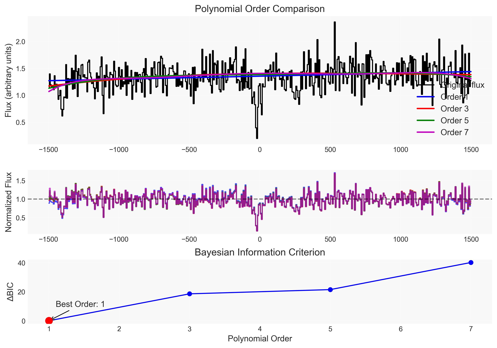

# rb_spec.py - Comprehensive Absorption Line Analysis Pipeline

[Back to Main Page](../../main_readme.md)

## Table of Contents
- [Overview](#-overview)
- [Key Features](#-key-features)
  - [Multiple Continuum Fitting Methods](#1-multiple-continuum-fitting-methods)
  - [Comprehensive Analysis Tools](#2-comprehensive-analysis-tools)
  - [Advanced Features](#3-advanced-features)
- [Quick Start Guide](#-quick-start-guide)
  - [Basic Workflow](#basic-workflow)
  - [Creating from Numpy Arrays](#creating-from-numpy-arrays)
- [Analysis Methods](#-analysis-methods)
  - [Continuum Fitting Methods](#continuum-fitting-methods)
  - [Equivalent Width and Column Density](#equivalent-width-and-column-density)
  - [Signal-to-Noise Estimation](#signal-to-noise-estimation)
  - [Saturation Detection](#saturation-detection)
  - [Data Persistence](#data-persistence)
- [Output Data Structure](#-output-data-structure)
- [Viewing and Inspection](#-viewing-and-inspection)
- [Example Applications](#-example-applications)
  - [CGM Analysis in Galaxy Spectra](#1-cgm-analysis-in-galaxy-spectra)
  - [IGM Lyman Series Analysis](#2-igm-lyman-series-analysis)
  - [Automated Batch Processing](#3-automated-batch-processing)
- [Important Notes](#️-important-notes)
- [Related Tools](#-related-tools)

`rb_spec.py` is a comprehensive absorption line analysis pipeline that is part of the `rbcodes` package. It lives in `rbcodes.GUIs` and provides a full suite of tools for analyzing absorption line spectra, particularly designed for studying the Circumgalactic Medium (CGM) and Intergalactic Medium (IGM).

## 🌟 Overview

The `rb_spec` class is a powerful spectroscopy analysis toolkit that provides automated and interactive methods for:

- **Spectral Analysis**: Read, process, and analyze 1D spectral data
- **Continuum Normalization**: Multiple algorithms for reliable continuum fitting
- **Line Measurements**: Robust equivalent width and column density calculations
- **Interactive Tools**: Visual interfaces for manual continuum adjustment
- **Data Management**: Save and load analysis results in JSON format

## 📝 Key Features

### 1. Multiple Continuum Fitting Methods
- **Interactive Spline Fitting**: Click-based interface for precise continuum selection
- **Legendre Polynomial Fitting**: With sigma clipping and automatic order selection
- **RANSAC-Based Fitting**: Robust outlier rejection for complex continua
- **Bayesian Information Criterion**: Automated optimal polynomial order selection

### 2. Comprehensive Analysis Tools
- **Equivalent Width Measurements**: With error propagation and saturation handling
- **Column Density Calculations**: Using Apparent Optical Depth (AOD) method
- **Velocity Analysis**: Centroid and dispersion measurements
- **SNR Estimation**: Per-pixel and binned signal-to-noise calculations

### 3. Advanced Features
- **Saturation Detection**: Automatic identification of saturated lines
- **Error Propagation**: Comprehensive uncertainty analysis
- **Multiple File Format Support**: FITS, ASCII, XSpectrum1D, and more
- **Data Persistence**: JSON-based save/load functionality

## 🚀 Quick Start Guide

### Basic Workflow

```python
import numpy as np
import matplotlib.pyplot as plt
from rbcodes.GUIs.rb_spec import rb_spec as r

# 1. Load spectrum from file
filename = 'example-data/test.fits'
spec = r.from_file(filename, filetype='linetools')

# 2. Shift to absorber rest frame
zabs = 0.348  # Absorber redshift
spec.shift_spec(zabs)

# 3. Slice spectrum around transition
transition = 977.0  # CIV 977
xlim = [-1500, 1500]  # Velocity limits
spec.slice_spec(transition, xlim[0], xlim[1], use_vel=True)

# 4. Fit continuum
spec.fit_continuum(
    mask=[-700, -540, -80, 50, 135, 360],  # Mask absorption regions
    domain=xlim,
    Legendre=3,
    use_weights=False
)

# 5. Compute equivalent width
spec.compute_EW(transition, vmin=-80, vmax=55, plot=True)

# 6. Save results
spec.save_slice('analysis_results.json', file_format='json')
```


### Creating from Numpy Arrays

```python
# Create rb_spec object directly from arrays
wave = np.array([...])
flux = np.array([...])
error = np.array([...])

spec = r.from_data(wave, flux, error)
```

## 💻 Analysis Methods

### Continuum Fitting Methods

#### 1. Interactive Continuum Fitting
```python
spec.fit_continuum(Interactive=True)
```

Interactive controls:
- **Left Click**: Select continuum points
- **Right Click**: Delete continuum points
- **b**: Add point at exact cursor position
- **Enter**: Fit spline to selected points
- **n**: Show normalized spectrum
- **w**: Save continuum and exit
- **q**: Quit without saving


#### 2. Automatic Polynomial Fitting
```python
# Fixed order Legendre polynomial
spec.fit_continuum(
    mask=[-200, 200],     # Mask absorption region
    domain=[-1500, 1500], # Fitting domain
    Legendre=3,           # Polynomial order
    use_weights=False     # Error weighting
)

# Automatic order selection using BIC
spec.fit_continuum(
    mask=[-200, 200],
    domain=[-1500, 1500],
    Legendre=True,
    optimize_cont=True,
    min_order=1,
    max_order=7
)
```



#### 3. RANSAC-Based Fitting
```python
# Automatic continuum with outlier rejection
spec.fit_continuum_ransac(window=149)

# Polynomial RANSAC fitting
spec.fit_polynomial_ransac(degree=4, residual_threshold=0.1)
```

### Equivalent Width and Column Density

```python
# Compute EW with plotting and SNR calculation
spec.compute_EW(
    transition,
    vmin=-80,     # Minimum velocity
    vmax=55,      # Maximum velocity
    plot=True,    # Show diagnostic plot
    SNR=True,     # Calculate SNR
    _binsize=3    # Binning for SNR
)

# Access results
print(f"W_λ = {spec.W:.3f} ± {spec.W_e:.3f} Å")
print(f"log N = {np.log10(spec.logN):.2f} ± {0.434 * spec.logN_e/spec.logN:.2f}")
print(f"Velocity centroid = {spec.vel_centroid:.1f} km/s")
```


### Signal-to-Noise Estimation

The pipeline includes robust SNR calculation algorithms:

```python
# Per-pixel or binned SNR
spec.compute_EW(transition, vmin=-80, vmax=55, SNR=True, _binsize=3)
print(f"SNR: {spec.SNR:.1f}")
```

### Saturation Detection

The pipeline automatically identifies saturated lines and adjusts calculations accordingly:

```python
# Automatic saturation handling
result = spec.compute_EW(transition, vmin=-100, vmax=100)
if result['line_saturation']:
    print(f"Line is saturated! ({result['saturation_fraction']:.1%} of pixels)")
```

### Data Persistence

#### Saving Analysis Results
```python
# Save as JSON (preferred)
spec.save_slice('results.json', file_format='json')

# Save as pickle
spec.save_slice('results.p')
```

#### Loading Results
```python
# Load from JSON
from rbcodes.GUIs.rb_spec import load_rb_spec_object
loaded_spec = load_rb_spec_object('results.json')

# Load from pickle
import pickle
with open('results.p', 'rb') as f:
    loaded_spec = pickle.load(f)
```

## 📊 Output Data Structure

After analysis, the `rb_spec` object contains:

| Attribute | Description |
|-----------|-------------|
| `wave_slice` | Sliced wavelength array |
| `flux_slice` | Sliced flux array |
| `error_slice` | Sliced error array |
| `velo` | Velocity array |
| `cont` | Fitted continuum |
| `fnorm` | Normalized flux |
| `enorm` | Normalized error |
| `W` | Rest-frame equivalent width |
| `W_e` | EW uncertainty |
| `logN` | AOD column density |
| `logN_e` | Column density uncertainty |
| `vel_centroid` | EW-weighted velocity centroid |
| `vel_disp` | Velocity dispersion |
| `Tau` | Apparent optical depth |
| `SNR` | Signal-to-noise ratio |

## 🔍 Viewing and Inspection

```python
# View full spectrum
spec.plot_spec()

# View sliced spectrum with continuum
spec.plot_slice()

# Plot doublets
spec.plot_doublet(1548.2, 1550.8, vmin=-600, vmax=600)
```


## 🎓 Example Applications

### 1. CGM Analysis in Galaxy Spectra
```python
# Analyze multiple absorption systems
zabs_list = [0.511, 1.026, 1.564]
transition = 2796.3  # MgII

for zabs in zabs_list:
    spec.shift_spec(zabs)
    spec.slice_spec(transition, -1500, 1500, use_vel=True)
    spec.fit_continuum(mask=[-200, 200], Legendre=3)
    spec.compute_EW(transition, vmin=-100, vmax=100)
    spec.save_slice(f'mgii_z{zabs:.3f}.json', file_format='json')
```

### 2. IGM Lyman Series Analysis
```python
# Analyze Lyman series
lyman_lines = [1215.67, 1025.72, 972.54]  # Lyα, Lyβ, Lyγ
zabs = 2.354

for lam in lyman_lines:
    spec.shift_spec(zabs)
    spec.slice_spec(lam, -2000, 2000, use_vel=True)
    spec.fit_continuum(optimize_cont=True)
    spec.compute_EW(lam, vmin=-300, vmax=300)
```

### 3. Automated Batch Processing
```python
# Process multiple files
files = ['qso1.fits', 'qso2.fits', 'qso3.fits']
results = []

for file in files:
    spec = r.from_file(file, filetype='linetools')
    spec.shift_spec(zabs=0.5)
    spec.slice_spec(1548.2, -1000, 1000, use_vel=True)
    spec.fit_continuum(domain=[-1000, 1000], Legendre=3)
    spec.compute_EW(1548.2, vmin=-200, vmax=200)
    results.append({
        'file': file,
        'EW': spec.W,
        'EW_err': spec.W_e,
        'logN': np.log10(spec.logN),
        'SNR': spec.SNR
    })
```

## ⚠️ Important Notes

1. **Continuum Fitting**: Always check the continuum fit visually before computing measurements
2. **Saturation**: Use the saturation detection feature for strong lines
3. **Error Propagation**: The pipeline includes comprehensive error propagation
4. **SNR**: Use the SNR calculation to assess data quality
5. **Masking**: Proper masking is crucial for accurate continuum fitting

## 🔗 Related Tools

The `rb_spec` pipeline integrates with other `rbcodes` modules:
- `rb_iter_contfit.py`: Advanced continuum fitting algorithms
- `compute_EW.py`: Core equivalent width calculations
- `rb_setline.py`: Atomic line database management
- Interactive GUIs for visual analysis


---
**Note**: This tool is part of the `rbcodes` package maintained by Rongmon Bordoloi. For the latest version and updates, visit the official GitHub repository.