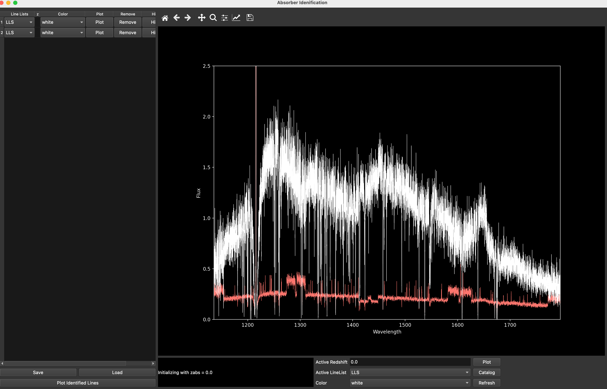
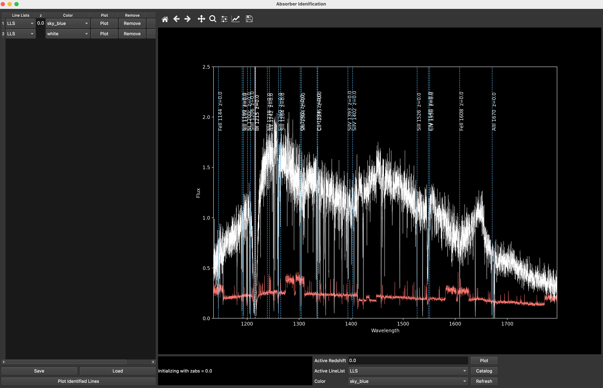
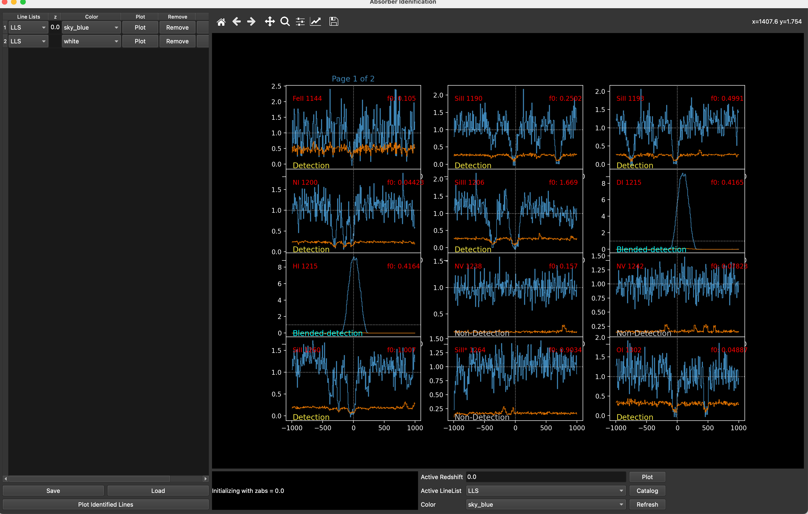
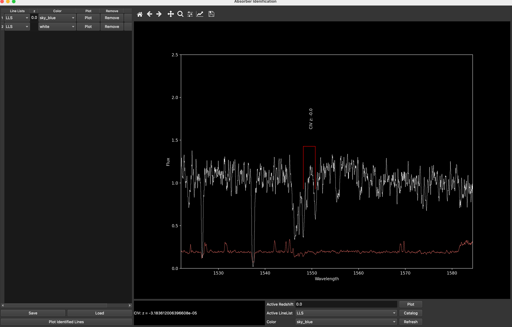
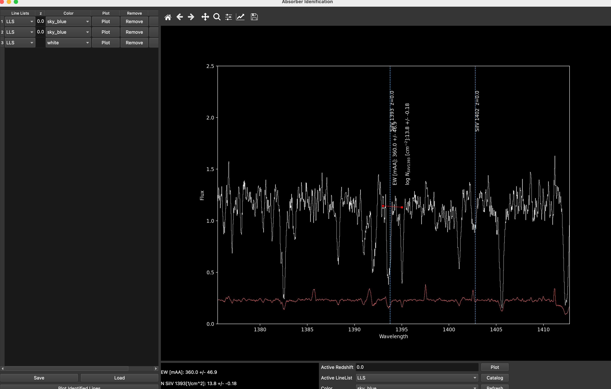

# rb_specgui

[Back to Main Page](../../main_readme.md)


A comprehensive tool for visualizing and analyzing astronomical spectra, with a focus on absorption line identification.

## Overview

The rb_specgui is a Python-based tool designed for astronomers to analyze spectral data, with a particular focus on identifying and characterizing absorption lines in astronomical spectra. The tool provides an interactive interface for visualizing spectra, identifying absorption systems at various redshifts, measuring equivalent widths, and cataloging absorption features.

This tool is particularly useful for:
- Analyzing quasar spectra to identify intervening absorption systems
- Studying Lyman-alpha systems, metal line absorbers, and other absorption features
- Measuring equivalent widths and column densities of absorption lines
- Creating catalogs of absorption systems at various redshifts


### Setup

1. The tool is part of the `rbcodes` distribution, specifically within the `rbcodes.GUIs` package

2. For convenient access from any location, create an alias in your shell configuration file (`.cshrc`):

```csh
# Add to your .cshrc file
alias rb_specgui 'python /path/to/rbcodes/GUIs/rb_specgui.py'
```

For example:
```csh
alias rb_specgui 'python /Users/bordoloi/WORK/python/rbcodes/GUIs/rb_specgui.py'
```

3. After adding the alias, reload your shell configuration:

```csh
source ~/.cshrc
```

4. Now you can run the tool from any directory using:

```csh
rb_specgui -h  # Show help
```

## Usage

The main entry point is `rb_specgui.py`, which can be executed from the command line with various options.

### Command Line Options

```
usage: rb_specgui.py [-h] [-t {ascii,linetools,fits,lt,lt_cont_norm,p}] [-e EFIL] [-n] [-v] [-z REDSHIFT] filename
```

- `filename`: Spectrum file to load
- `-t, --filetype`: File format type (ascii, linetools, fits, lt, lt_cont_norm, p)
- `-e, --error-file`: Optional separate error file
- `-n, --normalize`: Apply continuum normalization if available
- `-v, --verbose`: Enable verbose output
- `-z, --redshift`: Initial redshift (zabs) value (default: 0.0)

### Example Commands

Using the alias:

Load a FITS file with initial redshift of 0.5:
```bash
rb_specgui spectrum.fits -z 0.5
```

Load an ASCII file with separate error file:
```bash
rb_specgui spectrum.txt -t ascii -e error.txt
```

Load a normalized LineTools spectrum:
```bash
rb_specgui spectrum.fits -t lt_cont_norm
```

Get help on available options:
```bash
rb_specgui -h
```
## Key Features

- Interactive spectral visualization with zoom, pan, and scaling capabilities
- Identification of absorption systems at various redshifts
- Quick marking of common doublet absorption lines (MgII, CIV, etc.)
- Equivalent width and column density measurements
- Velocity-space visualization of absorption features (VStack GUI)
- Categorization of absorption lines (detection, non-detection, blended, low-confidence)
- Saving and loading catalogs of identified absorption systems

## GUI Controls

The RB Spectrum GUI offers a rich set of keyboard and mouse controls for interacting with the spectral data.

### Main Window Layout

The main window consists of three primary sections:
1. **Left Panel**: Absorber manager for cataloging identified absorption systems
2. **Center Panel**: Main spectral display canvas
3. **Bottom Panel**: Active redshift manager and controls



### Main Canvas Keyboard Controls

All keyboard commands are active when the main canvas has focus (click on the canvas to ensure focus).

#### View Controls
- `r`: Reset/clear the axes and replot the spectrum
- `R`: Remove all lines/text from canvas but keep spectrum active
- `t`: Restrict the y-max of canvas to current mouse height
- `b`: Restrict y-min of canvas to current mouse height
- `x`: Set left x-limit (xmin) to current mouse position
- `X`: Set right x-limit (xmax) to current mouse position
- `o`: Zoom out on x-range
- `]`: Shift canvas view to the right
- `[`: Shift canvas view to the left
- `Y`: Input custom y-limits

#### Spectrum Processing
- `S`: Smooth the spectrum (increases smoothing with each press)
- `U`: Unsmooth spectrum (decreases smoothing with each press)

#### Analysis Tools
- `E`: Compute rest-frame equivalent width (requires two keypresses to define region)
- `G`: Fit a Gaussian profile (requires three keypresses to define region)
- `v`: Open Velocity Stack GUI for identifying detected transitions
- `V`: Open Velocity Stack GUI with manual velocity axis selection
- `j` or `Right Click`: Open transition list window for identifying absorption features

#### Absorption Line Identification Shortcuts
- `M`: Mark MgII doublet (2796, 2803 Å)
- `C`: Mark CIV doublet (1548, 1550 Å)
- `F`: Mark FeII multiplet (2600, 2586, 2382 Å)
- `6`: Mark OVI doublet (1031, 1037 Å)
- `4`: Mark SiIV doublet (1393, 1402 Å)
- `8`: Mark NeVIII doublet (778, 770 Å)
- `2`: Mark Lyβ/Lyα pair
- `1`: Mark Lyα/Lyβ pair

#### Help and Exit
- `H` or `h`: Display help window
- `q` or `Q`: Quit the application

### Absorber Identification

The left panel of the GUI contains the Absorber Manager, which allows you to:
- Add known absorbers at specific redshifts
- Select line lists for identifying absorption features
- Plot or hide transition lines
- Remove absorbers from the catalog



#### Absorber Manager Controls
- **Line Lists**: Select from predefined line lists (LLS, DLA, etc.)
- **z**: Enter the redshift of the absorber
- **Color**: Select the color for plotting absorption lines
- **Plot**: Display the absorption lines for the selected absorber
- **Remove**: Delete the absorber from the manager
- **Hide**: Toggle visibility of the absorber's absorption lines

### Velocity Stack (VStack) Controls

The Velocity Stack (VStack) GUI provides a velocity-space view of all possible absorption features at a given redshift. This view is activated by pressing `v` or `V` in the main canvas.



#### VStack Keyboard Controls
- `>`: Navigate to next page of absorption lines
- `<`: Navigate to previous page
- `w`: Toggle between detection flags (Detection, Blended Detection, Low-Confidence Detection, Non-Detection)
- `Y`: Set custom y-limits for the current panel
- `S`: Save the identified lines and return to main interface

## Working with Absorbers

### Adding an Absorber
1. Enter the redshift in the "Active Redshift" field
2. Select the desired line list from the dropdown
3. Click "Plot" to display absorption lines at that redshift
4. Click "Catalog" to add the absorber to the catalog

### Quick Identification of Common Absorbers
1. Position the cursor over a suspected absorption feature
2. Press the corresponding key for common doublets:
   - `M` for MgII
   - `C` for CIV
   - `4` for SiIV
   - etc.
3. The GUI will mark the corresponding doublet and display the calculated redshift



### Manual Transition Identification
1. Position the cursor over a suspected absorption feature
2. Press `j` or right-click to open the transition list
3. Select the transition you believe corresponds to the feature
4. The GUI will calculate and display the corresponding redshift

### Evaluating Absorption Lines
1. Press `v` to open the Velocity Stack GUI
2. Navigate through all possible transitions at the current redshift
3. For each transition, press `w` to toggle between:
   - Non-Detection (default)
   - Detection
   - Blended Detection
   - Low-Confidence Detection
4. Press `S` to save your evaluations and return to the main GUI

## File Management

### Saving
1. Click the "Save" button in the absorber manager panel
2. Choose to save:
   - Absorber Catalog (.csv)
   - Identified Line List (.txt)
   - Both to a directory
3. Select your desired location and name
4. Click "Save"

### Loading
1. Click the "Load" button in the absorber manager panel
2. Choose to load:
   - Absorber Catalog (.csv)
   - Identified Line List (.txt)
   - Both from a directory
3. Navigate to the desired file(s)
4. Click "Open"

## Advanced Analysis

### Equivalent Width Measurement
1. Press `E` to initiate equivalent width measurement
2. Click at the beginning of the feature you want to measure
3. Click at the end of the feature
4. The equivalent width and, if applicable, column density will be displayed



### Gaussian Fitting
1. Press `G` to initiate Gaussian fitting
2. Click at the beginning of the feature you want to fit
3. Click at the approximate center of the feature
4. Click at the end of the feature
5. A Gaussian fit will be applied and parameters displayed


## Workflow Diagram

```
                                 ┌─────────────────┐
                                 │  Load Spectrum  │
                                 │  rb_specgui.py  │
                                 └────────┬────────┘
                                          │
                                          ▼
                          ┌───────────────────────────────┐
                          │      Main GUI Interface       │
                          │   PlotSpec_Integrated.py      │
                          └───────────────┬───────────────┘
                                          │
                        ┌─────────────────┴──────────────────┐
                        │                                     │
                ┌───────┴────────┐              ┌─────────────┴──────────┐
                │                │              │                        │
                ▼                ▼              ▼                        ▼
        ┌──────────────┐ ┌──────────────┐ ┌──────────┐          ┌───────────────┐
        │   Absorber   │ │  Equivalent  │ │  Manual  │          │ Velocity Stack│
        │ Identification│ │Width Analysis│ │Transition│          │   Analysis    │
        │              │ │              │ │Identification│       │ (VStack GUI)  │
        └──────┬───────┘ └──────┬───────┘ └─────┬────┘          └───────┬───────┘
               │                │                │                       │
               ▼                ▼                ▼                       ▼
        ┌──────────────┐ ┌──────────────┐ ┌──────────────┐      ┌───────────────┐
        │ Add Absorber │ │ Measure EW & │ │  Identify    │      │  Categorize   │
        │  to Catalog  │ │Column Density│ │  Absorption  │      │  Transitions  │
        │              │ │              │ │   Systems    │      │               │
        └──────┬───────┘ └──────────────┘ └──────────────┘      └───────┬───────┘
               │                                                         │
               └─────────────────────┬─────────────────────────────────┘
                                     │
                                     ▼
                              ┌──────────────┐
                              │  Save/Load   │
                              │   Catalog    │
                              └──────────────┘
```
## Technical Documentation

For developers interested in the codebase, the GUI consists of several key Python modules:

- `rb_specgui.py`: Command-line interface and file loader
- `PlotSpec_Integrated.py`: Main GUI interface with interactive controls
- `guess_abs_line_vel_gui.py`: Velocity stack visualization
- `Absorber.py`: Classes for handling absorption systems
- `rb_setline.py`: Line identification functionality
