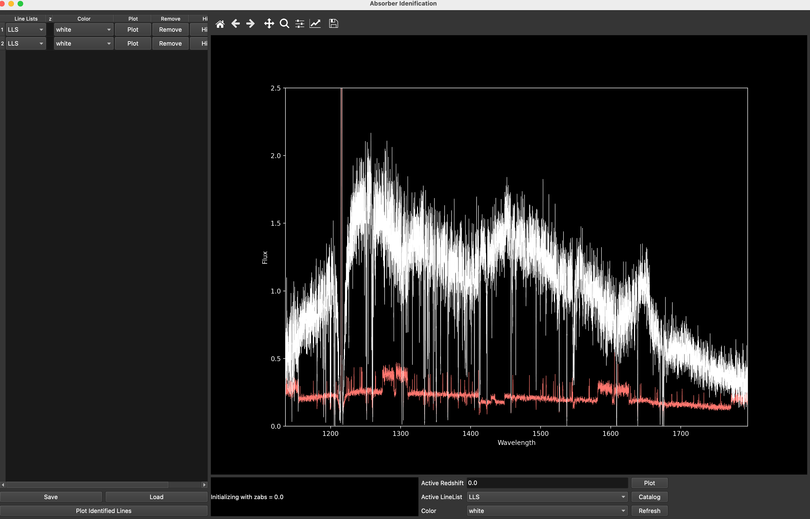
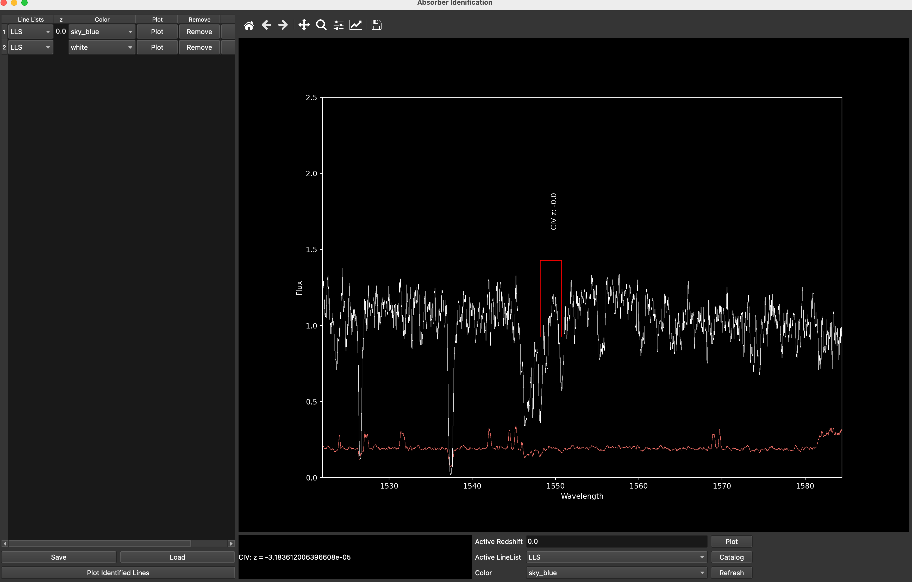
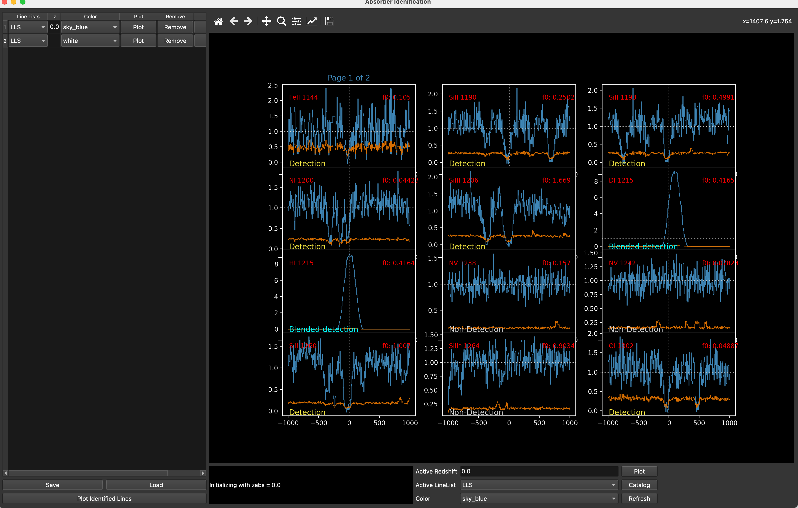
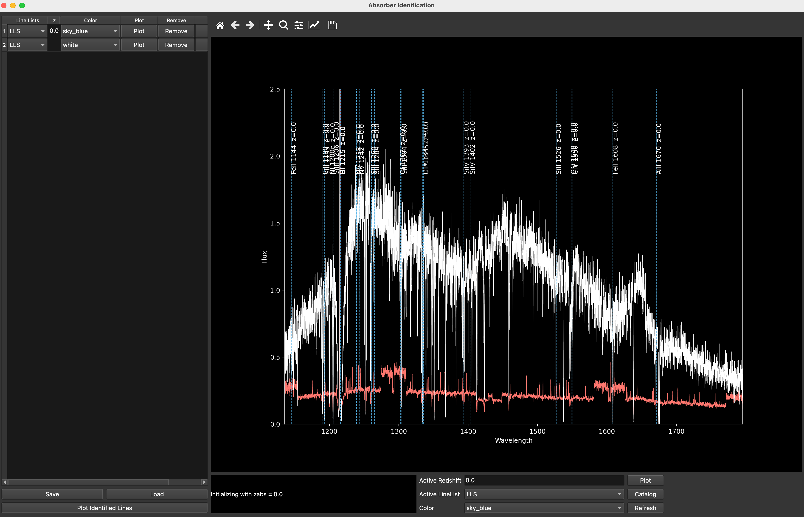
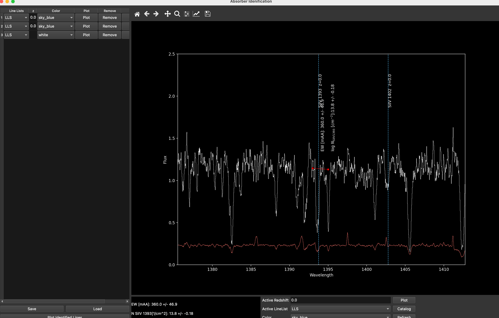

# rb_specgui

[Back to Main Page](../../main_readme.md)

Point-and-click interface for single-spectrum absorption line analysis — identify
absorbers, measure EW and column densities, and catalog systems.

```bash
launch_specgui spectrum.fits
launch_specgui spectrum.fits -z 0.5
launch_specgui spectrum.fits -t ascii -e error.txt
launch_specgui spectrum.fits -t lt_cont_norm
launch_specgui -b                        # batch mode
launch_specgui -h                        # help
```

**File types:** `linetools`, `fits`, `ascii`, `lt`, `lt_cont_norm`, `p` (pickle)



---

## Main canvas keyboard controls

### View

| Key | Action |
|-----|--------|
| `r` | Reset and replot spectrum |
| `R` | Remove all line overlays |
| `x` / `X` | Set left / right x-limit to cursor |
| `t` / `b` | Set y-max / y-min to cursor |
| `o` | Zoom out x-range |
| `[` / `]` | Pan left / right |
| `Y` | Enter custom y-limits |
| `S` / `U` | Increase / decrease smoothing |
| `h` / `H` | Help window |
| `q` / `Q` | Quit |

### Line identification

| Key | Lines marked |
|-----|-------------|
| `M` | MgII doublet (2796, 2803 Å) |
| `C` | CIV doublet (1548, 1550 Å) |
| `F` | FeII multiplet (2600, 2586, 2382 Å) |
| `6` | OVI doublet (1031, 1037 Å) |
| `4` | SiIV doublet (1393, 1402 Å) |
| `8` | NeVIII doublet (778, 770 Å) |
| `2` | Lyβ/Lyα |
| `1` | Lyα/Lyβ |
| `j` / right-click | Open full transition list at cursor wavelength |

### Analysis

| Key | Action |
|-----|--------|
| `E` | Equivalent width (two clicks define region) |
| `G` | Gaussian fit (three clicks: start, center, end) |
| `v` | Open VStack GUI (default ±1000 km/s window) |
| `V` | Open VStack GUI with custom velocity limits |



---

## VStack keyboard controls

| Key | Action |
|-----|--------|
| `>` / `<` | Next / previous page of transitions |
| `w` | Cycle flag: Non-Detection → Detection → Blended → Low-Confidence |
| `Y` | Set custom y-limits for current panel |
| `S` | Save flags and return to main GUI |



---

## Absorber manager



Enter redshift, select line list, click **Plot** to overlay lines. Click
**Catalog** to save the absorber. Save/load the full catalog via the
**Save** / **Load** buttons (CSV + line list TXT).

---

## EW measurement


