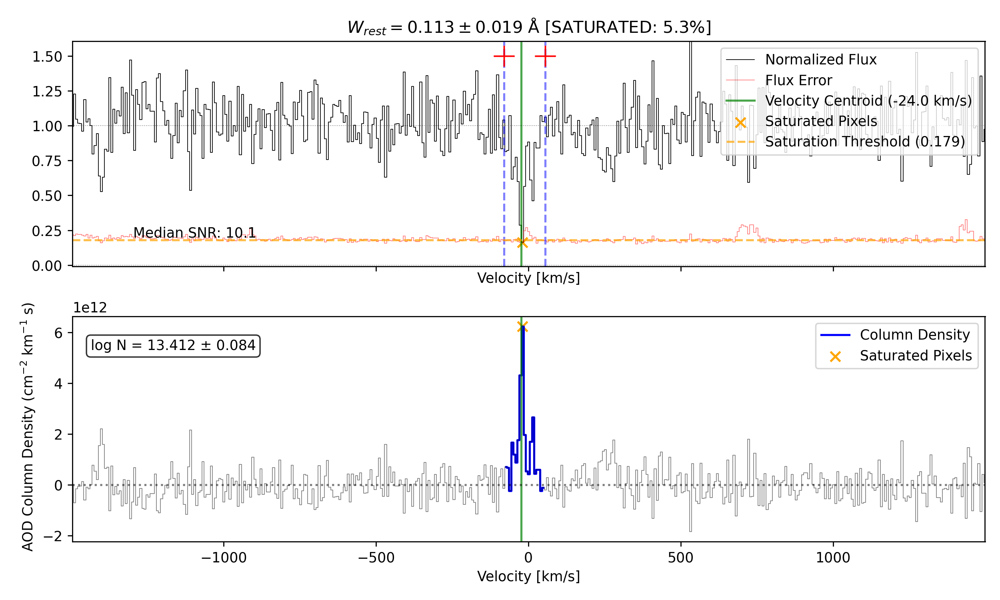

# Equivalent Width Calculator for Spectroscopic Analysis

The `compute_EW` function is a comprehensive tool for calculating equivalent widths (EW) of absorption lines in spectroscopic data. It offers advanced functionality including dynamic saturation detection, apparent optical depth (AOD) calculations, and visualization.

## Main Features

- **Equivalent Width Calculation**: Accurately measures absorption line strengths in specified velocity windows
- **Dynamic Saturation Detection**: Automatically identifies saturated regions based on flux errors
- **Column Density Estimation**: Optional calculation of column densities using the apparent optical depth method
- **Error Propagation**: Robust error handling throughout all calculations
- **Visualization**: Optional plotting of absorption features with saturation highlighting and results
- **Signal-to-Noise Estimation**: Optional SNR calculation for quality assessment
- **Velocity Dispersion**: Computes absorption line velocity centroids and width metrics


## Usage Examples

### Basic Equivalent Width Calculation

```python
import numpy as np
from rbcodes.IGM.compute_EW import compute_EW

# Example wavelength, flux and error arrays
wavelength = np.array([...])  # Observed wavelength in Angstroms
flux = np.array([...])        # Continuum-normalized flux
error = np.array([...])       # Flux error array

# Calculate EW for HI Lyman-alpha absorption
result = compute_EW(
    wavelength,
    flux,
    1215.67,       # Rest wavelength of Lyman-alpha (Å)
    [-100, 100],   # Velocity integration window (km/s)
    error
)

# Print results
print(f"Equivalent Width: {result['ew_tot']:.3f} ± {result['err_ew_tot']:.3f} Å")
print(f"Velocity Dispersion: {result['vel_disp']:.1f} km/s")
print(f"Line Saturated: {result['line_saturation']}")
```

### Full Analysis with Column Density and Visualization

```python
result = compute_EW(
    wavelength,
    flux,
    1215.67,         # Rest wavelength of Lyman-alpha (Å)
    [-150, 150],     # Velocity integration window (km/s)
    error,
    plot=True,       # Generate visualization
    zabs=0.1,        # Absorber redshift
    f0=0.4164,       # Oscillator strength (required for column density)
    verbose=True,    # Print detailed information
    SNR=True         # Calculate signal-to-noise ratio
)

# Column density results (only available when f0 is provided)
if 'col' in result:
    print(f"log(N): {np.log10(result['col']):.3f} ± "
          f"{np.log10(result['col'] + result['colerr']) - np.log10(result['col']):.3f} cm^-2")
```

### Custom Saturation Handling

```python
# Define custom saturation threshold
result = compute_EW(
    wavelength,
    flux,
    1215.67,
    [-100, 100],
    error,
    sat_limit=0.1,         # Custom saturation threshold
    normalization='median' # Normalize flux by median
)

print(f"Saturation fraction: {result['saturation_fraction']:.1%}")
```

## Visualization Examples

When `plot=True`, the function generates a visualization showing:

1. **Top panel**: The normalized flux and error spectrum with:
   - Integration window markers
   - Velocity centroid
   - Saturation threshold and flagged pixels (if applicable)

2. **Bottom panel**: Either:
   - Column density as a function of velocity (if f0 provided)
   - Cumulative equivalent width with 16%, 50%, and 84% percentiles (if f0 not provided)



## Best Practices

1. **Input Preparation**:
   - Ensure wavelength array is monotonically increasing
   - Pre-normalize spectrum to continuum level when possible
   - Provide accurate error spectrum for reliable saturation detection

2. **Velocity Window Selection**:
   - Choose windows wide enough to capture the full absorption profile
   - Avoid including unrelated absorption features
   - Use consistent windows when comparing multiple absorption systems

3. **Saturation Handling**:
   - Use the default `sat_limit='auto'` for most spectra
   - For high SNR data, consider custom thresholds
   - Always check the `saturation_fraction` in results

4. **Column Density Estimation**:
   - For accurate column densities, provide oscillator strength (f0)
   - Be cautious with column density values from heavily saturated lines
   - Use weaker transitions when available to avoid saturation effects

5. **Result Validation**:
   - Always use `plot=True` to visually inspect fits
   - Compare with multiple transitions of the same element when possible
   - Use `verbose=True` to see detailed output for troubleshooting

## Function Parameters

| Parameter | Type | Description |
|-----------|------|-------------|
| lam | np.ndarray | Observed wavelength array (Å) |
| flx | np.ndarray | Flux array (normalized) |
| wrest | float | Rest wavelength of absorption (Å) |
| lmts | List[float] | Velocity limits [vmin, vmax] (km/s) |
| flx_err | np.ndarray | Error spectrum |
| plot | bool | Generate visualization |
| zabs | float | Absorber redshift |
| f0 | Optional[float] | Oscillator strength |
| sat_limit | Union[float, str, None] | Saturation detection threshold |
| normalization | str | Flux normalization method |
| verbose | bool | Print detailed output |
| SNR | bool | Calculate signal-to-noise ratio |
| _binsize | int | Binning size for SNR calculation |

## Return Dictionary

| Key | Description |
|-----|-------------|
| ew_tot | Total rest frame equivalent width (Å) |
| err_ew_tot | Error on total equivalent width (Å) |
| vel_disp | 1-sigma velocity dispersion (km/s) |
| vel50_err | Error on velocity centroid (km/s) |
| line_saturation | Boolean flag for line saturation |
| saturation_fraction | Fraction of integration window that is saturated |
| col | AOD column density (if f0 provided) |
| colerr | Error on AOD column density (if f0 provided) |
| Tau_a | Apparent optical depth (if f0 provided) |
| med_vel | Velocity centroid (if f0 provided) |
| SNR | Signal-to-noise ratio (if SNR=True) |