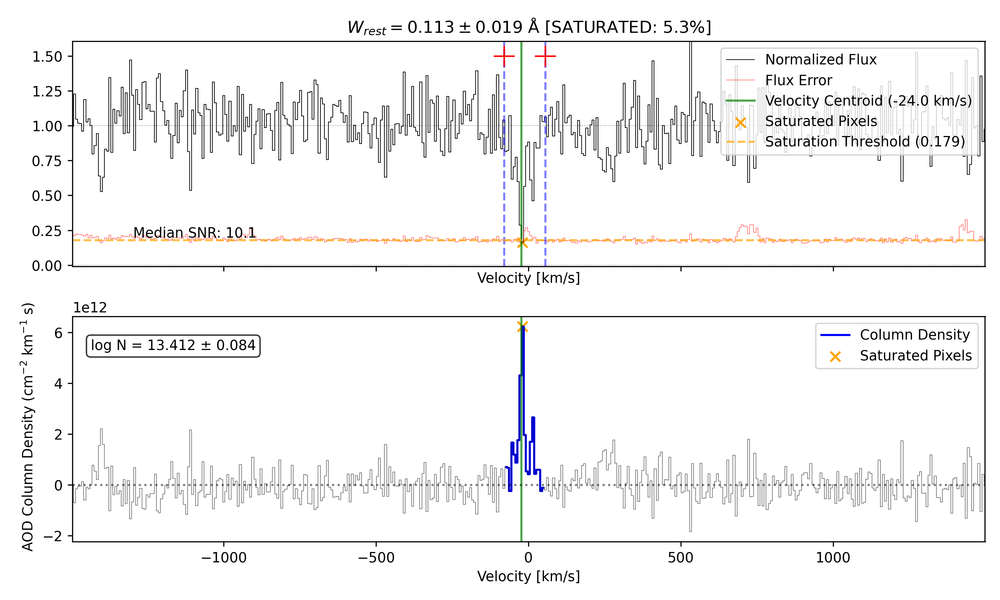

# compute_EW

[Back to Main Page](../main_readme.md)

Measures equivalent width, column density, and velocity dispersion of an
absorption line in a continuum-normalized spectrum.

```python
from rbcodes.IGM.compute_EW import compute_EW

result = compute_EW(wave, flux, 1215.67, [-100, 100], error)

print(result['ew_tot'], result['err_ew_tot'])   # EW ± error (Å)
print(result['vel_disp'])                        # 1-sigma dispersion (km/s)
print(result['line_saturation'])                 # True/False
```

With column density and plot:

```python
result = compute_EW(wave, flux, 1215.67, [-150, 150], error,
                    f0=0.4164, zabs=0.1, plot=True, SNR=True)

# log N — only when f0 is given
import numpy as np
print(np.log10(result['col']))              # log(N) cm^-2
print(result['col'] / result['colerr'])     # significance
```



---

## Parameters

| Parameter | Type | Default | Description |
|-----------|------|---------|-------------|
| `lam` | array | — | Observed wavelength (Å) |
| `flx` | array | — | Continuum-normalized flux |
| `wrest` | float | — | Rest wavelength of transition (Å) |
| `lmts` | [float, float] | — | Velocity integration window [vmin, vmax] km/s |
| `flx_err` | array | — | Flux error array |
| `f0` | float | None | Oscillator strength — required for column density |
| `zabs` | float | 0 | Absorber redshift |
| `plot` | bool | False | Show absorption plot |
| `sat_limit` | float or `'auto'` | `'auto'` | Saturation threshold |
| `normalization` | str | `'median'` | Flux normalization method |
| `SNR` | bool | False | Compute signal-to-noise ratio |
| `verbose` | bool | False | Print results to terminal |

## Output keys

| Key | Description |
|-----|-------------|
| `ew_tot` | Rest-frame EW (Å) |
| `err_ew_tot` | EW error (Å) |
| `vel_disp` | 1-sigma velocity dispersion (km/s) |
| `vel50_err` | Velocity centroid error (km/s) |
| `line_saturation` | `True` if line is saturated |
| `saturation_fraction` | Fraction of window that is saturated |
| `col` | AOD column density — only if `f0` given |
| `colerr` | Column density error — only if `f0` given |
| `Tau_a` | Apparent optical depth — only if `f0` given |
| `SNR` | Signal-to-noise ratio — only if `SNR=True` |
