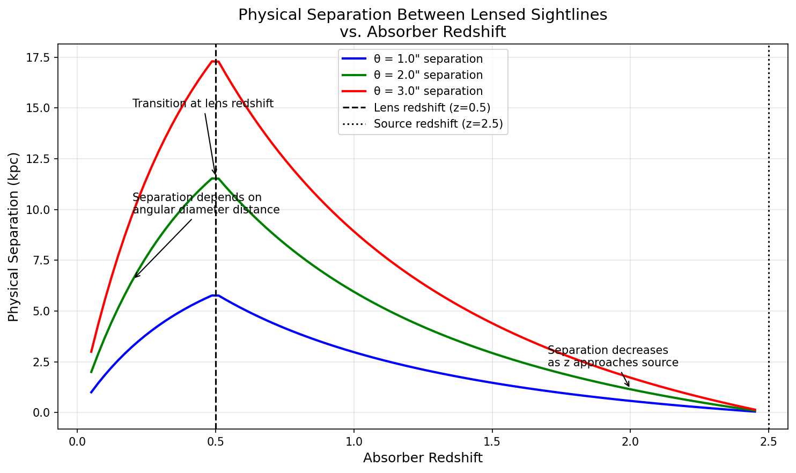
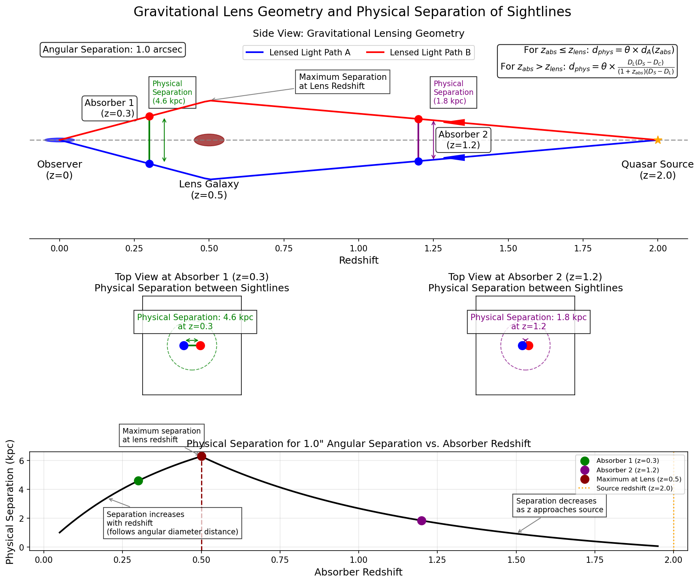

# Lens Separation Calculator

[Back to Main Page](../main_readme.md)


The `lens_sep_to_kpc` function is a specialized tool for calculating physical separations between sightlines in gravitationally lensed quasar systems. It implements the equations from Cooke et al. 2010 to accurately determine the physical separations at various absorber redshifts.

## Main Features

- **Physical Separation Calculation**: Computes transverse distances between lensed quasar sightlines
- **Redshift Handling**: Properly accounts for lens, source, and absorber redshifts
- **Cosmology Integration**: Uses Astropy's cosmology module with Planck18 defaults
- **Astropy Units Support**: Optional unit-aware returns for integration with Astropy
- **Vectorized Operations**: Efficiently handles arrays of absorber redshifts

## Dependencies

- NumPy
- Astropy (for cosmology calculations and units)
- Matplotlib (for optional visualization)

## Usage Examples

### Basic Usage with Single Absorber

```python
from rbcodes.IGM.lens_sep_to_kpc import lens_sep_to_kpc

# Calculate physical separation for a single absorber
delta_arcsec = 2.5    # Angular separation in arcseconds
zabs = 1.2            # Absorber redshift
z_lens = 0.5          # Lens galaxy redshift
z_source = 2.5        # Background quasar redshift

# Calculate physical separation in kpc
separation = lens_sep_to_kpc(delta_arcsec, zabs, z_lens, z_source)

print(f"Physical separation at z={zabs}: {separation:.2f} kpc")
```

### Multiple Absorber Redshifts

```python
import numpy as np
from rbcodes.IGM.lens_sep_to_kpc import lens_sep_to_kpc

# Angular separation in arcseconds
delta_arcsec = 1.8

# Multiple absorber redshifts
zabs_list = np.array([0.5, 0.8, 1.2, 1.5, 2.0])

# Lens and source redshifts
z_lens = 0.6
z_source = 2.8

# Calculate physical separations
separations = lens_sep_to_kpc(delta_arcsec, zabs_list, z_lens, z_source)

# Print results
for i, z in enumerate(zabs_list):
    print(f"z = {z:.1f}: {separations[i]:.2f} kpc")
```

### Using Custom Cosmology

```python
from astropy.cosmology import FlatLambdaCDM
from rbcodes.IGM.lens_sep_to_kpc import lens_sep_to_kpc

# Define a custom cosmology
custom_cosmo = FlatLambdaCDM(H0=70, Om0=0.3, Tcmb0=2.725)

# Calculate with custom cosmology
separation = lens_sep_to_kpc(
    delta_arcsec=2.0,
    zabs_list=[1.0],
    z_lens=0.4,
    z_source=2.2,
    custom_cosmo=custom_cosmo
)

print(f"Separation with custom cosmology: {separation[0]:.2f} kpc")
```

### Using Astropy Units

```python
from rbcodes.IGM.lens_sep_to_kpc import lens_sep_to_kpc

# Calculate with astropy units
separation_with_units = lens_sep_to_kpc(
    delta_arcsec=1.5,
    zabs_list=[0.8, 1.2],
    z_lens=0.5,
    z_source=2.0,
    return_with_units=True
)

# Print with units
for i, sep in enumerate([0.8, 1.2]):
    print(f"z = {sep:.1f}: {separation_with_units[i]}")

# Convert to different units if needed
separations_in_mpc = separation_with_units.to('Mpc')
```

## Visualization Example

```python
import numpy as np
import matplotlib.pyplot as plt
from rbcodes.IGM.lens_sep_to_kpc import lens_sep_to_kpc

# Parameters
delta_arcsec = 2.0
z_lens = 0.5
z_source = 2.5

# Create absorber redshift array
zabs_array = np.linspace(0.1, z_source-0.1, 50)

# Calculate separations
separations = lens_sep_to_kpc(delta_arcsec, zabs_array, z_lens, z_source)

# Create figure
plt.figure(figsize=(10, 5))
plt.plot(zabs_array, separations, 'b-', linewidth=2)
plt.axvline(x=z_lens, color='r', linestyle='--', 
            label=f'Lens redshift (z={z_lens})')
plt.grid(True, alpha=0.3)
plt.xlabel('Absorber Redshift')
plt.ylabel('Physical Separation (kpc)')
plt.title(f'Physical Separation vs. Absorber Redshift\n'
          f'(θ = {delta_arcsec}" , z_lens = {z_lens}, z_source = {z_source})')
plt.legend()
plt.tight_layout()
plt.show()
```



## Function Parameters

| Parameter | Type | Description |
|-----------|------|-------------|
| delta_arcsec | float | Angular separation between lensed quasar images (arcseconds) |
| zabs_list | array-like | Absorber redshift(s) |
| z_lens | float | Lens galaxy redshift |
| z_source | float | Background quasar redshift |
| custom_cosmo | astropy.cosmology object | Optional custom cosmology (default: Planck18) |
| return_with_units | bool | If True, returns result with astropy units attached |

## Best Practices

1. **Redshift Ordering**:
   - Always ensure z_source > z_lens, as required by the physics of gravitational lensing
   - For absorbers with zabs ≤ z_lens, the function automatically uses angular diameter distance

2. **Angular Separation Measurement**:
   - For best results, measure angular separations from high-resolution imaging
   - For four-image lens systems, consider calculating multiple separation pairs
   - Be consistent in which images you measure separations between when comparing results

3. **Cosmology Considerations**:
   - The default Planck18 cosmology is recommended for most applications
   - When comparing with older literature, be aware that different cosmological parameters can affect results
   - For custom analyses, provide a consistent cosmology across all calculations

4. **Interpretation Guidelines**:
   - Physical separations are most accurate for absorbers near the lens redshift
   - For absorbers near the source redshift, uncertainties increase
   - Remember that transverse distance does not account for possible line-of-sight differences

5. **Visualization Tips**:
   - When plotting separation vs. redshift, always mark the lens redshift
   - Consider including confidence intervals if uncertainties in angular separation are significant
   - For comparative studies, normalize separations to a common angular scale

## Physical Interpretation

The physical separation between lensed quasar sightlines changes with absorber redshift:

1. **zabs < z_lens**: Separation decreases as redshift approaches zero
2. **zabs = z_lens**: Separation is proportional to the angular diameter distance to the lens
3. **zabs > z_lens**: Separation decreases as redshift approaches the source
4. **zabs approaching z_source**: Separation approaches zero

This behavior allows for unique studies of gas properties on various physical scales within the same system.



## Technical Implementation Details

The function implements equation (5) from Cooke et al. 2010:

Distance = θ × DL × (DS - DC) / [(1 + zabs) × (DS - DL)]

Where:
- θ: Angular separation in radians
- DL: Comoving distance to the lens
- DS: Comoving distance to the source
- DC: Comoving distance to the absorber

For absorbers at redshifts less than or equal to the lens redshift, the function uses:

Distance = θ / (arcsec per kpc at zabs)

This special case handling ensures physically meaningful results across all redshifts.