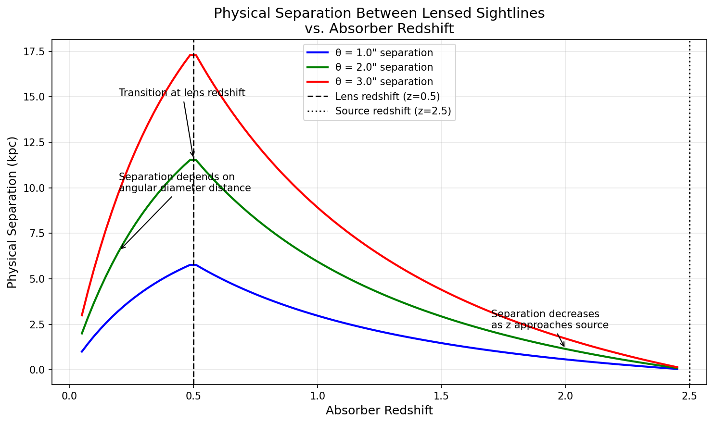
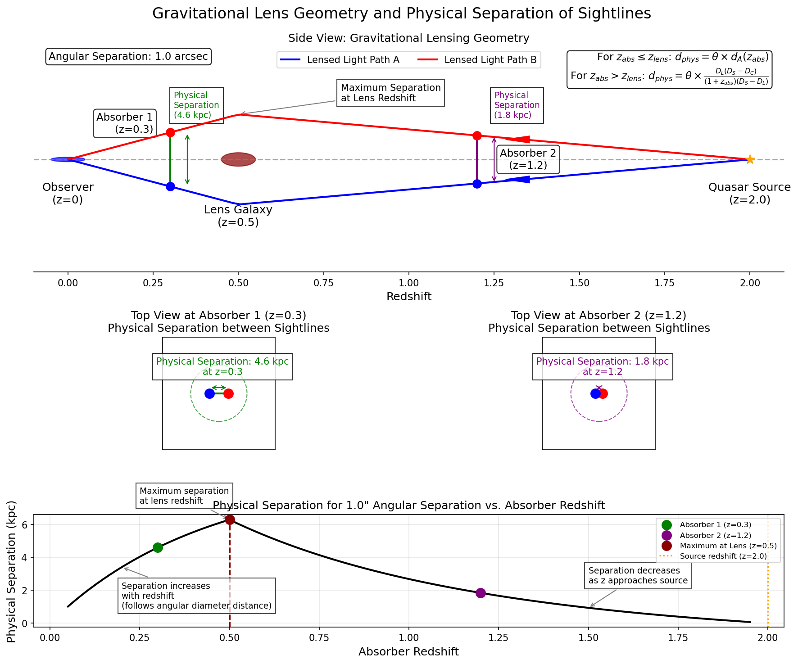

# lens_sep_to_kpc

[Back to Main Page](../main_readme.md)

Computes the physical transverse separation (kpc) between lensed quasar
sightlines as a function of absorber redshift. Implements Cooke et al. 2010
eq. (5). Default cosmology is Planck18.

```python
from rbcodes.IGM.lens_sep_to_kpc import lens_sep_to_kpc

# Single absorber
sep = lens_sep_to_kpc(2.5, zabs=1.2, z_lens=0.5, z_source=2.5)
print(f"{sep:.2f} kpc")

# Array of absorber redshifts
import numpy as np
zabs_array = np.linspace(0.1, 2.4, 50)
seps = lens_sep_to_kpc(2.5, zabs_array, z_lens=0.5, z_source=2.5)

# Custom cosmology
from astropy.cosmology import FlatLambdaCDM
cosmo = FlatLambdaCDM(H0=70, Om0=0.3)
sep = lens_sep_to_kpc(2.0, zabs=1.0, z_lens=0.4, z_source=2.2,
                      custom_cosmo=cosmo)

# Return with astropy units
sep = lens_sep_to_kpc(1.5, zabs=0.8, z_lens=0.5, z_source=2.0,
                      return_with_units=True)
sep.to('Mpc')
```





---

## Parameters

| Parameter | Type | Default | Description |
|-----------|------|---------|-------------|
| `delta_arcsec` | float | — | Angular separation between lensed images (arcsec) |
| `zabs_list` | float or array | — | Absorber redshift(s) |
| `z_lens` | float | — | Lens galaxy redshift |
| `z_source` | float | — | Background quasar redshift |
| `custom_cosmo` | astropy cosmology | Planck18 | Optional custom cosmology |
| `return_with_units` | bool | False | Return result as astropy Quantity |

## Physical note

The separation peaks near `z_lens` and approaches zero as `zabs → 0` or
`zabs → z_source`. For absorbers at `zabs ≤ z_lens`, the function falls back
to the angular diameter distance formula automatically.
