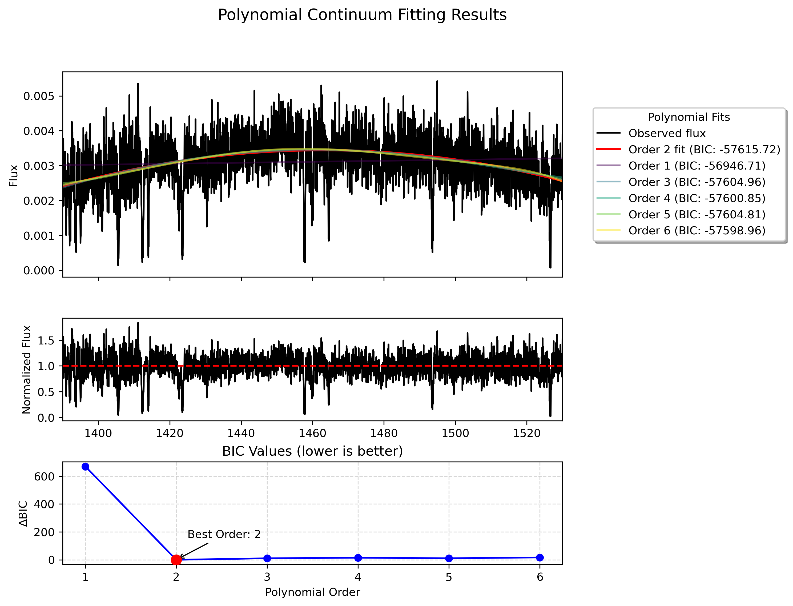

# Polynomial Continuum Fitting Tools for Spectral Analysis

This repository contains a set of Python tools for robust continuum fitting of astronomical spectra. These modules are part of the `rbcodes.IGM` package, providing flexible and powerful methods for normalizing spectra.

## Main Features

- **Robust polynomial fitting** with sigma-clipping outlier rejection
- **Automatic determination of optimal polynomial order** using Bayesian Information Criterion (BIC)
- **Segmented continuum fitting** for handling complex spectra with varying features
- **Support for weighted fitting** using error spectra
- **Comprehensive visualization tools** for fitting results
- **Save figure options** for all visualizations with customizable filenames

## Modules

### `rb_iter_contfit`

This module provides tools for iterative continuum fitting using Legendre polynomials with sigma clipping to exclude outliers (such as absorption or emission features).

### `fit_continuum_full_spec`

This module extends the functionality to fit the continuum of a full spectrum by dividing it into overlapping segments, fitting each segment with optimal polynomial orders, and blending the results.

## Dependencies

- NumPy
- Matplotlib
- Astropy
- linetools (optional, for reading/writing FITS files)

## Usage Examples

### Basic Continuum Fitting with `rb_iter_contfit`

```python
import numpy as np
from rbcodes.IGM.rb_iter_contfit import rb_iter_contfit
from linetools.spectra.xspectrum1d import XSpectrum1D
from pkg_resources import resource_filename

# Load real spectral data
filename = resource_filename('rbcodes', 'example-data/test.fits')
sp = XSpectrum1D.from_file(filename)
wave = sp.wavelength.value
flux = sp.flux.value
error = sp.sig.value

# Define a wavelength region to fit
region_mask = (wave >= 1390) & (wave <= 1530)
region_wave = wave[region_mask]
region_flux = flux[region_mask]
region_error = error[region_mask]

# Simple usage with default parameters (order=4)
result = rb_iter_contfit(region_wave, region_flux, region_error)
continuum = result['continuum']
normalized_flux = region_flux / continuum

print(f"Fit standard deviation: {result['fit_error']:.4f}")
```

### Finding Optimal Polynomial Order for a Spectral Region

```python
from rbcodes.IGM.rb_iter_contfit import fit_optimal_polynomial
from linetools.spectra.xspectrum1d import XSpectrum1D
from pkg_resources import resource_filename

# Load the test spectrum
filename = resource_filename('rbcodes', 'example-data/test.fits')
sp = XSpectrum1D.from_file(filename)

# Define a wavelength region
region_mask = (sp.wavelength.value >= 1390) & (sp.wavelength.value <= 1530)
region_wave = sp.wavelength.value[region_mask]
region_flux = sp.flux.value[region_mask]
region_error = sp.sig.value[region_mask]

# Test polynomial orders from 1 to 6
result = fit_optimal_polynomial(
    region_wave, 
    region_flux, 
    error=region_error,
    min_order=1, 
    max_order=6, 
    use_weights=False,
    plot=True,  # Creates a visualization of different polynomial fits
    save_plot=True,  # Save the plot to a file
    plot_filename='polynomial_fit_comparison.png'  # Optional filename
)

best_order = result['best_order']
continuum = result['continuum']
normalized_flux = result['normalized_flux']

print(f"Optimal polynomial order: {best_order}")
print(f"Fit standard deviation: {result['fit_error']:.4f}")

# The saved plot is available at:
if 'plot_file' in result:
    print(f"Plot saved to: {result['plot_file']}")
```

### Full Spectrum Continuum Fitting

```python
from rbcodes.IGM.fit_continuum_full_spec import fit_quasar_continuum
from pkg_resources import resource_filename

# Path to example spectrum
filename = resource_filename('rbcodes', 'example-data/test.fits')

# Fit the full spectrum using chunks
results = fit_quasar_continuum(
    filename,
    chunk_params={
        'window_size': 100,        # Angstroms
        'overlap_fraction': 0.3,   # Fraction of window to overlap
        'method': 'uniform'        # Method for selecting chunks
    },
    fitting_params={
        'min_order': 1,            # Minimum polynomial order to test
        'max_order': 6,            # Maximum polynomial order to test
        'maxiter': 20,             # Maximum iterations
        'sigma': 2.5,              # Sigma clipping threshold
        'use_weights': False       # Use error as weights
    },
    save_output=True,              # Save normalized spectrum to FITS file
    output_filename='normalized_quasar.fits'
)

# Access results
continuum = results['continuum']
normalized_flux = results['normalized_flux']
chunk_results = results['chunk_results']

# Print summary of chunk results
for chunk in chunk_results:
    print(f"Chunk {chunk['chunk_id']}: {chunk['wavelength_range'][0]:.1f} - "
          f"{chunk['wavelength_range'][1]:.1f} Å, Best Order: {chunk['best_order']}")
```

### Fitting a Specific Wavelength Region of a Real Spectrum

```python
from rbcodes.IGM.rb_iter_contfit import fit_spectral_region
from pkg_resources import resource_filename

# Path to example spectrum
filename = resource_filename('rbcodes', 'example-data/test.fits')

# Fit a specific wavelength region in the spectrum
result = fit_spectral_region(
    filename,
    lam_min=1390,  # Minimum wavelength (Å)
    lam_max=1530,  # Maximum wavelength (Å)
    min_order=1,
    max_order=6,
    use_weights=False,
    plot=True,
    save_output=True,
    output_filename="normalized_region.fits",
    save_plot=True,  # Save the plot to a file
    plot_filename="region_fit_plot.png"  # Optional filename
)

print(f"Best polynomial order: {result['best_order']}")
if 'plot_file' in result:
    print(f"Plot saved to: {result['plot_file']}")
```

## Saving Plots

Both `fit_optimal_polynomial` and `fit_spectral_region` functions now support saving figures:

```python
# Example: Save polynomial fitting results
result = fit_optimal_polynomial(
    wave, flux, error=error,
    save_plot=True,  # Enable plot saving
    plot_filename='my_polynomial_fit.png'  # Specify filename (optional)
)

# Example: Save results through fit_spectral_region
result = fit_spectral_region(
    filename, lam_min=1390, lam_max=1530,
    save_plot=True,
    plot_filename='spectral_region_fit.png'
)

# If no filename is specified, default names are used:
# - 'polynomial_fit.png' for fit_optimal_polynomial
# - 'region_fit_plot.png' for fit_spectral_region
```

## Visualization Examples

The following examples demonstrate the tools working with real spectroscopic data from the `example-data/test.fits` file:

### Optimal Polynomial Order Selection for a Spectral Region

The `fit_optimal_polynomial` function provides a comprehensive visualization showing:
1. Original spectrum with all polynomial fits of different orders
2. Normalized flux (flux/continuum)
3. BIC values for different polynomial orders (lower is better)



### Full Spectrum Continuum Fitting

The `fit_quasar_continuum` function generates a visualization showing:
1. Full spectrum with fitted continuum
2. Individual chunk fits with their polynomial orders
3. Normalized spectrum
4. BIC values for each chunk


## Advanced Usage: Real Data Examples

### Working with Complex Quasar Spectra

```python
from rbcodes.IGM.fit_continuum_full_spec import fit_quasar_continuum
from pkg_resources import resource_filename

# For a complex quasar spectrum with many features
filename = resource_filename('rbcodes', 'example-data/test.fits')

result = fit_quasar_continuum(
    filename,
    chunk_params={
        'window_size': 80,          # Smaller windows for complex features
        'overlap_fraction': 0.4,    # More overlap for smoother blending
        'method': 'uniform'
    },
    fitting_params={
        'min_order': 2,             # Test higher minimum order
        'max_order': 8,             # Allow higher orders for complex regions
        'maxiter': 25,              # More iterations for convergence
        'sigma': 2.0,               # More aggressive outlier rejection
        'use_weights': True         # Use error weighting
    }
)
```

### Working with Specific Wavelength Ranges

```python
# If you only want to fit a portion of the spectrum
results = fit_quasar_continuum(
    filename,
    chunk_params={
        'window_size': 100,
        'overlap_fraction': 0.3,
        'method': 'uniform',
        'wmin': 1200,  # Start fitting at 1200 Å
        'wmax': 1800   # End fitting at 1800 Å
    },
    fitting_params={
        'min_order': 1,
        'max_order': 6,
        'maxiter': 20,
        'sigma': 2.5,
        'use_weights': False
    }
)
```

### Accessing Detailed Results

```python
# After fitting, you can access detailed information about each chunk
for chunk in results['chunk_results']:
    print(f"\nChunk {chunk['chunk_id']}:")
    print(f"  Wavelength range: {chunk['wavelength_range'][0]:.1f} - {chunk['wavelength_range'][1]:.1f} Å")
    print(f"  Best order: {chunk['best_order']}")
    print(f"  BIC value: {chunk['bic_value']:.2f}")
    print(f"  Residual std: {chunk['std_error']:.4f}")
    
    # Look at all orders tested for this chunk
    for order, bic in chunk['all_bics']:
        print(f"    Order {order}: BIC = {bic:.2f}")
```

## Practical Tips for Real Data

1. **Data Quality Assessment**:
   - Check for chip gaps, bad pixels, or cosmic rays before fitting
   - The functions handle chip gaps automatically but may need help with other artifacts
   - Use the error spectrum to appropriately weight the fit

2. **Choosing Window Sizes**:
   - For quasar spectra: 80-120 Å windows work well
   - For galaxy spectra: 50-100 Å windows may be better
   - Adjust based on the density of spectral features

3. **Overlap Considerations**:
   - 30-40% overlap usually provides smooth blending
   - More overlap (up to 50%) for smoother results but slower computation
   - Less overlap (20%) for faster processing but potentially visible seams

4. **Polynomial Order Selection**:
   - Start with min_order=1 and max_order=6 for most cases
   - For very smooth continua, max_order=4 may be sufficient
   - For very complex continua, consider max_order=8 or higher

5. **Visualization and Quality Control**:
   - Always inspect the normalized spectrum visually
   - Check for overfit/underfit in regions with known features
   - The residuals should show noise-like behavior without systematic trends

## Notes on Error Handling

The functions include several safeguards for real data:
- Automatic handling of chip gaps where flux and error are both zero
- Robust error estimation if error spectrum is not provided
- Automatic adjustment of polynomial order if data points are insufficient
- Warnings for poor fits or insufficient inliers