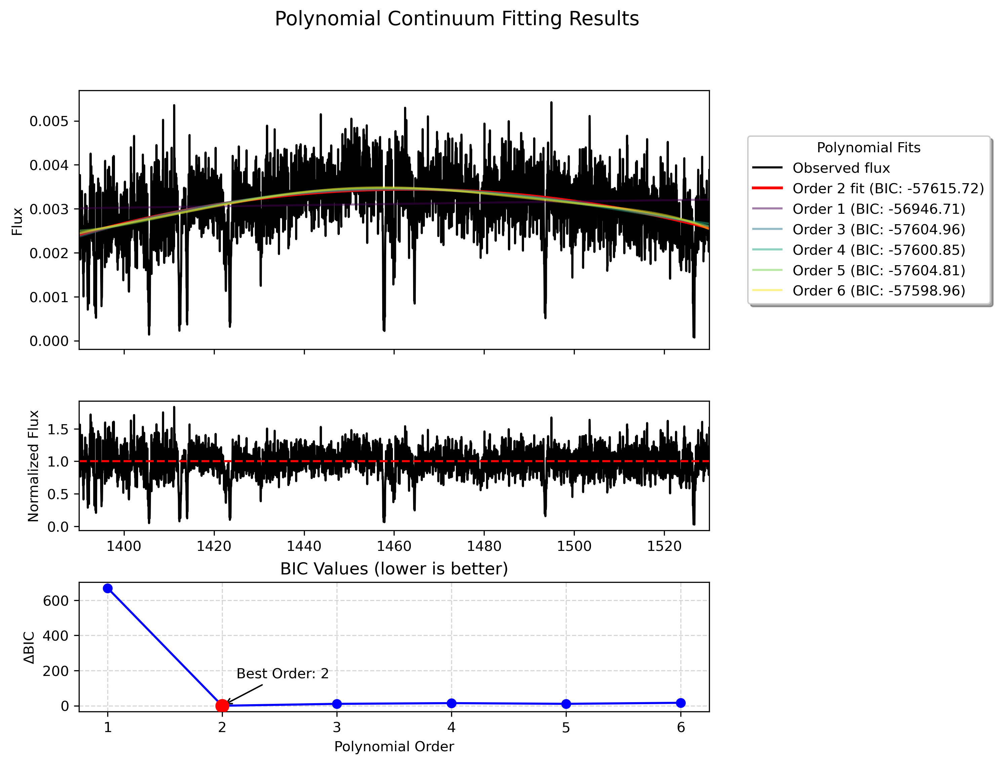
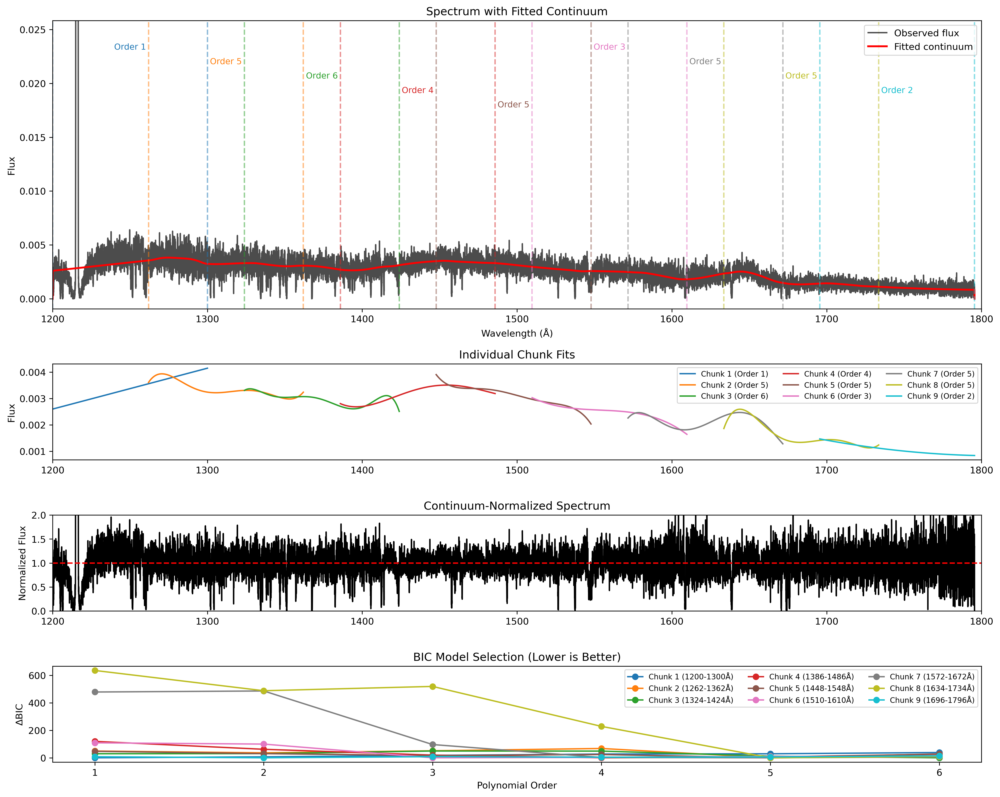

# rb_iter_contfit

[Back to Main Page](../main_readme.md)

Iterative Legendre polynomial continuum fitting with sigma-clipping and
automatic BIC-based order selection. `fit_continuum_full_spec` extends this
to an entire spectrum by fitting overlapping chunks.

---

## Fit a spectral region

```python
from rbcodes.IGM.rb_iter_contfit import rb_iter_contfit

result = rb_iter_contfit(wave, flux, error)
continuum = result['continuum']
normalized = flux / continuum
```

Find the optimal polynomial order (BIC-selected):

```python
from rbcodes.IGM.rb_iter_contfit import fit_optimal_polynomial

result = fit_optimal_polynomial(wave, flux, error=error,
                                min_order=1, max_order=6,
                                plot=True, save_plot=True,
                                plot_filename='cont_fit.png')

print(result['best_order'])
continuum = result['continuum']
```

Fit a specific wavelength range from a file:

```python
from rbcodes.IGM.rb_iter_contfit import fit_spectral_region

result = fit_spectral_region('spectrum.fits',
                              lam_min=1390, lam_max=1530,
                              min_order=1, max_order=6,
                              plot=True, save_output=True,
                              output_filename='normalized.fits')
```



---

## Fit a full spectrum

```python
from rbcodes.IGM.fit_continuum_full_spec import fit_quasar_continuum

results = fit_quasar_continuum(
    'spectrum.fits',
    chunk_params={'window_size': 100, 'overlap_fraction': 0.3,
                  'method': 'uniform'},
    fitting_params={'min_order': 1, 'max_order': 6,
                    'maxiter': 20, 'sigma': 2.5, 'use_weights': False},
    save_output=True,
    output_filename='normalized_quasar.fits'
)

continuum = results['continuum']
normalized = results['normalized_flux']
```



---

## Parameters — `rb_iter_contfit`

| Parameter | Type | Default | Description |
|-----------|------|---------|-------------|
| `wave` | array | — | Wavelength array (Å) |
| `flux` | array | — | Flux array |
| `error` | array | — | Error spectrum |
| `order` | int | 4 | Legendre polynomial order |
| `maxiter` | int | 20 | Maximum sigma-clipping iterations |
| `sigma` | float | 2.5 | Clipping threshold (σ) |
| `use_weights` | bool | False | Weight fit by error spectrum |

## Parameters — `fit_quasar_continuum` chunk_params

| Parameter | Default | Description |
|-----------|---------|-------------|
| `window_size` | 100 | Chunk width in Å |
| `overlap_fraction` | 0.3 | Fractional overlap between chunks |
| `method` | `'uniform'` | Chunk placement method |
| `wmin`, `wmax` | — | Wavelength range to fit (optional) |
