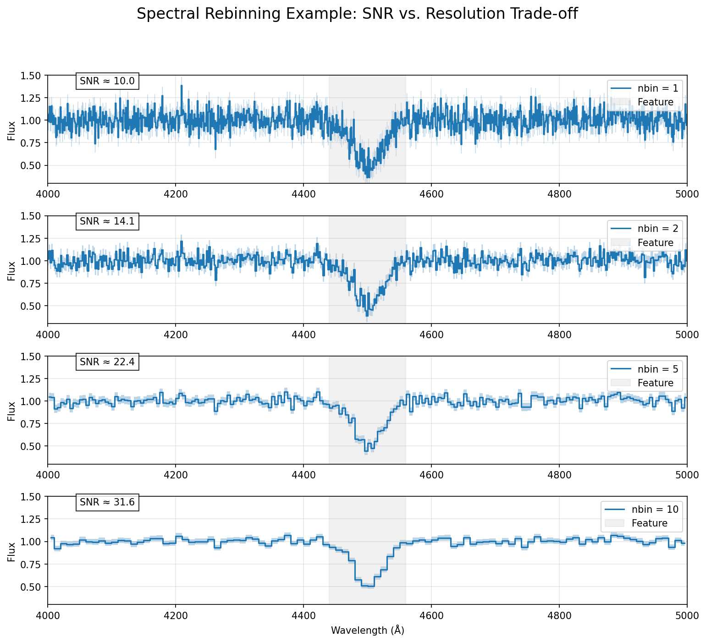

# rb_specbin

[Back to Main Page](../main_readme.md)

Rebin a 1D spectrum by combining N adjacent pixels. Flux is averaged, errors
are propagated correctly (input is variance, output is error).

```python
from rbcodes.IGM.rb_specbin import rb_specbin

result = rb_specbin(flux, 4, var=error**2, wave=wave)

rebinned_wave  = result['wave']
rebinned_flux  = result['flux']
rebinned_error = result['error']
```



---

## Parameters

| Parameter | Type | Description |
|-----------|------|-------------|
| `flux` | array | Input flux array |
| `nbin` | int | Number of pixels to combine per bin |
| `var` | array, optional | Input variance array (error²) |
| `wave` | array, optional | Input wavelength array |

## Output keys

| Key | Description |
|-----|-------------|
| `flux` | Rebinned flux |
| `error` | Rebinned error — only if `var` was provided |
| `wave` | Rebinned wavelength — only if `wave` was provided |

Array lengths not exactly divisible by `nbin` are handled automatically.
